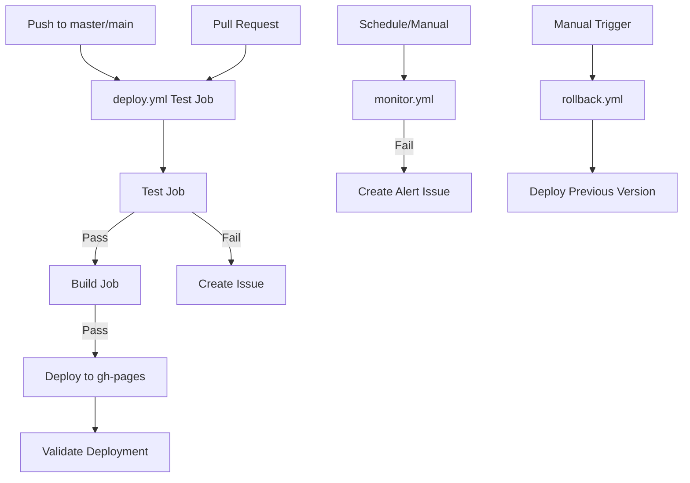

# GitHub Actions Workflows Documentation

## Overview

This repository uses GitHub Actions to automate testing, deployment, monitoring, and maintenance of the BWS website. The workflows are designed to ensure code quality, automate deployments, and monitor production health.

## Workflow Dependency Diagram



## Workflows

### 1. deploy.yml - Main CI/CD Pipeline
**Purpose:** Complete CI/CD pipeline for testing, building, and deploying the website to GitHub Pages.

**Triggers:**
- Push to `main` or `master` branches
- Pull requests to `main` or `master` branches
- Manual workflow dispatch

**Jobs:**
1. **Test** (matrix: chromium)
   - Runs Playwright tests
   - Captures test results in JSON format
   - Creates GitHub issues on failure with detailed error reports

2. **Build** (depends on: test)
   - Builds production site with Astro
   - Creates deployment artifact

3. **Deploy** (depends on: build)
   - Deploys to GitHub Pages (`gh-pages` branch)
   - Updates CNAME for custom domain

4. **Validate Deployment** (depends on: deploy)
   - Runs smoke tests against production
   - Creates critical issues for production failures

**On Success:**
- ✅ Site is deployed to production (https://www.bws.ninja)
- ✅ All test artifacts are uploaded
- ✅ Deployment is validated with smoke tests

**On Failure:**
- ❌ Workflow stops at failed stage
- ❌ Automated GitHub issue created with:
  - Detailed test failure logs
  - Stack traces and error messages
  - Environment information
  - Assigned to @claude for investigation
- ❌ Subsequent jobs (build/deploy) are skipped

**Permissions Required:**
- `contents: write` (for deployment)
- `pages: write` (for GitHub Pages)
- `id-token: write` (for OIDC)
- `pull-requests: write` (for PR comments)
- `issues: write` (for creating issues)

---

### 2. monitor.yml - Production Health Monitoring
**Purpose:** Scheduled monitoring of production site health and performance.

**Triggers:**
- Schedule: Every 6 hours (`0 */6 * * *`)
- Manual workflow dispatch

**Health Checks:**
1. HTTP status verification
2. Response time measurement (<3s threshold)
3. SSL certificate validation
4. Critical resource availability
5. Lighthouse performance audit (manual only)

**On Success:**
- ✅ All health checks pass
- ✅ Logs success metrics

**On Failure:**
- ❌ Creates/updates monitoring alert issue
- ❌ Labels: `monitoring`, `production`, `urgent`
- ❌ Includes failure details and action items

---

### 3. rollback.yml - Emergency Rollback
**Purpose:** Quickly rollback production to a previous working version.

**Triggers:**
- Manual workflow dispatch only
- Input: specific commit SHA (optional)

**Rollback Process:**
1. Checkout target commit (specified or HEAD~1)
2. Rebuild site from that commit
3. Deploy to production
4. Verify deployment
5. Create rollback documentation issue

**On Success:**
- ✅ Previous version deployed
- ✅ Rollback issue created with details
- ✅ Site verified as accessible

**On Failure:**
- ❌ Production remains in current state
- ❌ Manual intervention required

---

## Workflow Status

### ✅ Active and Working Workflows
1. **deploy.yml** - Main CI/CD pipeline with testing, building, and deployment
2. **monitor.yml** - Production health monitoring (fixed to use existing smoke tests)
3. **rollback.yml** - Emergency rollback capability

### 🗑️ Removed Workflows
1. **html-validate.yml** - Removed (referenced non-existent npm scripts)
2. **test.yml** - Removed (duplicate of deploy.yml test job)

---

## Workflow Relationships

### Primary Pipeline
```
deploy.yml (main branch) → GitHub Pages → Production
     ↓ (on failure)
GitHub Issue → @claude assignment
```

### Monitoring Loop
```
monitor.yml (every 6hrs) → Health Checks
     ↓ (on failure)
Alert Issue → Manual Investigation → rollback.yml (if needed)
```

### Pull Request Flow
```
PR Created → deploy.yml (test job only)
     ↓ (must pass)
PR Merge → deploy.yml (full pipeline) → Production
```

---

## Environment Variables

| Variable | Used In | Purpose |
|----------|---------|---------|
| `CI` | All workflows | Indicates CI environment |
| `NODE_ENV` | deploy, rollback | Build environment (production) |
| `PLAYWRIGHT_BASE_URL` | deploy, test, monitor | Test target URL |
| `NO_WEBSERVER` | deploy | Skip test server startup |
| `PORT` | deploy | Test server port (4321) |
| `PRODUCTION_URL` | monitor | Production site URL |

---

## Permissions Matrix

| Workflow | Contents | Pages | ID Token | PRs | Issues |
|----------|----------|-------|----------|-----|--------|
| deploy.yml | write | write | write | write | write |
| monitor.yml | read | - | - | - | write |
| rollback.yml | write | write | write | - | - |

---

## Maintenance Tasks

### Recently Completed Actions
1. ✅ Removed broken `html-validate.yml` workflow
2. ✅ Fixed `monitor.yml` to use existing smoke tests
3. ✅ Removed duplicate `test.yml` workflow

### Best Practices
- ✅ Automated issue creation on failures (implemented)
- ✅ Test failure details in issues (implemented)
- ✅ Rollback capability (implemented)
- ✅ Production monitoring (partially working)
- ⚠️ Fix broken workflows before they cause confusion

---

## Workflow Commands

### Manual Triggers
```bash
# Run deployment manually
gh workflow run deploy.yml

# Trigger monitoring check
gh workflow run monitor.yml

# Rollback to previous version
gh workflow run rollback.yml

# Rollback to specific commit
gh workflow run rollback.yml -f commit_sha=abc123
```

### View Workflow Status
```bash
# List recent workflow runs
gh run list

# View specific run details
gh run view <run-id>

# Watch workflow in progress
gh run watch
```