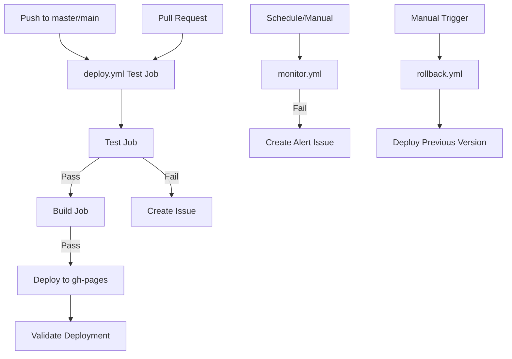

# GitHub Actions Workflows Documentation

## Overview

This repository uses GitHub Actions to automate testing, deployment, monitoring, and maintenance of the BWS website. The workflows are designed to ensure code quality, automate deployments, and monitor production health.

## Workflow Dependency Diagram



## Workflows

### 1. deploy.yml - Main CI/CD Pipeline
**Purpose:** Complete CI/CD pipeline for testing, building, and deploying the website to GitHub Pages.

**Triggers:**
- Push to `main` or `master` branches
- Pull requests to `main` or `master` branches
- Manual workflow dispatch

**Jobs:**
1. **Test** (matrix: chromium)
   - Runs Playwright tests with JSON and list reporters
   - Captures complete test results and console output
   - Downloads job logs for failed jobs
   - Creates enhanced GitHub issues on failure

2. **Build** (depends on: test)
   - Builds production site with Astro
   - Creates deployment artifact

3. **Deploy** (depends on: build)
   - Deploys to GitHub Pages (`gh-pages` branch)
   - Updates CNAME for custom domain

4. **Validate Deployment** (depends on: deploy)
   - Runs smoke tests against production
   - Creates critical issues for production failures

**On Success:**
- ✅ Site is deployed to production (https://www.bws.ninja)
- ✅ All test artifacts are uploaded
- ✅ Deployment is validated with smoke tests

**On Failure:**
- ❌ Workflow stops at failed stage (`set -o pipefail` ensures proper failure propagation)
- ❌ Job logs downloaded via GitHub API for all failed jobs
- ❌ Enhanced GitHub issue created with:
  - `/fix-ci` command structure for Claude
  - Complete test failure details with stack traces
  - Extracted errors from job logs (TypeScript, npm, build errors)
  - PR context when applicable (PR number, branches, author)
  - Suggested fix branch naming
  - Allowed tools specification for auto-fix
  - Fix checklist for tracking progress
  - Direct links to workflow run and artifacts
- ❌ Issue assigned to @claude with `test-failure`, `automated`, `urgent`, `needs-fix` labels
- ❌ Subsequent jobs (build/deploy) are skipped

**Permissions Required:**
- `contents: write` (for deployment)
- `pages: write` (for GitHub Pages)
- `id-token: write` (for OIDC)
- `pull-requests: write` (for PR comments)
- `issues: write` (for creating issues)

---

### 2. monitor.yml - Production Health Monitoring
**Purpose:** Scheduled monitoring of production site health and performance.

**Triggers:**
- Schedule: Every 6 hours (`0 */6 * * *`)
- Manual workflow dispatch

**Health Checks:**
1. HTTP status verification
2. Response time measurement (<3s threshold)
3. SSL certificate validation
4. Critical resource availability
5. Lighthouse performance audit (manual only)

**On Success:**
- ✅ All health checks pass
- ✅ Logs success metrics

**On Failure:**
- ❌ Creates/updates monitoring alert issue
- ❌ Labels: `monitoring`, `production`, `urgent`
- ❌ Includes failure details and action items

---

### 3. rollback.yml - Emergency Rollback
**Purpose:** Quickly rollback production to a previous working version.

**Triggers:**
- Manual workflow dispatch only
- Input: specific commit SHA (optional)

**Rollback Process:**
1. Checkout target commit (specified or HEAD~1)
2. Rebuild site from that commit
3. Deploy to production
4. Verify deployment
5. Create rollback documentation issue

**On Success:**
- ✅ Previous version deployed
- ✅ Rollback issue created with details
- ✅ Site verified as accessible

**On Failure:**
- ❌ Production remains in current state
- ❌ Manual intervention required

---

## Workflow Status

### ✅ Active and Working Workflows
1. **deploy.yml** - Main CI/CD pipeline with testing, building, and deployment
   - Enhanced with Claude auto-fix support
   - Job logs collection for comprehensive error reporting
   - PR-aware issue creation
2. **monitor.yml** - Production health monitoring (fixed to use existing smoke tests)
3. **rollback.yml** - Emergency rollback capability

### 🗑️ Removed Workflows
1. **html-validate.yml** - Removed (referenced non-existent npm scripts)
2. **test.yml** - Removed (duplicate of deploy.yml test job)

### 🤖 Claude Auto-Fix Integration

**Automatic Triggering with PAT:**
The repository uses a Personal Access Token (`PAT_REPOS_AND_WORKFLOW`) to enable automatic Claude triggering when tests fail. This overcomes GitHub's built-in limitation where actions using GITHUB_TOKEN cannot trigger other workflows.

**Enhanced Issue Creation:**
When tests fail, the system creates issues optimized for Claude to automatically fix:

```markdown
## 🔴 CI Failure - Auto-Fix Request

@claude - Please fix these test failures using the command below.

### Command for Claude
/fix-ci

### Failure Context
- Failed Run: #42
- PR: #99 (feature-branch → main)
- Triggered by: @user
- Job: test

[Complete test failures with error details]
[Job logs with extracted errors]
[Allowed tools and fix checklist]
```

**Features:**
- Automatic Claude triggering via PAT (no manual intervention needed)
- @claude mention in issue body triggers claude.yml workflow
- Structured format for Claude parsing
- Complete error context from multiple sources
- PR-aware with branch information
- Suggested fix branch naming convention
- Tool permissions specified for auto-fix

**Required Setup:**
1. Create a Personal Access Token with `repo` and `workflow` scopes
2. Add it as secret `PAT_REPOS_AND_WORKFLOW` in repository settings
3. Claude will auto-trigger when issues are created with @claude mention

See `.github/workflows/CLAUDE_SETUP.md` for detailed PAT setup instructions.

---

## Workflow Relationships

### Primary Pipeline
```
deploy.yml (main branch) → GitHub Pages → Production
     ↓ (on failure)
GitHub Issue → @claude assignment
```

### Monitoring Loop
```
monitor.yml (every 6hrs) → Health Checks
     ↓ (on failure)
Alert Issue → Manual Investigation → rollback.yml (if needed)
```

### Pull Request Flow
```
PR Created → deploy.yml (test job only)
     ↓ (must pass)
PR Merge → deploy.yml (full pipeline) → Production
```

---

## Environment Variables

### Standard GitHub Actions Variables (Automatically Provided)

| Variable | Used In | Purpose |
|----------|---------|---------|
| `CI` | All workflows | Indicates CI environment |
| `NODE_ENV` | deploy, rollback | Build environment (production) |
| `PLAYWRIGHT_BASE_URL` | deploy, monitor | Test target URL |
| `NO_WEBSERVER` | deploy | Skip test server startup |
| `PORT` | deploy | Test server port (4321) |
| `PRODUCTION_URL` | monitor | Production site URL |
| `GITHUB_PR_NUMBER` | deploy | PR number (set in workflow) |
| `GITHUB_HEAD_REF` | deploy | PR source branch |
| `GITHUB_BASE_REF` | deploy | PR target branch |

### GitHub Context Variables (Used for Enhanced Issue Creation)

| Variable | Purpose | Available When |
|----------|---------|---------------|
| `GITHUB_RUN_ID` | Unique workflow run ID | Always |
| `GITHUB_RUN_NUMBER` | Sequential run number | Always |
| `GITHUB_ACTOR` | User who triggered run | Always |
| `GITHUB_WORKFLOW` | Workflow name | Always |
| `GITHUB_JOB` | Current job name | Always |
| `GITHUB_EVENT_NAME` | Triggering event | Always |
| `GITHUB_SHA` | Commit SHA | Always |
| `GITHUB_REF` | Git ref | Always |
| `github.event.pull_request.*` | PR details | On pull_request events |

---

## Permissions Matrix

| Workflow | Contents | Pages | ID Token | PRs | Issues |
|----------|----------|-------|----------|-----|--------|
| deploy.yml | write | write | write | write | write |
| monitor.yml | read | - | - | - | write |
| rollback.yml | write | write | write | - | - |

---

## Maintenance Tasks

### Recently Completed Improvements
1. ✅ Removed broken `html-validate.yml` workflow
2. ✅ Fixed `monitor.yml` to use existing smoke tests
3. ✅ Removed duplicate `test.yml` workflow
4. ✅ Enhanced issue creation with Claude auto-fix support
5. ✅ Added job logs collection for comprehensive error reporting
6. ✅ Implemented PR-aware issue creation with branch context
7. ✅ Fixed test failure propagation with `set -o pipefail`
8. ✅ Added detailed test error extraction and formatting

### Best Practices
- ✅ Automated issue creation on failures with Claude auto-fix support
- ✅ Comprehensive test failure details including job logs
- ✅ PR-aware context in issues for better debugging
- ✅ Rollback capability for emergency recovery
- ✅ Production monitoring with smoke tests
- ✅ Proper error propagation in shell commands
- ✅ Job logs collection for non-test failures
- ✅ Structured issue format for automated fixing

---

## Workflow Commands

### Manual Triggers
```bash
# Run deployment manually
gh workflow run deploy.yml

# Trigger monitoring check
gh workflow run monitor.yml

# Rollback to previous version
gh workflow run rollback.yml

# Rollback to specific commit
gh workflow run rollback.yml -f commit_sha=abc123
```

### View Workflow Status
```bash
# List recent workflow runs
gh run list

# View specific run details
gh run view <run-id>

# Watch workflow in progress
gh run watch
```

---

## Error Collection System

### Overview
The repository includes an advanced error collection system (`scripts/collect-test-errors.js`) that parses multiple sources of failure data and generates comprehensive GitHub issues.

### Data Sources
1. **Playwright JSON Reporter** - Test results with pass/fail status
2. **Console Output** - Test execution logs and errors
3. **Job Logs** - Downloaded via GitHub API for build/TypeScript/npm errors
4. **WebServer Errors** - Astro preview server issues

### Error Collection Features

#### Test Failure Details
- Full test name and file location with line numbers
- Complete error messages with actual vs expected values
- Stack traces pointing to exact failure points
- Code snippets showing the failing test
- Test duration and status

#### Job Logs Analysis
Automatically extracts and categorizes errors:
- TypeScript compilation errors (`error TS****`)
- JavaScript syntax errors
- npm installation/build failures
- Generic ERROR/FAILED patterns
- WebServer startup issues

#### Smart Suggestions
Context-aware action items based on error patterns:
- **Timeout errors** → Suggests increasing timeouts, checking selectors
- **Connection refused** → Points to server configuration issues
- **Element not found** → Recommends selector verification
- **File URL errors** → Identifies encoding problems

### Issue Format Structure

```markdown
## 🔴 CI Failure - Auto-Fix Request

### Command for Claude
/fix-ci

### Failure Context
[PR info, workflow details, trigger info]

### Test Results Summary
[Pass/fail statistics]

### Detailed Test Failures
[Numbered failures with full context]

### Job Logs Summary
[Extracted errors from CI logs]

### Suggested Fix Branch
git checkout -b claude-fix-ci-{date}-{run-id}

### Allowed Tools
[Specified tools for auto-fix]

### Fix Checklist
- [ ] Fix all test failures
- [ ] Update configurations
- [ ] Follow conventions
```

### Configuration
The error collector accepts up to 4 arguments:
```bash
node scripts/collect-test-errors.js [json-results] [console-output] [output-file] [job-logs]
```

All arguments are optional with sensible defaults.