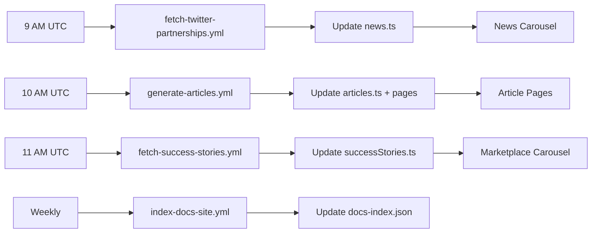

# Architecture

## Technology Stack

### Core Technologies
- **[Astro](https://astro.build)** - Static site generator with component islands architecture
- **Astro Components** - Component-based templating system using `.astro` files
- **TypeScript** - Type-safe data structures for content management
- **HTML5 & CSS3** - Modern web standards for structure and styling
- **JavaScript** - Client-side interactivity and animations

### Content Generation
- **Anthropic Claude API** - AI-powered content generation (Sonnet 4.5)
- **Twitter API v2** - Social media content fetching
- **Automated Workflows** - Daily content generation and updates

### Infrastructure
- **GitHub Pages** - Static site hosting via `gh-pages` branch
- **GitHub Actions** - CI/CD pipeline for automated testing, deployment, and content generation
- **Playwright** - End-to-end testing framework with cross-browser support
- **Node.js 20** - Build tooling and development environment

## Project Structure

```
bws-website-front/
├── src/                       # Source code
│   ├── pages/                 # Astro pages (routes)
│   │   ├── index.astro        # Homepage
│   │   ├── about.astro        # About page
│   │   ├── industries.astro   # Industries overview
│   │   ├── articles/          # ⭐ Auto-generated article pages
│   │   │   ├── x-bot-*.astro
│   │   │   ├── blockchain-badges-*.astro
│   │   │   ├── esg-credits-*.astro
│   │   │   └── fan-game-cube-*.astro
│   │   ├── marketplace/       # Marketplace product pages
│   │   └── industry-content/  # Industry-specific pages
│   ├── components/            # Reusable Astro components
│   │   ├── Navigation.astro   # Main navigation
│   │   ├── Footer.astro       # Footer component
│   │   ├── Scripts.astro      # JavaScript includes
│   │   ├── articles/          # ⭐ Auto-generated article content components
│   │   ├── home/              # Homepage-specific components
│   │   │   ├── NewsCarousel.astro              # Partnership news
│   │   │   ├── MarketplaceAnnouncementCarousel.astro  # Success stories
│   │   │   └── SuccessStory.astro              # Success story cards
│   │   └── *MainContent.astro # Page-specific content
│   ├── layouts/               # Page layouts
│   │   └── BaseLayout.astro   # Main layout wrapper
│   └── data/                  # ⭐ TypeScript data files
│       ├── articles.ts        # Article metadata (auto-updated)
│       ├── successStories.ts  # Success stories (auto-updated)
│       ├── news.ts           # Partnership news (auto-updated)
│       ├── solutions.ts      # Marketplace solutions
│       ├── quarterContent.ts # Roadmap content
│       └── quarterLearnings.ts # Roadmap learnings
├── public/                    # Static assets (served as-is)
│   ├── styles.css            # Consolidated CSS (from Webflow)
│   ├── CNAME                 # Custom domain configuration
│   └── assets/               # Images, fonts, JS files
│       ├── images/           # All image assets
│       │   ├── articles/     # ⭐ Auto-downloaded article images
│       │   ├── success-stories/ # ⭐ Auto-downloaded partnership images
│       │   ├── news/         # ⭐ Auto-downloaded news images
│       │   └── ...           # Static images
│       ├── fonts/            # Web fonts
│       └── js/               # JavaScript libraries
├── scripts/                   # ⭐ Build and automation scripts
│   ├── generate-articles.js  # Daily article generation
│   ├── fetch-success-stories.js # Daily success story fetch
│   ├── fetch-twitter-partnerships.js # Daily partnership fetch
│   ├── index-docs-site.js    # Weekly docs indexing
│   ├── data/                 # Script data and state
│   │   ├── processed-article-tweets.json
│   │   ├── processed-success-story-tweets.json
│   │   ├── processed-tweets.json
│   │   ├── manual-success-stories.json
│   │   └── docs-index.json
│   └── ...                   # Build utilities
├── tests/                    # Test suite (isolated npm ecosystem)
│   ├── node_modules/         # Test dependencies
│   ├── package.json          # Test configuration
│   ├── playwright.config.cjs # Playwright configuration
│   ├── e2e/                  # End-to-end tests
│   ├── smoke/                # Production smoke tests
│   ├── visual/               # Visual regression tests
│   ├── performance/          # Performance tests
│   ├── accessibility/        # WCAG compliance tests
│   └── page-objects/         # Page Object Model classes
├── docs/                     # Documentation
│   ├── workflows/            # Workflow automation docs
│   └── ...                   # Architecture, building, testing
├── .github/                  # GitHub configuration
│   └── workflows/            # ⭐ CI/CD and automation workflows
│       ├── main-deploy.yml   # Main deployment pipeline
│       ├── generate-articles.yml       # Daily at 10 AM UTC
│       ├── fetch-success-stories.yml   # Daily at 11 AM UTC
│       ├── fetch-twitter-partnerships.yml # Daily at 9 AM UTC
│       ├── index-docs-site.yml         # Weekly on Sunday
│       ├── monitor.yml       # Every 6 hours
│       ├── rollback.yml      # Manual emergency rollback
│       └── fix-branch.yml    # Automated fix branch creation
├── _site/                    # Build output (generated, DO NOT EDIT)
├── node_modules/             # Project dependencies
├── package.json              # Project configuration
└── astro.config.mjs          # Astro configuration
```

## Design Principles

### Component Architecture
- **Component Islands**: Astro's partial hydration for optimal performance
- **Static First**: Generate static HTML at build time
- **Progressive Enhancement**: JavaScript enhances but isn't required
- **Separation of Concerns**: Clear boundaries between source, build, automation, and tests
- **Type Safety**: TypeScript interfaces for all data structures

### Content Architecture

**Two-Tier Content System:**

1. **Automated Content** (AI-Generated)
   - Articles (SEO-focused product pages)
   - Success Stories (customer partnerships)
   - Partnership News (news carousel)

2. **Manual Content** (Hand-Crafted)
   - Core pages (About, Industries, etc.)
   - Marketplace product pages
   - Roadmap and learnings

### Folder Organization
- **Root Cleanliness**: Single package.json in root for project dependencies
- **Isolated Test Dependencies**: Tests have separate dependency tree
- **Source Clarity**: All source code in `src/` and `public/`
- **Generated Separation**: Build output clearly marked as `_site/`
- **Scripts Folder**: All automation and build scripts in dedicated `scripts/` directory

## Content Generation Architecture

### Daily Automation Pipeline



### Content System Separation

**Articles System** (SEO-focused product content)
- **Script:** `scripts/generate-articles.js`
- **Workflow:** `.github/workflows/generate-articles.yml` (10 AM UTC daily)
- **Input:** @BWSCommunity tweets (product-related)
- **Output:**
  - `src/data/articles.ts` - Article metadata
  - `src/pages/articles/*.astro` - Article pages
  - `src/components/articles/*MainContent.astro` - Content components
  - `public/assets/images/articles/` - Article images
- **Display:** Article pages at `/articles/*.html`
- **Features:** Image lightbox, SEO optimization, AI-generated content
- **Purpose:** Product education, search engine visibility

**Success Stories System** (Customer partnerships)
- **Script:** `scripts/fetch-success-stories.js`
- **Workflow:** `.github/workflows/fetch-success-stories.yml` (11 AM UTC daily)
- **Input:** @BWSCommunity tweets (success stories) + manual config
- **Output:**
  - `src/data/successStories.ts` - Partnership data
  - `public/assets/images/success-stories/` - Partnership images
- **Display:** Marketplace carousel on homepage
- **Features:** Image lightbox, Swiper.js carousel, client-focused summaries
- **Purpose:** Social proof, partnership highlights

**Partnership News System** (News carousel)
- **Script:** `scripts/fetch-twitter-partnerships.js`
- **Workflow:** `.github/workflows/fetch-twitter-partnerships.yml` (9 AM UTC daily)
- **Input:** @BWSCommunity tweets (starting with "Partnership")
- **Output:**
  - `src/data/news.ts` - News items
  - `public/assets/images/news/` - News images
- **Display:** News carousel on homepage
- **Features:** AI-generated summaries, image handling
- **Purpose:** Partnership announcements, company news

**IMPORTANT:** These three systems are completely independent and do NOT write to each other's data files.

## Build Architecture

### Build Pipeline
1. **Source Files** (`src/`) → Astro processes templates and TypeScript data
2. **Static Assets** (`public/`) → Copied directly to output
3. **Auto-Generated Content** → Articles, success stories, news integrated during build
4. **Build Output** (`_site/`) → Complete static website

### CSS Architecture
- Single consolidated CSS file (`/public/styles.css`)
- Migrated from Webflow with optimizations
- Served directly without processing
- All styles in one place for maintainability
- Custom classes for dynamic content (`.article-image-clickable`, `.success-story-image-clickable`)

### TypeScript Data Architecture

All content uses strongly-typed TypeScript interfaces:

**Articles:**
```typescript
export interface ArticleMetadata {
  slug: string;
  product: string;
  title: string;
  subtitle: string;
  publishDate: string;
  tweetId: string;
  featuredImage?: ArticleImage;
  seoDescription: string;
}
```

**Success Stories:**
```typescript
export interface SuccessStory {
  product: string;
  title: string;
  description: string;
  image?: SuccessStoryImage;
  buttons?: SuccessStoryButton[];
  tweetUrl?: string;
  tweetId?: string;
}
```

## Deployment Architecture

### GitHub Pages Setup
- **Source Branch**: `master`
- **Deployment Branch**: `gh-pages`
- **Custom Domain**: www.bws.ninja (via CNAME)
- **SSL**: Provided automatically by GitHub Pages

### CI/CD Pipeline (main-deploy.yml)
1. **Push to master** → Triggers GitHub Actions
2. **Test Job** → Runs Playwright test suite (Chromium)
3. **Build Job** → Creates production build with Astro
4. **Deploy Job** → Pushes to gh-pages branch
5. **Validate Job** → Smoke tests on production

### Content Automation Workflows

**Daily Workflows:**
- `fetch-twitter-partnerships.yml` - 9:00 AM UTC
- `generate-articles.yml` - 10:00 AM UTC
- `fetch-success-stories.yml` - 11:00 AM UTC

**Weekly Workflows:**
- `index-docs-site.yml` - Sunday 3:00 AM UTC

**Continuous Monitoring:**
- `monitor.yml` - Every 6 hours

**Emergency:**
- `rollback.yml` - Manual trigger only

### Workflow Failure Handling

All content generation workflows include automatic failure handling:
1. Create timestamped fix branch
2. Generate detailed failure report
3. Open Pull Request with debugging steps
4. Create tracking issue
5. Preserve system state for investigation

## Performance Considerations

### Static Site Benefits
- No server-side processing required
- CDN distribution via GitHub Pages
- Optimal caching strategies
- Minimal JavaScript footprint
- Pre-rendered HTML for instant load times

### Optimization Strategies
- Image optimization before commit
- CSS consolidation and minification
- HTML prettification for consistency
- Lazy loading for below-fold content
- Lighthouse performance monitoring

### Content Generation Efficiency
- Daily automation runs during low-traffic hours
- Deduplication prevents re-processing
- Image size validation before download
- Build verification before commit
- Incremental updates (only changed files)

## Client-Side Features

### Image Lightbox System

**Two Separate Implementations:**

1. **Article Image Lightbox** (`article-image-lightbox`)
   - Used in article pages
   - Handles multiple images per article
   - Floating right layout with clickable images

2. **Success Story Lightbox** (`success-story-lightbox`)
   - Used in marketplace carousel
   - Single image per success story
   - Swiper.js carousel integration

**Common Features:**
- Full-screen overlay on click
- Close with X button, background click, or Escape key
- Prevents body scroll when open
- Responsive image sizing

### Carousel Systems

**News Carousel** (`NewsCarousel.astro`)
- Displays partnership announcements
- Auto-rotation every 5 seconds
- Manual navigation controls
- Responsive breakpoints

**Marketplace Announcement Carousel** (`MarketplaceAnnouncementCarousel.astro`)
- Displays success stories
- Swiper.js integration
- Clickable images with lightbox
- Multiple slides visible on desktop

## Security Considerations

### Static Security
- No server-side vulnerabilities
- No database or dynamic content risks
- HTTPS enforced via GitHub Pages
- No user data processing
- All content generated at build time

### API Security
- API keys stored in GitHub Secrets
- Never committed to repository
- Scoped to minimal required permissions
- Twitter API: Read-only access
- Anthropic API: Content generation only

### Development Security
- Dependencies isolated and managed
- No secrets in repository
- Public repository transparency
- Automated security updates via Dependabot
- Workflow permissions matrix documented

### Content Integrity
- All auto-generated content reviewed before display
- Deduplication prevents content manipulation
- State tracking prevents re-processing attacks
- Build validation ensures site integrity
- Version control provides audit trail

## AI Integration Architecture

### Anthropic Claude Integration

**Model:** Claude Sonnet 4.5 (`claude-sonnet-4-5-20250929`)

**Usage Patterns:**

1. **Article Generation**
   - Product classification from tweet content
   - Title and subtitle generation
   - Full article content with structured sections
   - SEO meta descriptions
   - Image alt text generation

2. **Success Story Summaries**
   - Client-focused descriptions
   - Key capabilities highlighting
   - Business value extraction
   - Partner name prominence

3. **Partnership News**
   - Concise summaries (max 150 chars)
   - Partner name extraction
   - Key benefit identification

**Content Guidelines:**
- Problem-solution narrative structure
- Benefit-driven messaging
- Proof-backed claims when available
- SEO optimization with natural keywords
- Client-first language for success stories

### Twitter API Integration

**API Version:** Twitter API v2

**Endpoints Used:**
- User lookup (get @BWSCommunity ID)
- User timeline (fetch recent tweets)
- Tweet search (find success stories)

**Data Extracted:**
- Tweet text content
- Media attachments (images)
- Tweet metadata (ID, URL, timestamp)
- Quoted/retweeted content
- Media URLs with size information

**Rate Limits:**
- 1,500 timeline requests per 15 minutes
- 900 user lookups per 15 minutes
- Well within limits (~10 requests/day total)

## Testing Architecture

### Test Organization

**Separate npm Ecosystem:**
- Independent `node_modules/` and `package.json`
- Isolated from project dependencies
- Playwright as primary testing framework

**Test Suites:**
1. **Smoke Tests** - Quick health checks
2. **E2E Tests** - Full user flows
3. **Visual Tests** - Screenshot regression
4. **Performance Tests** - Load time validation
5. **Accessibility Tests** - WCAG compliance

### Testing in CI/CD

**Pre-Deployment:**
- All tests must pass before deploy
- Test failures create GitHub issues
- Artifacts preserved for debugging

**Post-Deployment:**
- Smoke tests validate production
- Monitoring workflow runs every 6 hours
- Alerts created for failures

## Monitoring and Observability

### Production Monitoring
- HTTP status checks
- Response time measurement (<3s threshold)
- SSL certificate validation
- Critical resource availability
- Lighthouse performance audits (manual)

### Content Generation Monitoring
- Daily workflow success/failure
- Auto-created issues for failures
- Pull requests with debugging info
- State tracking in JSON files
- Failure count increments

### Error Handling Strategy
1. **Detection** - Workflow failure or monitoring alert
2. **Documentation** - Automated failure report generation
3. **Notification** - Issue and PR creation
4. **Investigation** - Detailed logs and debugging steps
5. **Recovery** - Fix implementation and re-run
6. **Rollback** - Emergency rollback capability if needed

## Development Workflow

### Local Development
```bash
npm run dev        # Start dev server (port 8087)
npm run build      # Build production site
npm run preview    # Preview built site
```

### Content Generation Testing
```bash
# Set environment variables
export TWITTER_BEARER_TOKEN="..."
export ANTHROPIC_API_KEY="..."

# Run scripts locally
node scripts/generate-articles.js
node scripts/fetch-success-stories.js
node scripts/fetch-twitter-partnerships.js
```

### Testing Workflow
```bash
cd tests
npm install               # Install test dependencies
npm test                  # Run all tests
npm run test:smoke        # Quick health checks
npm run test:e2e          # End-to-end tests
npm run test:ui           # Interactive UI mode
```

### Deployment Workflow
1. Make changes locally
2. Test with `npm run build`
3. Run tests: `cd tests && npm test`
4. Commit and push to master
5. GitHub Actions handles deployment
6. Monitor workflow in Actions tab
7. Verify production after deployment

## Related Documentation

- **[Workflows Overview](./workflows/GITHUB_ACTIONS.md)** - Complete workflow reference
- **[Article Generation](./workflows/ARTICLE_GENERATION.md)** - Article automation details
- **[Success Stories](./workflows/SUCCESS_STORIES_AUTOMATION.md)** - Success story automation
- **[Building Guide](./BUILDING.md)** - Build procedures and commands
- **[Testing Guide](./TESTING.md)** - Test setup and execution
- **[Development Guidelines](./DEVELOPMENT_GUIDELINES.md)** - Code standards and practices
