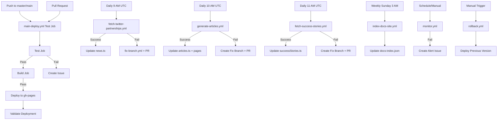

# GitHub Actions Workflows Documentation

## Overview

This repository uses GitHub Actions to automate testing, deployment, monitoring, content generation, and maintenance of the BWS website. The workflows are designed to ensure code quality, automate deployments, monitor production health, and keep content fresh.

## Workflow Dependency Diagram



## Workflows

### 1. main-deploy.yml - Main CI/CD Pipeline
**Purpose:** Complete CI/CD pipeline for testing, building, and deploying the website to GitHub Pages.

**Triggers:**
- Push to `main` or `master` branches
- Pull requests to `main` or `master` branches
- Manual workflow dispatch

**Jobs:**
1. **Test** (matrix: chromium)
   - Runs Playwright tests
   - Captures test results in JSON format
   - Creates GitHub issues on failure with detailed error reports

2. **Build** (depends on: test)
   - Builds production site with Astro
   - Creates deployment artifact

3. **Deploy** (depends on: build)
   - Deploys to GitHub Pages (`gh-pages` branch)
   - Updates CNAME for custom domain

4. **Validate Deployment** (depends on: deploy)
   - Runs smoke tests against production
   - Creates critical issues for production failures

**On Success:**
- ✅ Site is deployed to production (https://www.bws.ninja)
- ✅ All test artifacts are uploaded
- ✅ Deployment is validated with smoke tests

**On Failure:**
- ❌ Workflow stops at failed stage
- ❌ Automated GitHub issue created with detailed error reports
- ❌ Subsequent jobs (build/deploy) are skipped

**Permissions Required:**
- `contents: write` (for deployment)
- `pages: write` (for GitHub Pages)
- `id-token: write` (for OIDC)
- `pull-requests: write` (for PR comments)
- `issues: write` (for creating issues)

---

### 2. fetch-twitter-partnerships.yml - Partnership Announcements
**Purpose:** Daily automation to fetch partnership announcements from @BWSCommunity and add them to the news carousel.

**Triggers:**
- Schedule: Daily at 9:00 AM UTC (`0 9 * * *`)
- Manual workflow dispatch

**Process:**
1. Fetches last 50 tweets from @BWSCommunity
2. Filters for tweets starting with "Partnership"
3. Downloads images and generates AI summaries via Claude
4. Updates `src/data/news.ts`
5. Commits and pushes changes

**On Success:**
- ✅ New partnerships added to news carousel
- ✅ Images downloaded to `/public/assets/images/news/`
- ✅ Changes committed automatically

**On Failure:**
- ❌ Creates fix branch with failure report
- ❌ Opens PR with debugging steps
- ❌ Creates tracking issue

**Permissions Required:**
- `contents: write`
- `issues: write`
- `pull-requests: write`

**Required Secrets:**
- `TWITTER_BEARER_TOKEN` - X API read access
- `ANTHROPIC_API_KEY` - Claude AI for summaries

**Documentation:** See [TWITTER_PARTNERSHIP_AUTOMATION.md](./TWITTER_PARTNERSHIP_AUTOMATION.md)

---

### 3. generate-articles.yml - Article Generation
**Purpose:** Daily automation to generate SEO-optimized article pages from product tweets.

**Triggers:**
- Schedule: Daily at 10:00 AM UTC (`0 10 * * *`) - 1 hour after partnerships
- Manual workflow dispatch

**Process:**
1. Fetches tweets from @BWSCommunity
2. Classifies product-related content (X Bot, Blockchain Badges, ESG Credits, Fan Game Cube)
3. Generates article pages with Claude AI
4. Creates Astro page components with image lightbox
5. Updates `src/data/articles.ts`
6. Downloads images to `/public/assets/images/articles/`

**Output Files:**
- `src/data/articles.ts` - Article metadata
- `src/pages/articles/*.astro` - Article pages
- `src/components/articles/*MainContent.astro` - Article content components

**On Success:**
- ✅ New article pages created
- ✅ SEO-optimized content with images
- ✅ Clickable image lightbox functionality

**On Failure:**
- ❌ Creates fix branch with detailed failure report
- ❌ Opens PR with debugging steps
- ❌ Creates tracking issue

**Permissions Required:**
- `contents: write`
- `issues: write`
- `pull-requests: write`

**Required Secrets:**
- `TWITTER_BEARER_TOKEN`
- `ANTHROPIC_API_KEY`

**Important:** Does NOT write to `successStories.ts` - articles and success stories are separate systems

---

### 4. fetch-success-stories.yml - Success Stories
**Purpose:** Daily automation to fetch customer success stories for the marketplace carousel.

**Triggers:**
- Schedule: Daily at 11:00 AM UTC (`0 11 * * *`) - 1 hour after articles
- Manual workflow dispatch

**Process:**
1. Searches for tweets with "Success Story" text
2. Processes manual success stories from config
3. Generates client-focused summaries via Claude
4. Downloads partnership images (with size requirements)
5. Updates `src/data/successStories.ts`

**Output Files:**
- `src/data/successStories.ts` - Partnership success stories
- `/public/assets/images/success-stories/` - Partnership images

**On Success:**
- ✅ New success stories added to marketplace carousel
- ✅ Real customer partnerships highlighted
- ✅ Clickable image lightbox on carousel

**On Failure:**
- ❌ Creates fix branch with failure report
- ❌ Opens PR with debugging steps
- ❌ Creates tracking issue

**Permissions Required:**
- `contents: write`
- `issues: write`
- `pull-requests: write`

**Required Secrets:**
- `TWITTER_BEARER_TOKEN`
- `ANTHROPIC_API_KEY`

**Important:** Does NOT write to `articles.ts` - success stories and articles are separate systems

---

### 5. index-docs-site.yml - Documentation Indexing
**Purpose:** Weekly automation to index the docs.bws.ninja documentation site for search and reference.

**Triggers:**
- Schedule: Weekly on Sunday at 3:00 AM UTC (`0 3 * * 0`)
- Manual workflow dispatch

**Process:**
1. Crawls docs.bws.ninja website
2. Extracts documentation content
3. Creates searchable index with Claude AI
4. Updates `scripts/data/docs-index.json`

**On Success:**
- ✅ Documentation index updated
- ✅ Changes committed with `[skip ci]` flag

**Permissions Required:**
- `contents: write`

**Required Secrets:**
- `ANTHROPIC_API_KEY`

---

### 6. monitor.yml - Production Health Monitoring
**Purpose:** Scheduled monitoring of production site health and performance.

**Triggers:**
- Schedule: Every 6 hours (`0 */6 * * *`)
- Manual workflow dispatch

**Health Checks:**
1. HTTP status verification
2. Response time measurement (<3s threshold)
3. SSL certificate validation
4. Critical resource availability
5. Lighthouse performance audit (manual only)

**On Success:**
- ✅ All health checks pass
- ✅ Logs success metrics

**On Failure:**
- ❌ Creates/updates monitoring alert issue
- ❌ Labels: `monitoring`, `production`, `urgent`
- ❌ Includes failure details and action items

**Permissions Required:**
- `contents: read`
- `issues: write`

---

### 7. rollback.yml - Emergency Rollback
**Purpose:** Quickly rollback production to a previous working version.

**Triggers:**
- Manual workflow dispatch only
- Input: specific commit SHA (optional)

**Rollback Process:**
1. Checkout target commit (specified or HEAD~1)
2. Rebuild site from that commit
3. Deploy to production
4. Verify deployment
5. Create rollback documentation issue

**On Success:**
- ✅ Previous version deployed
- ✅ Rollback issue created with details
- ✅ Site verified as accessible

**On Failure:**
- ❌ Production remains in current state
- ❌ Manual intervention required

**Permissions Required:**
- `contents: write`
- `pages: write`
- `id-token: write`

---

### 8. fix-branch.yml - Automated Fix Branch Creation
**Purpose:** Helper workflow used by other workflows to create fix branches on failure.

**Triggers:**
- Called by other workflows (not standalone)

**Used By:**
- `fetch-twitter-partnerships.yml`
- `generate-articles.yml`
- `fetch-success-stories.yml`

**Actions:**
- Creates timestamped fix branch
- Generates failure report
- Opens PR with debugging instructions
- Creates tracking issue

---

## Workflow Status

### ✅ Active Workflows
1. **main-deploy.yml** - Main CI/CD pipeline with testing, building, and deployment
2. **fetch-twitter-partnerships.yml** - Daily partnership announcements (9 AM UTC)
3. **generate-articles.yml** - Daily article generation (10 AM UTC)
4. **fetch-success-stories.yml** - Daily success stories (11 AM UTC)
5. **index-docs-site.yml** - Weekly docs indexing (Sunday 3 AM UTC)
6. **monitor.yml** - Production health monitoring (every 6 hours)
7. **rollback.yml** - Emergency rollback capability (manual)
8. **fix-branch.yml** - Automated fix branch creation (helper)

### 🗑️ Removed Workflows
1. **html-validate.yml** - Removed (referenced non-existent npm scripts)
2. **test.yml** - Removed (duplicate of main-deploy.yml test job)
3. **deploy.yml** - Renamed to main-deploy.yml

---

## Daily Automation Schedule

**9:00 AM UTC** - `fetch-twitter-partnerships.yml`
- Fetches partnership announcements
- Updates news carousel

**10:00 AM UTC** - `generate-articles.yml`
- Generates product article pages
- Updates articles section

**11:00 AM UTC** - `fetch-success-stories.yml`
- Fetches customer success stories
- Updates marketplace carousel

**Weekly Sunday 3:00 AM UTC** - `index-docs-site.yml`
- Indexes documentation site

**Every 6 hours** - `monitor.yml`
- Production health monitoring

---

## Workflow Relationships

### Primary Pipeline
```
main-deploy.yml (main branch) → GitHub Pages → Production
     ↓ (on failure)
GitHub Issue → Manual Investigation
```

### Content Generation Pipeline
```
9 AM: Partnerships → news.ts → News Carousel
10 AM: Articles → articles.ts + pages → Articles Section
11 AM: Success Stories → successStories.ts → Marketplace Carousel
```

### Monitoring Loop
```
monitor.yml (every 6hrs) → Health Checks
     ↓ (on failure)
Alert Issue → Manual Investigation → rollback.yml (if needed)
```

### Pull Request Flow
```
PR Created → main-deploy.yml (test job only)
     ↓ (must pass)
PR Merge → main-deploy.yml (full pipeline) → Production
```

---

## Environment Variables

| Variable | Used In | Purpose |
|----------|---------|---------|
| `CI` | All workflows | Indicates CI environment |
| `NODE_ENV` | deploy, rollback | Build environment (production) |
| `PLAYWRIGHT_BASE_URL` | deploy, test, monitor | Test target URL |
| `NO_WEBSERVER` | deploy | Skip test server startup |
| `PORT` | deploy | Test server port (4321) |
| `PRODUCTION_URL` | monitor | Production site URL |

---

## Required Secrets

| Secret | Used In | Purpose |
|--------|---------|---------|
| `TWITTER_BEARER_TOKEN` | partnerships, articles, success stories | X API access |
| `ANTHROPIC_API_KEY` | partnerships, articles, success stories, docs indexing | Claude AI content generation |
| `GITHUB_TOKEN` | All workflows | GitHub API access (auto-provided) |

---

## Permissions Matrix

| Workflow | Contents | Pages | ID Token | PRs | Issues |
|----------|----------|-------|----------|-----|--------|
| main-deploy.yml | write | write | write | write | write |
| fetch-twitter-partnerships.yml | write | - | - | write | write |
| generate-articles.yml | write | - | - | write | write |
| fetch-success-stories.yml | write | - | - | write | write |
| index-docs-site.yml | write | - | - | - | - |
| monitor.yml | read | - | - | - | write |
| rollback.yml | write | write | write | - | - |
| fix-branch.yml | write | - | - | write | write |

---

## Content System Architecture

### Two Separate Content Systems

**1. Articles System** (SEO-focused product content)
- **Script:** `scripts/generate-articles.js`
- **Workflow:** `generate-articles.yml` (10 AM UTC)
- **Output:** `src/data/articles.ts` + article page files
- **Display:** Article pages at `/articles/*.html`
- **Purpose:** SEO optimization, product education

**2. Success Stories System** (Customer partnerships)
- **Script:** `scripts/fetch-success-stories.js`
- **Workflow:** `fetch-success-stories.yml` (11 AM UTC)
- **Output:** `src/data/successStories.ts`
- **Display:** Marketplace carousel on homepage
- **Purpose:** Social proof, partnership highlights

**Important:** These systems are completely independent and do NOT write to each other's files.

---

## Workflow Commands

### Manual Triggers
```bash
# Run deployment manually
gh workflow run main-deploy.yml

# Fetch partnerships
gh workflow run fetch-twitter-partnerships.yml

# Generate articles
gh workflow run generate-articles.yml

# Fetch success stories
gh workflow run fetch-success-stories.yml

# Index documentation
gh workflow run index-docs-site.yml

# Trigger monitoring check
gh workflow run monitor.yml

# Rollback to previous version
gh workflow run rollback.yml

# Rollback to specific commit
gh workflow run rollback.yml -f commit_sha=abc123
```

### View Workflow Status
```bash
# List recent workflow runs
gh run list

# View specific run details
gh run view <run-id>

# Watch workflow in progress
gh run watch
```

---

## Troubleshooting

### Content Generation Failures

**Check:**
1. Workflow logs in Actions tab
2. `TWITTER_BEARER_TOKEN` secret validity
3. `ANTHROPIC_API_KEY` secret validity
4. Twitter API status
5. Anthropic API status

**Common Causes:**
- Expired API tokens
- Rate limits exceeded
- Network connectivity issues
- Malformed tweet content
- Image download failures

**Solution:**
- Review auto-created fix branch and PR
- Update secrets if expired
- Re-run workflow manually after fixing

### Deployment Failures

**Check:**
1. Test results in workflow logs
2. Build errors
3. GitHub Pages settings

**Solution:**
- Fix failing tests
- Resolve build errors
- Use rollback.yml if urgent

---

## Best Practices

1. **Monitor Actions Tab** - Check workflow runs regularly
2. **Review Auto-Created PRs** - Fix branches contain valuable debugging info
3. **Update Secrets** - Rotate API tokens before expiration
4. **Test Locally First** - Run scripts locally before pushing
5. **Use Rollback** - Quick recovery for critical issues
6. **Check Rate Limits** - Monitor API usage to avoid limits

---

## Related Documentation

- [GitHub Pages Deployment](./GITHUB_PAGES_DEPLOYMENT.md)
- [Twitter Partnership Automation](./TWITTER_PARTNERSHIP_AUTOMATION.md)
- [Architecture Overview](../ARCHITECTURE.md)
- [Testing Guide](../TESTING.md)
