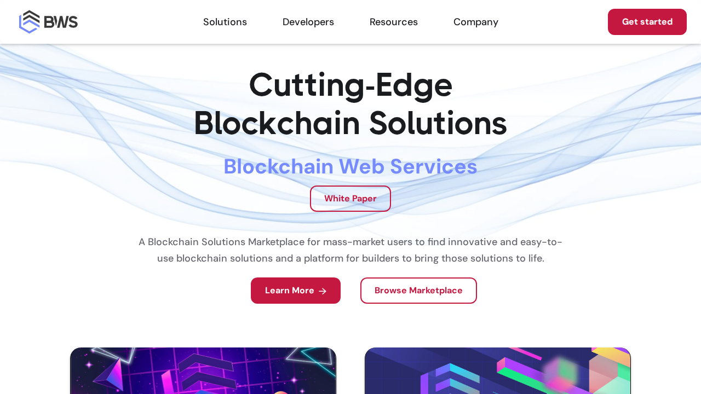
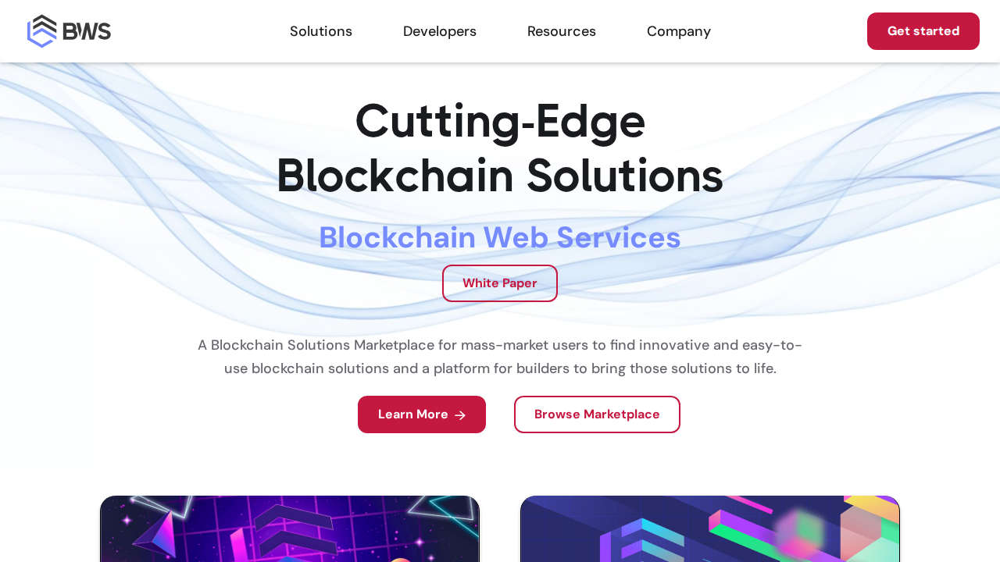

# Test Failure Report - Fix Branch

**Generated:** 2025-10-05 19:44:30 UTC
**Branch:** fix/test-failures-2025-09-28T15-58-27-e2206f4
**Commit:** db23f73de307486b46be1f7757efcc26fea0ff94
**Workflow Run:** [View Run](https://github.com/blockchain-web-services/bws-website-front/actions/runs/18263312338)

## 🔁 Recurring Issues Analysis

Comparing with previous reports:
- BRANCH_ISSUES_05-10-16.md
- BRANCH_ISSUES_29-09-13.md
- BRANCH_ISSUES_29-09-16.md
- BRANCH_ISSUES_29-09-17.md
- BRANCH_ISSUES_30-09-06.md

### Known Recurring Issues:
- ⚠️ **WCAG Color Contrast Failures** (wcag-compliance.spec.js)
  - Appears in 4 of last 5 reports
  - Error: Color contrast violations not meeting WCAG AA 4.5:1 or AAA 3:1 standards

## Test Results
### 📊 Test Statistics
- **Total Tests:** 119
- **✅ Passed:** 84
- **❌ Failed:** 30
- **⚠️ Flaky:** 0
- **⏭ Skipped:** 5
- **⏱ Duration:** 847273.929ms

### 🔴 Failed Tests Summary

## 🔍 Enhanced Error Diagnostics

No enhanced diagnostics available - diagnostics directory not created.

_This is expected if no tests failed or error-reporting functions weren't called._

## 📋 Detailed Test Failures

### Failure #1

**Test:** `     Fix: Fix any of the following:`

**Error Details:**
```
Error: expect(received).toEqual(expected) // deep equality
        at /home/runner/work/bws-website-front/bws-website-front/tests/accessibility/wcag-compliance.spec.js:33:49
    test-results/accessibility-wcag-complia-62f5f-passes-accessibility-checks-chromium/test-failed-1.png
    Error Context: test-results/accessibility-wcag-complia-62f5f-passes-accessibility-checks-chromium/error-context.md
```

**WCAG Violations:**
```
=== WCAG Violations Detected ===
1. frame-title: Frames must have an accessible name
1. frame-title: Frames must have an accessible name
   Impact: serious
   Impact: serious
   Description: Ensure <iframe> and <frame> elements have an accessible name
   Description: Ensure <iframe> and <frame> elements have an accessible name
   Affected nodes: 1
   Affected nodes: 1
   - Node 1: <iframe scrolling="no" frameborder="0" id="player" src="https://player.vimeo.com/video/976431707?app...
   - Node 1: <iframe scrolling="no" frameborder="0" id="player" src="https://player.vimeo.com/video/976431707?app...
     Fix: Fix any of the following:
     Fix: Fix any of the following:
  ✓    4 [chromium] › accessibility/wcag-compliance.spec.js:36:3 › WCAG Accessibility Compliance › About page passes accessibility checks (4.4s)
  ✘    3 [chromium] › accessibility/wcag-compliance.spec.js:6:3 › WCAG Accessibility Compliance › Homepage passes accessibility checks (8.1s)
  ✓    5 [chromium] › accessibility/wcag-compliance.spec.js:61:3 › WCAG Accessibility Compliance › All images have alt text (3.0s)
  ✓    7 [chromium] › accessibility/wcag-compliance.spec.js:87:3 › WCAG Accessibility Compliance › All form inputs have labels (2.4s)
  ✓    8 [chromium] › accessibility/wcag-compliance.spec.js:130:3 › WCAG Accessibility Compliance › Keyboard navigation works correctly (3.5s)
=== WCAG Violations Detected ===
=== WCAG Violations Detected ===
1. frame-title: Frames must have an accessible name
1. frame-title: Frames must have an accessible name
   Impact: serious
   Impact: serious
   Description: Ensure <iframe> and <frame> elements have an accessible name
   Description: Ensure <iframe> and <frame> elements have an accessible name
   Affected nodes: 1
   Affected nodes: 1
   - Node 1: <iframe scrolling="no" frameborder="0" id="player" src="https://player.vimeo.com/video/976431707?app...
   - Node 1: <iframe scrolling="no" frameborder="0" id="player" src="https://player.vimeo.com/video/976431707?app...
     Fix: Fix any of the following:
     Fix: Fix any of the following:
  ✓    9 [chromium] › accessibility/wcag-compliance.spec.js:157:3 › WCAG Accessibility Compliance › Color contrast meets WCAG standards (12.1s)
  ✘    6 [chromium] › accessibility/wcag-compliance.spec.js:6:3 › WCAG Accessibility Compliance › Homepage passes accessibility checks (retry #1) (17.3s)
  ✓   10 [chromium] › accessibility/wcag-compliance.spec.js:198:3 › WCAG Accessibility Compliance › Page has proper heading hierarchy (2.9s)
  ✓   11 [chromium] › accessibility/wcag-compliance.spec.js:263:3 › WCAG Accessibility Compliance › ARIA landmarks are properly used (3.4s)
  ✓   13 [chromium] › accessibility/wcag-compliance.spec.js:303:3 › WCAG Accessibility Compliance › Focus trap in modals works correctly (3.3s)
  ✓   15 [chromium] › assets.spec.js:47:3 › Asset Verification Tests › AssureDefi image size check (4.0s)
=== WCAG Violations Detected ===
=== WCAG Violations Detected ===
1. frame-title: Frames must have an accessible name
1. frame-title: Frames must have an accessible name
   Impact: serious
   Impact: serious
   Description: Ensure <iframe> and <frame> elements have an accessible name
   Description: Ensure <iframe> and <frame> elements have an accessible name
   Affected nodes: 1
   Affected nodes: 1
   - Node 1: <iframe scrolling="no" frameborder="0" id="player" src="https://player.vimeo.com/video/976431707?app...
   - Node 1: <iframe scrolling="no" frameborder="0" id="player" src="https://player.vimeo.com/video/976431707?app...
     Fix: Fix any of the following:
     Fix: Fix any of the following:
  ✘   12 [chromium] › accessibility/wcag-compliance.spec.js:6:3 › WCAG Accessibility Compliance › Homepage passes accessibility checks (retry #2) (11.4s)
    Error: expect(received).toEqual(expected) // deep equality
        at /home/runner/work/bws-website-front/bws-website-front/tests/accessibility/wcag-compliance.spec.js:33:49
    test-results/accessibility-wcag-complia-62f5f-passes-accessibility-checks-chromium/test-failed-1.png
    Error Context: test-results/accessibility-wcag-complia-62f5f-passes-accessibility-checks-chromium/error-context.md
    Error: expect(received).toEqual(expected) // deep equality
        at /home/runner/work/bws-website-front/bws-website-front/tests/accessibility/wcag-compliance.spec.js:33:49
    test-results/accessibility-wcag-complia-62f5f-passes-accessibility-checks-chromium-retry1/test-failed-1.png
    Error Context: test-results/accessibility-wcag-complia-62f5f-passes-accessibility-checks-chromium-retry1/error-context.md
    test-results/accessibility-wcag-complia-62f5f-passes-accessibility-checks-chromium-retry1/trace.zip
        npx playwright show-trace test-results/accessibility-wcag-complia-62f5f-passes-accessibility-checks-chromium-retry1/trace.zip
    Error: expect(received).toEqual(expected) // deep equality
        at /home/runner/work/bws-website-front/bws-website-front/tests/accessibility/wcag-compliance.spec.js:33:49
    test-results/accessibility-wcag-complia-62f5f-passes-accessibility-checks-chromium-retry2/test-failed-1.png
    Error Context: test-results/accessibility-wcag-complia-62f5f-passes-accessibility-checks-chromium-retry2/error-context.md
  ✓   16 [chromium] › assets.spec.js:66:3 › Asset Verification Tests › Tokenomics image test (4.7s)
  ✓   17 [chromium] › assets.spec.js:86:3 › Asset Verification Tests › Blockchain Founders Group image test (3.8s)
  ✓   18 [chromium] › assets.spec.js:105:5 › Asset Verification Tests › Layout test on Desktop (3.7s)
  ✓   19 [chromium] › assets.spec.js:105:5 › Asset Verification Tests › Layout test on Tablet (3.1s)
  ✓   20 [chromium] › assets.spec.js:105:5 › Asset Verification Tests › Layout test on Mobile (2.8s)
  ✓   23 [chromium] › e2e/navigation.spec.js:80:3 › Navigation Tests › Footer navigation links work (5.6s)
  ✓   22 [chromium] › e2e/navigation.spec.js:38:3 › Navigation Tests › Industry dropdown navigation works (6.1s)
✓ 404 handling is working correctly for static site
✓ 404 handling is working correctly for static site
  ✓   25 [chromium] › e2e/navigation.spec.js:243:3 › Navigation Tests › 404 page handles non-existent routes (318ms)
  ✓   24 [chromium] › e2e/navigation.spec.js:207:3 › Navigation Tests › Logo click returns to homepage (3.6s)
  ✓   28 [chromium] › image-validation.spec.js:52:3 › Image Files and CSS Validation › Check image files exist in build directory (8ms)
  ✓   29 [chromium] › image-validation.spec.js:77:3 › Image Files and CSS Validation › Check CSS classes are defined with proper rules (42ms)
  ✓   30 [chromium] › image-validation.spec.js:150:3 › Image Files and CSS Validation › Check HTML for problematic attributes (12ms)
  ✓   26 [chromium] › e2e/navigation.spec.js:288:3 › Navigation Tests › All marketplace products are accessible (5.6s)
[32/154] [chromium] › image-validation.spec.js:454:3 › Image Visibility on Live Page › No 404 errors for images
✅ No 404 errors detected for images
[chromium] › image-validation.spec.js:454:3 › Image Visibility on Live Page › No 404 errors for images
✅ No 404 errors detected for images
  ✓   32 [chromium] › image-validation.spec.js:454:3 › Image Visibility on Live Page › No 404 errors for images (7.5s)
  ✘   31 [chromium] › image-validation.spec.js:273:3 › Image Visibility on Live Page › All critical images are visible and properly sized (10.7s)
  ✓   33 [chromium] › image-validation.spec.js:499:3 › Image Visibility on Live Page › Take screenshots for visual verification (6.6s)
  ✓   35 [chromium] › image-visibility-index.spec.js:17:3 › Image Visibility on Index Page › PROOF Logo visibility and CSS (5.1s)
  ✓   36 [chromium] › image-visibility-index.spec.js:73:3 › Image Visibility on Index Page › AssureDefi Logo visibility and CSS (4.8s)
  ✘   34 [chromium] › image-validation.spec.js:273:3 › Image Visibility on Live Page › All critical images are visible and properly sized (retry #1) (13.3s)
```

**Screenshot:** 
*(Original path: `test-results/accessibility-wcag-complia-62f5f-passes-accessibility-checks-chromium/test-failed-1.png`)*

**Trace Available:** `npx playwright show-trace test-results/accessibility-wcag-complia-62f5f-passes-accessibility-checks-chromium-retry1/trace.zip`

---

### Failure #2

**Test:** `     Fix: Fix any of the following:`

**Error Details:**
```
Error: expect(received).toEqual(expected) // deep equality
        at /home/runner/work/bws-website-front/bws-website-front/tests/accessibility/wcag-compliance.spec.js:33:49
    test-results/accessibility-wcag-complia-62f5f-passes-accessibility-checks-chromium/test-failed-1.png
    Error Context: test-results/accessibility-wcag-complia-62f5f-passes-accessibility-checks-chromium/error-context.md
```

**WCAG Violations:**
```
=== WCAG Violations Detected ===
1. frame-title: Frames must have an accessible name
1. frame-title: Frames must have an accessible name
   Impact: serious
   Impact: serious
   Description: Ensure <iframe> and <frame> elements have an accessible name
   Description: Ensure <iframe> and <frame> elements have an accessible name
   Affected nodes: 1
   Affected nodes: 1
   - Node 1: <iframe scrolling="no" frameborder="0" id="player" src="https://player.vimeo.com/video/976431707?app...
   - Node 1: <iframe scrolling="no" frameborder="0" id="player" src="https://player.vimeo.com/video/976431707?app...
     Fix: Fix any of the following:
     Fix: Fix any of the following:
  ✓    4 [chromium] › accessibility/wcag-compliance.spec.js:36:3 › WCAG Accessibility Compliance › About page passes accessibility checks (4.4s)
  ✘    3 [chromium] › accessibility/wcag-compliance.spec.js:6:3 › WCAG Accessibility Compliance › Homepage passes accessibility checks (8.1s)
  ✓    5 [chromium] › accessibility/wcag-compliance.spec.js:61:3 › WCAG Accessibility Compliance › All images have alt text (3.0s)
  ✓    7 [chromium] › accessibility/wcag-compliance.spec.js:87:3 › WCAG Accessibility Compliance › All form inputs have labels (2.4s)
  ✓    8 [chromium] › accessibility/wcag-compliance.spec.js:130:3 › WCAG Accessibility Compliance › Keyboard navigation works correctly (3.5s)
=== WCAG Violations Detected ===
=== WCAG Violations Detected ===
1. frame-title: Frames must have an accessible name
1. frame-title: Frames must have an accessible name
   Impact: serious
   Impact: serious
   Description: Ensure <iframe> and <frame> elements have an accessible name
   Description: Ensure <iframe> and <frame> elements have an accessible name
   Affected nodes: 1
   Affected nodes: 1
   - Node 1: <iframe scrolling="no" frameborder="0" id="player" src="https://player.vimeo.com/video/976431707?app...
   - Node 1: <iframe scrolling="no" frameborder="0" id="player" src="https://player.vimeo.com/video/976431707?app...
     Fix: Fix any of the following:
     Fix: Fix any of the following:
  ✓    9 [chromium] › accessibility/wcag-compliance.spec.js:157:3 › WCAG Accessibility Compliance › Color contrast meets WCAG standards (12.1s)
  ✘    6 [chromium] › accessibility/wcag-compliance.spec.js:6:3 › WCAG Accessibility Compliance › Homepage passes accessibility checks (retry #1) (17.3s)
  ✓   10 [chromium] › accessibility/wcag-compliance.spec.js:198:3 › WCAG Accessibility Compliance › Page has proper heading hierarchy (2.9s)
  ✓   11 [chromium] › accessibility/wcag-compliance.spec.js:263:3 › WCAG Accessibility Compliance › ARIA landmarks are properly used (3.4s)
  ✓   13 [chromium] › accessibility/wcag-compliance.spec.js:303:3 › WCAG Accessibility Compliance › Focus trap in modals works correctly (3.3s)
  ✓   15 [chromium] › assets.spec.js:47:3 › Asset Verification Tests › AssureDefi image size check (4.0s)
=== WCAG Violations Detected ===
=== WCAG Violations Detected ===
1. frame-title: Frames must have an accessible name
1. frame-title: Frames must have an accessible name
   Impact: serious
   Impact: serious
   Description: Ensure <iframe> and <frame> elements have an accessible name
   Description: Ensure <iframe> and <frame> elements have an accessible name
   Affected nodes: 1
   Affected nodes: 1
   - Node 1: <iframe scrolling="no" frameborder="0" id="player" src="https://player.vimeo.com/video/976431707?app...
   - Node 1: <iframe scrolling="no" frameborder="0" id="player" src="https://player.vimeo.com/video/976431707?app...
     Fix: Fix any of the following:
     Fix: Fix any of the following:
  ✘   12 [chromium] › accessibility/wcag-compliance.spec.js:6:3 › WCAG Accessibility Compliance › Homepage passes accessibility checks (retry #2) (11.4s)
    Error: expect(received).toEqual(expected) // deep equality
        at /home/runner/work/bws-website-front/bws-website-front/tests/accessibility/wcag-compliance.spec.js:33:49
    test-results/accessibility-wcag-complia-62f5f-passes-accessibility-checks-chromium/test-failed-1.png
    Error Context: test-results/accessibility-wcag-complia-62f5f-passes-accessibility-checks-chromium/error-context.md
    Error: expect(received).toEqual(expected) // deep equality
        at /home/runner/work/bws-website-front/bws-website-front/tests/accessibility/wcag-compliance.spec.js:33:49
    test-results/accessibility-wcag-complia-62f5f-passes-accessibility-checks-chromium-retry1/test-failed-1.png
    Error Context: test-results/accessibility-wcag-complia-62f5f-passes-accessibility-checks-chromium-retry1/error-context.md
    test-results/accessibility-wcag-complia-62f5f-passes-accessibility-checks-chromium-retry1/trace.zip
        npx playwright show-trace test-results/accessibility-wcag-complia-62f5f-passes-accessibility-checks-chromium-retry1/trace.zip
    Error: expect(received).toEqual(expected) // deep equality
        at /home/runner/work/bws-website-front/bws-website-front/tests/accessibility/wcag-compliance.spec.js:33:49
    test-results/accessibility-wcag-complia-62f5f-passes-accessibility-checks-chromium-retry2/test-failed-1.png
    Error Context: test-results/accessibility-wcag-complia-62f5f-passes-accessibility-checks-chromium-retry2/error-context.md
  ✓   16 [chromium] › assets.spec.js:66:3 › Asset Verification Tests › Tokenomics image test (4.7s)
  ✓   17 [chromium] › assets.spec.js:86:3 › Asset Verification Tests › Blockchain Founders Group image test (3.8s)
  ✓   18 [chromium] › assets.spec.js:105:5 › Asset Verification Tests › Layout test on Desktop (3.7s)
  ✓   19 [chromium] › assets.spec.js:105:5 › Asset Verification Tests › Layout test on Tablet (3.1s)
  ✓   20 [chromium] › assets.spec.js:105:5 › Asset Verification Tests › Layout test on Mobile (2.8s)
  ✓   23 [chromium] › e2e/navigation.spec.js:80:3 › Navigation Tests › Footer navigation links work (5.6s)
  ✓   22 [chromium] › e2e/navigation.spec.js:38:3 › Navigation Tests › Industry dropdown navigation works (6.1s)
✓ 404 handling is working correctly for static site
✓ 404 handling is working correctly for static site
  ✓   25 [chromium] › e2e/navigation.spec.js:243:3 › Navigation Tests › 404 page handles non-existent routes (318ms)
  ✓   24 [chromium] › e2e/navigation.spec.js:207:3 › Navigation Tests › Logo click returns to homepage (3.6s)
  ✓   28 [chromium] › image-validation.spec.js:52:3 › Image Files and CSS Validation › Check image files exist in build directory (8ms)
  ✓   29 [chromium] › image-validation.spec.js:77:3 › Image Files and CSS Validation › Check CSS classes are defined with proper rules (42ms)
  ✓   30 [chromium] › image-validation.spec.js:150:3 › Image Files and CSS Validation › Check HTML for problematic attributes (12ms)
  ✓   26 [chromium] › e2e/navigation.spec.js:288:3 › Navigation Tests › All marketplace products are accessible (5.6s)
[32/154] [chromium] › image-validation.spec.js:454:3 › Image Visibility on Live Page › No 404 errors for images
✅ No 404 errors detected for images
[chromium] › image-validation.spec.js:454:3 › Image Visibility on Live Page › No 404 errors for images
✅ No 404 errors detected for images
  ✓   32 [chromium] › image-validation.spec.js:454:3 › Image Visibility on Live Page › No 404 errors for images (7.5s)
  ✘   31 [chromium] › image-validation.spec.js:273:3 › Image Visibility on Live Page › All critical images are visible and properly sized (10.7s)
  ✓   33 [chromium] › image-validation.spec.js:499:3 › Image Visibility on Live Page › Take screenshots for visual verification (6.6s)
  ✓   35 [chromium] › image-visibility-index.spec.js:17:3 › Image Visibility on Index Page › PROOF Logo visibility and CSS (5.1s)
  ✓   36 [chromium] › image-visibility-index.spec.js:73:3 › Image Visibility on Index Page › AssureDefi Logo visibility and CSS (4.8s)
  ✘   34 [chromium] › image-validation.spec.js:273:3 › Image Visibility on Live Page › All critical images are visible and properly sized (retry #1) (13.3s)
```

**Screenshot:** 
*(Original path: `test-results/accessibility-wcag-complia-62f5f-passes-accessibility-checks-chromium/test-failed-1.png`)*

**Trace Available:** `npx playwright show-trace test-results/accessibility-wcag-complia-62f5f-passes-accessibility-checks-chromium-retry1/trace.zip`

---

### Failure #3

**Test:** `     Fix: Fix any of the following:`

**Error Details:**
```
Error: expect(received).toEqual(expected) // deep equality
        at /home/runner/work/bws-website-front/bws-website-front/tests/accessibility/wcag-compliance.spec.js:33:49
    test-results/accessibility-wcag-complia-62f5f-passes-accessibility-checks-chromium/test-failed-1.png
    Error Context: test-results/accessibility-wcag-complia-62f5f-passes-accessibility-checks-chromium/error-context.md
```

**WCAG Violations:**
```
=== WCAG Violations Detected ===
1. frame-title: Frames must have an accessible name
1. frame-title: Frames must have an accessible name
   Impact: serious
   Impact: serious
   Description: Ensure <iframe> and <frame> elements have an accessible name
   Description: Ensure <iframe> and <frame> elements have an accessible name
   Affected nodes: 1
   Affected nodes: 1
   - Node 1: <iframe scrolling="no" frameborder="0" id="player" src="https://player.vimeo.com/video/976431707?app...
   - Node 1: <iframe scrolling="no" frameborder="0" id="player" src="https://player.vimeo.com/video/976431707?app...
     Fix: Fix any of the following:
     Fix: Fix any of the following:
  ✓    4 [chromium] › accessibility/wcag-compliance.spec.js:36:3 › WCAG Accessibility Compliance › About page passes accessibility checks (4.4s)
  ✘    3 [chromium] › accessibility/wcag-compliance.spec.js:6:3 › WCAG Accessibility Compliance › Homepage passes accessibility checks (8.1s)
  ✓    5 [chromium] › accessibility/wcag-compliance.spec.js:61:3 › WCAG Accessibility Compliance › All images have alt text (3.0s)
  ✓    7 [chromium] › accessibility/wcag-compliance.spec.js:87:3 › WCAG Accessibility Compliance › All form inputs have labels (2.4s)
  ✓    8 [chromium] › accessibility/wcag-compliance.spec.js:130:3 › WCAG Accessibility Compliance › Keyboard navigation works correctly (3.5s)
=== WCAG Violations Detected ===
=== WCAG Violations Detected ===
1. frame-title: Frames must have an accessible name
1. frame-title: Frames must have an accessible name
   Impact: serious
   Impact: serious
   Description: Ensure <iframe> and <frame> elements have an accessible name
   Description: Ensure <iframe> and <frame> elements have an accessible name
   Affected nodes: 1
   Affected nodes: 1
   - Node 1: <iframe scrolling="no" frameborder="0" id="player" src="https://player.vimeo.com/video/976431707?app...
   - Node 1: <iframe scrolling="no" frameborder="0" id="player" src="https://player.vimeo.com/video/976431707?app...
     Fix: Fix any of the following:
     Fix: Fix any of the following:
  ✓    9 [chromium] › accessibility/wcag-compliance.spec.js:157:3 › WCAG Accessibility Compliance › Color contrast meets WCAG standards (12.1s)
  ✘    6 [chromium] › accessibility/wcag-compliance.spec.js:6:3 › WCAG Accessibility Compliance › Homepage passes accessibility checks (retry #1) (17.3s)
  ✓   10 [chromium] › accessibility/wcag-compliance.spec.js:198:3 › WCAG Accessibility Compliance › Page has proper heading hierarchy (2.9s)
  ✓   11 [chromium] › accessibility/wcag-compliance.spec.js:263:3 › WCAG Accessibility Compliance › ARIA landmarks are properly used (3.4s)
  ✓   13 [chromium] › accessibility/wcag-compliance.spec.js:303:3 › WCAG Accessibility Compliance › Focus trap in modals works correctly (3.3s)
  ✓   15 [chromium] › assets.spec.js:47:3 › Asset Verification Tests › AssureDefi image size check (4.0s)
=== WCAG Violations Detected ===
=== WCAG Violations Detected ===
1. frame-title: Frames must have an accessible name
1. frame-title: Frames must have an accessible name
   Impact: serious
   Impact: serious
   Description: Ensure <iframe> and <frame> elements have an accessible name
   Description: Ensure <iframe> and <frame> elements have an accessible name
   Affected nodes: 1
   Affected nodes: 1
   - Node 1: <iframe scrolling="no" frameborder="0" id="player" src="https://player.vimeo.com/video/976431707?app...
   - Node 1: <iframe scrolling="no" frameborder="0" id="player" src="https://player.vimeo.com/video/976431707?app...
     Fix: Fix any of the following:
     Fix: Fix any of the following:
  ✘   12 [chromium] › accessibility/wcag-compliance.spec.js:6:3 › WCAG Accessibility Compliance › Homepage passes accessibility checks (retry #2) (11.4s)
    Error: expect(received).toEqual(expected) // deep equality
        at /home/runner/work/bws-website-front/bws-website-front/tests/accessibility/wcag-compliance.spec.js:33:49
    test-results/accessibility-wcag-complia-62f5f-passes-accessibility-checks-chromium/test-failed-1.png
    Error Context: test-results/accessibility-wcag-complia-62f5f-passes-accessibility-checks-chromium/error-context.md
    Error: expect(received).toEqual(expected) // deep equality
        at /home/runner/work/bws-website-front/bws-website-front/tests/accessibility/wcag-compliance.spec.js:33:49
    test-results/accessibility-wcag-complia-62f5f-passes-accessibility-checks-chromium-retry1/test-failed-1.png
    Error Context: test-results/accessibility-wcag-complia-62f5f-passes-accessibility-checks-chromium-retry1/error-context.md
    test-results/accessibility-wcag-complia-62f5f-passes-accessibility-checks-chromium-retry1/trace.zip
        npx playwright show-trace test-results/accessibility-wcag-complia-62f5f-passes-accessibility-checks-chromium-retry1/trace.zip
    Error: expect(received).toEqual(expected) // deep equality
        at /home/runner/work/bws-website-front/bws-website-front/tests/accessibility/wcag-compliance.spec.js:33:49
    test-results/accessibility-wcag-complia-62f5f-passes-accessibility-checks-chromium-retry2/test-failed-1.png
    Error Context: test-results/accessibility-wcag-complia-62f5f-passes-accessibility-checks-chromium-retry2/error-context.md
  ✓   16 [chromium] › assets.spec.js:66:3 › Asset Verification Tests › Tokenomics image test (4.7s)
  ✓   17 [chromium] › assets.spec.js:86:3 › Asset Verification Tests › Blockchain Founders Group image test (3.8s)
  ✓   18 [chromium] › assets.spec.js:105:5 › Asset Verification Tests › Layout test on Desktop (3.7s)
  ✓   19 [chromium] › assets.spec.js:105:5 › Asset Verification Tests › Layout test on Tablet (3.1s)
  ✓   20 [chromium] › assets.spec.js:105:5 › Asset Verification Tests › Layout test on Mobile (2.8s)
  ✓   23 [chromium] › e2e/navigation.spec.js:80:3 › Navigation Tests › Footer navigation links work (5.6s)
  ✓   22 [chromium] › e2e/navigation.spec.js:38:3 › Navigation Tests › Industry dropdown navigation works (6.1s)
✓ 404 handling is working correctly for static site
✓ 404 handling is working correctly for static site
  ✓   25 [chromium] › e2e/navigation.spec.js:243:3 › Navigation Tests › 404 page handles non-existent routes (318ms)
  ✓   24 [chromium] › e2e/navigation.spec.js:207:3 › Navigation Tests › Logo click returns to homepage (3.6s)
  ✓   28 [chromium] › image-validation.spec.js:52:3 › Image Files and CSS Validation › Check image files exist in build directory (8ms)
  ✓   29 [chromium] › image-validation.spec.js:77:3 › Image Files and CSS Validation › Check CSS classes are defined with proper rules (42ms)
  ✓   30 [chromium] › image-validation.spec.js:150:3 › Image Files and CSS Validation › Check HTML for problematic attributes (12ms)
  ✓   26 [chromium] › e2e/navigation.spec.js:288:3 › Navigation Tests › All marketplace products are accessible (5.6s)
[32/154] [chromium] › image-validation.spec.js:454:3 › Image Visibility on Live Page › No 404 errors for images
✅ No 404 errors detected for images
[chromium] › image-validation.spec.js:454:3 › Image Visibility on Live Page › No 404 errors for images
✅ No 404 errors detected for images
  ✓   32 [chromium] › image-validation.spec.js:454:3 › Image Visibility on Live Page › No 404 errors for images (7.5s)
  ✘   31 [chromium] › image-validation.spec.js:273:3 › Image Visibility on Live Page › All critical images are visible and properly sized (10.7s)
  ✓   33 [chromium] › image-validation.spec.js:499:3 › Image Visibility on Live Page › Take screenshots for visual verification (6.6s)
  ✓   35 [chromium] › image-visibility-index.spec.js:17:3 › Image Visibility on Index Page › PROOF Logo visibility and CSS (5.1s)
  ✓   36 [chromium] › image-visibility-index.spec.js:73:3 › Image Visibility on Index Page › AssureDefi Logo visibility and CSS (4.8s)
  ✘   34 [chromium] › image-validation.spec.js:273:3 › Image Visibility on Live Page › All critical images are visible and properly sized (retry #1) (13.3s)
```

**Screenshot:** 
*(Original path: `test-results/accessibility-wcag-complia-62f5f-passes-accessibility-checks-chromium/test-failed-1.png`)*

**Trace Available:** `npx playwright show-trace test-results/accessibility-wcag-complia-62f5f-passes-accessibility-checks-chromium-retry1/trace.zip`

---

### Failure #4

**Test:** `  ✓   37 [chromium] › image-visibility-index.spec.js:157:3 › Image Visibility on Index Page › BFG Logo visibility and CSS (4.6s)`

**Error Details:**
```
Error: expect(locator).toBeVisible() failed
        9 × locator resolved to 
          - unexpected value "hidden"
      298 |         } catch (error) {
```

**WCAG Violations:**
```
=== WCAG Violations Detected ===
1. frame-title: Frames must have an accessible name
1. frame-title: Frames must have an accessible name
   Impact: serious
   Impact: serious
   Description: Ensure <iframe> and <frame> elements have an accessible name
   Description: Ensure <iframe> and <frame> elements have an accessible name
   Affected nodes: 1
   Affected nodes: 1
   - Node 1: <iframe scrolling="no" frameborder="0" id="player" src="https://player.vimeo.com/video/976431707?app...
   - Node 1: <iframe scrolling="no" frameborder="0" id="player" src="https://player.vimeo.com/video/976431707?app...
     Fix: Fix any of the following:
     Fix: Fix any of the following:
  ✓    4 [chromium] › accessibility/wcag-compliance.spec.js:36:3 › WCAG Accessibility Compliance › About page passes accessibility checks (4.4s)
  ✘    3 [chromium] › accessibility/wcag-compliance.spec.js:6:3 › WCAG Accessibility Compliance › Homepage passes accessibility checks (8.1s)
  ✓    5 [chromium] › accessibility/wcag-compliance.spec.js:61:3 › WCAG Accessibility Compliance › All images have alt text (3.0s)
  ✓    7 [chromium] › accessibility/wcag-compliance.spec.js:87:3 › WCAG Accessibility Compliance › All form inputs have labels (2.4s)
  ✓    8 [chromium] › accessibility/wcag-compliance.spec.js:130:3 › WCAG Accessibility Compliance › Keyboard navigation works correctly (3.5s)
=== WCAG Violations Detected ===
=== WCAG Violations Detected ===
1. frame-title: Frames must have an accessible name
1. frame-title: Frames must have an accessible name
   Impact: serious
   Impact: serious
   Description: Ensure <iframe> and <frame> elements have an accessible name
   Description: Ensure <iframe> and <frame> elements have an accessible name
   Affected nodes: 1
   Affected nodes: 1
   - Node 1: <iframe scrolling="no" frameborder="0" id="player" src="https://player.vimeo.com/video/976431707?app...
   - Node 1: <iframe scrolling="no" frameborder="0" id="player" src="https://player.vimeo.com/video/976431707?app...
     Fix: Fix any of the following:
     Fix: Fix any of the following:
  ✓    9 [chromium] › accessibility/wcag-compliance.spec.js:157:3 › WCAG Accessibility Compliance › Color contrast meets WCAG standards (12.1s)
  ✘    6 [chromium] › accessibility/wcag-compliance.spec.js:6:3 › WCAG Accessibility Compliance › Homepage passes accessibility checks (retry #1) (17.3s)
  ✓   10 [chromium] › accessibility/wcag-compliance.spec.js:198:3 › WCAG Accessibility Compliance › Page has proper heading hierarchy (2.9s)
  ✓   11 [chromium] › accessibility/wcag-compliance.spec.js:263:3 › WCAG Accessibility Compliance › ARIA landmarks are properly used (3.4s)
  ✓   13 [chromium] › accessibility/wcag-compliance.spec.js:303:3 › WCAG Accessibility Compliance › Focus trap in modals works correctly (3.3s)
  ✓   15 [chromium] › assets.spec.js:47:3 › Asset Verification Tests › AssureDefi image size check (4.0s)
=== WCAG Violations Detected ===
=== WCAG Violations Detected ===
1. frame-title: Frames must have an accessible name
1. frame-title: Frames must have an accessible name
   Impact: serious
   Impact: serious
   Description: Ensure <iframe> and <frame> elements have an accessible name
   Description: Ensure <iframe> and <frame> elements have an accessible name
   Affected nodes: 1
   Affected nodes: 1
   - Node 1: <iframe scrolling="no" frameborder="0" id="player" src="https://player.vimeo.com/video/976431707?app...
   - Node 1: <iframe scrolling="no" frameborder="0" id="player" src="https://player.vimeo.com/video/976431707?app...
     Fix: Fix any of the following:
     Fix: Fix any of the following:
  ✘   12 [chromium] › accessibility/wcag-compliance.spec.js:6:3 › WCAG Accessibility Compliance › Homepage passes accessibility checks (retry #2) (11.4s)
    Error: expect(received).toEqual(expected) // deep equality
        at /home/runner/work/bws-website-front/bws-website-front/tests/accessibility/wcag-compliance.spec.js:33:49
    test-results/accessibility-wcag-complia-62f5f-passes-accessibility-checks-chromium/test-failed-1.png
    Error Context: test-results/accessibility-wcag-complia-62f5f-passes-accessibility-checks-chromium/error-context.md
    Error: expect(received).toEqual(expected) // deep equality
        at /home/runner/work/bws-website-front/bws-website-front/tests/accessibility/wcag-compliance.spec.js:33:49
    test-results/accessibility-wcag-complia-62f5f-passes-accessibility-checks-chromium-retry1/test-failed-1.png
    Error Context: test-results/accessibility-wcag-complia-62f5f-passes-accessibility-checks-chromium-retry1/error-context.md
    test-results/accessibility-wcag-complia-62f5f-passes-accessibility-checks-chromium-retry1/trace.zip
        npx playwright show-trace test-results/accessibility-wcag-complia-62f5f-passes-accessibility-checks-chromium-retry1/trace.zip
    Error: expect(received).toEqual(expected) // deep equality
        at /home/runner/work/bws-website-front/bws-website-front/tests/accessibility/wcag-compliance.spec.js:33:49
    test-results/accessibility-wcag-complia-62f5f-passes-accessibility-checks-chromium-retry2/test-failed-1.png
    Error Context: test-results/accessibility-wcag-complia-62f5f-passes-accessibility-checks-chromium-retry2/error-context.md
  ✓   16 [chromium] › assets.spec.js:66:3 › Asset Verification Tests › Tokenomics image test (4.7s)
  ✓   17 [chromium] › assets.spec.js:86:3 › Asset Verification Tests › Blockchain Founders Group image test (3.8s)
  ✓   18 [chromium] › assets.spec.js:105:5 › Asset Verification Tests › Layout test on Desktop (3.7s)
  ✓   19 [chromium] › assets.spec.js:105:5 › Asset Verification Tests › Layout test on Tablet (3.1s)
  ✓   20 [chromium] › assets.spec.js:105:5 › Asset Verification Tests › Layout test on Mobile (2.8s)
  ✓   23 [chromium] › e2e/navigation.spec.js:80:3 › Navigation Tests › Footer navigation links work (5.6s)
  ✓   22 [chromium] › e2e/navigation.spec.js:38:3 › Navigation Tests › Industry dropdown navigation works (6.1s)
✓ 404 handling is working correctly for static site
✓ 404 handling is working correctly for static site
  ✓   25 [chromium] › e2e/navigation.spec.js:243:3 › Navigation Tests › 404 page handles non-existent routes (318ms)
  ✓   24 [chromium] › e2e/navigation.spec.js:207:3 › Navigation Tests › Logo click returns to homepage (3.6s)
  ✓   28 [chromium] › image-validation.spec.js:52:3 › Image Files and CSS Validation › Check image files exist in build directory (8ms)
  ✓   29 [chromium] › image-validation.spec.js:77:3 › Image Files and CSS Validation › Check CSS classes are defined with proper rules (42ms)
  ✓   30 [chromium] › image-validation.spec.js:150:3 › Image Files and CSS Validation › Check HTML for problematic attributes (12ms)
  ✓   26 [chromium] › e2e/navigation.spec.js:288:3 › Navigation Tests › All marketplace products are accessible (5.6s)
[32/154] [chromium] › image-validation.spec.js:454:3 › Image Visibility on Live Page › No 404 errors for images
✅ No 404 errors detected for images
[chromium] › image-validation.spec.js:454:3 › Image Visibility on Live Page › No 404 errors for images
✅ No 404 errors detected for images
  ✓   32 [chromium] › image-validation.spec.js:454:3 › Image Visibility on Live Page › No 404 errors for images (7.5s)
  ✘   31 [chromium] › image-validation.spec.js:273:3 › Image Visibility on Live Page › All critical images are visible and properly sized (10.7s)
  ✓   33 [chromium] › image-validation.spec.js:499:3 › Image Visibility on Live Page › Take screenshots for visual verification (6.6s)
  ✓   35 [chromium] › image-visibility-index.spec.js:17:3 › Image Visibility on Index Page › PROOF Logo visibility and CSS (5.1s)
  ✓   36 [chromium] › image-visibility-index.spec.js:73:3 › Image Visibility on Index Page › AssureDefi Logo visibility and CSS (4.8s)
  ✘   34 [chromium] › image-validation.spec.js:273:3 › Image Visibility on Live Page › All critical images are visible and properly sized (retry #1) (13.3s)
```

**Screenshot:** 
*(Original path: `test-results/image-validation-Image-Vis-184d7--visible-and-properly-sized-chromium/test-failed-1.png`)*

**Trace Available:** `npx playwright show-trace test-results/image-validation-Image-Vis-184d7--visible-and-properly-sized-chromium-retry1/trace.zip`

---

### Failure #5

**Test:** `  ✓   37 [chromium] › image-visibility-index.spec.js:157:3 › Image Visibility on Index Page › BFG Logo visibility and CSS (4.6s)`

**Error Details:**
```
Error: expect(locator).toBeVisible() failed
        9 × locator resolved to 
          - unexpected value "hidden"
      298 |         } catch (error) {
```

**WCAG Violations:**
```
=== WCAG Violations Detected ===
1. frame-title: Frames must have an accessible name
1. frame-title: Frames must have an accessible name
   Impact: serious
   Impact: serious
   Description: Ensure <iframe> and <frame> elements have an accessible name
   Description: Ensure <iframe> and <frame> elements have an accessible name
   Affected nodes: 1
   Affected nodes: 1
   - Node 1: <iframe scrolling="no" frameborder="0" id="player" src="https://player.vimeo.com/video/976431707?app...
   - Node 1: <iframe scrolling="no" frameborder="0" id="player" src="https://player.vimeo.com/video/976431707?app...
     Fix: Fix any of the following:
     Fix: Fix any of the following:
  ✓    4 [chromium] › accessibility/wcag-compliance.spec.js:36:3 › WCAG Accessibility Compliance › About page passes accessibility checks (4.4s)
  ✘    3 [chromium] › accessibility/wcag-compliance.spec.js:6:3 › WCAG Accessibility Compliance › Homepage passes accessibility checks (8.1s)
  ✓    5 [chromium] › accessibility/wcag-compliance.spec.js:61:3 › WCAG Accessibility Compliance › All images have alt text (3.0s)
  ✓    7 [chromium] › accessibility/wcag-compliance.spec.js:87:3 › WCAG Accessibility Compliance › All form inputs have labels (2.4s)
  ✓    8 [chromium] › accessibility/wcag-compliance.spec.js:130:3 › WCAG Accessibility Compliance › Keyboard navigation works correctly (3.5s)
=== WCAG Violations Detected ===
=== WCAG Violations Detected ===
1. frame-title: Frames must have an accessible name
1. frame-title: Frames must have an accessible name
   Impact: serious
   Impact: serious
   Description: Ensure <iframe> and <frame> elements have an accessible name
   Description: Ensure <iframe> and <frame> elements have an accessible name
   Affected nodes: 1
   Affected nodes: 1
   - Node 1: <iframe scrolling="no" frameborder="0" id="player" src="https://player.vimeo.com/video/976431707?app...
   - Node 1: <iframe scrolling="no" frameborder="0" id="player" src="https://player.vimeo.com/video/976431707?app...
     Fix: Fix any of the following:
     Fix: Fix any of the following:
  ✓    9 [chromium] › accessibility/wcag-compliance.spec.js:157:3 › WCAG Accessibility Compliance › Color contrast meets WCAG standards (12.1s)
  ✘    6 [chromium] › accessibility/wcag-compliance.spec.js:6:3 › WCAG Accessibility Compliance › Homepage passes accessibility checks (retry #1) (17.3s)
  ✓   10 [chromium] › accessibility/wcag-compliance.spec.js:198:3 › WCAG Accessibility Compliance › Page has proper heading hierarchy (2.9s)
  ✓   11 [chromium] › accessibility/wcag-compliance.spec.js:263:3 › WCAG Accessibility Compliance › ARIA landmarks are properly used (3.4s)
  ✓   13 [chromium] › accessibility/wcag-compliance.spec.js:303:3 › WCAG Accessibility Compliance › Focus trap in modals works correctly (3.3s)
  ✓   15 [chromium] › assets.spec.js:47:3 › Asset Verification Tests › AssureDefi image size check (4.0s)
=== WCAG Violations Detected ===
=== WCAG Violations Detected ===
1. frame-title: Frames must have an accessible name
1. frame-title: Frames must have an accessible name
   Impact: serious
   Impact: serious
   Description: Ensure <iframe> and <frame> elements have an accessible name
   Description: Ensure <iframe> and <frame> elements have an accessible name
   Affected nodes: 1
   Affected nodes: 1
   - Node 1: <iframe scrolling="no" frameborder="0" id="player" src="https://player.vimeo.com/video/976431707?app...
   - Node 1: <iframe scrolling="no" frameborder="0" id="player" src="https://player.vimeo.com/video/976431707?app...
     Fix: Fix any of the following:
     Fix: Fix any of the following:
  ✘   12 [chromium] › accessibility/wcag-compliance.spec.js:6:3 › WCAG Accessibility Compliance › Homepage passes accessibility checks (retry #2) (11.4s)
    Error: expect(received).toEqual(expected) // deep equality
        at /home/runner/work/bws-website-front/bws-website-front/tests/accessibility/wcag-compliance.spec.js:33:49
    test-results/accessibility-wcag-complia-62f5f-passes-accessibility-checks-chromium/test-failed-1.png
    Error Context: test-results/accessibility-wcag-complia-62f5f-passes-accessibility-checks-chromium/error-context.md
    Error: expect(received).toEqual(expected) // deep equality
        at /home/runner/work/bws-website-front/bws-website-front/tests/accessibility/wcag-compliance.spec.js:33:49
    test-results/accessibility-wcag-complia-62f5f-passes-accessibility-checks-chromium-retry1/test-failed-1.png
    Error Context: test-results/accessibility-wcag-complia-62f5f-passes-accessibility-checks-chromium-retry1/error-context.md
    test-results/accessibility-wcag-complia-62f5f-passes-accessibility-checks-chromium-retry1/trace.zip
        npx playwright show-trace test-results/accessibility-wcag-complia-62f5f-passes-accessibility-checks-chromium-retry1/trace.zip
    Error: expect(received).toEqual(expected) // deep equality
        at /home/runner/work/bws-website-front/bws-website-front/tests/accessibility/wcag-compliance.spec.js:33:49
    test-results/accessibility-wcag-complia-62f5f-passes-accessibility-checks-chromium-retry2/test-failed-1.png
    Error Context: test-results/accessibility-wcag-complia-62f5f-passes-accessibility-checks-chromium-retry2/error-context.md
  ✓   16 [chromium] › assets.spec.js:66:3 › Asset Verification Tests › Tokenomics image test (4.7s)
  ✓   17 [chromium] › assets.spec.js:86:3 › Asset Verification Tests › Blockchain Founders Group image test (3.8s)
  ✓   18 [chromium] › assets.spec.js:105:5 › Asset Verification Tests › Layout test on Desktop (3.7s)
  ✓   19 [chromium] › assets.spec.js:105:5 › Asset Verification Tests › Layout test on Tablet (3.1s)
  ✓   20 [chromium] › assets.spec.js:105:5 › Asset Verification Tests › Layout test on Mobile (2.8s)
  ✓   23 [chromium] › e2e/navigation.spec.js:80:3 › Navigation Tests › Footer navigation links work (5.6s)
  ✓   22 [chromium] › e2e/navigation.spec.js:38:3 › Navigation Tests › Industry dropdown navigation works (6.1s)
✓ 404 handling is working correctly for static site
✓ 404 handling is working correctly for static site
  ✓   25 [chromium] › e2e/navigation.spec.js:243:3 › Navigation Tests › 404 page handles non-existent routes (318ms)
  ✓   24 [chromium] › e2e/navigation.spec.js:207:3 › Navigation Tests › Logo click returns to homepage (3.6s)
  ✓   28 [chromium] › image-validation.spec.js:52:3 › Image Files and CSS Validation › Check image files exist in build directory (8ms)
  ✓   29 [chromium] › image-validation.spec.js:77:3 › Image Files and CSS Validation › Check CSS classes are defined with proper rules (42ms)
  ✓   30 [chromium] › image-validation.spec.js:150:3 › Image Files and CSS Validation › Check HTML for problematic attributes (12ms)
  ✓   26 [chromium] › e2e/navigation.spec.js:288:3 › Navigation Tests › All marketplace products are accessible (5.6s)
[32/154] [chromium] › image-validation.spec.js:454:3 › Image Visibility on Live Page › No 404 errors for images
✅ No 404 errors detected for images
[chromium] › image-validation.spec.js:454:3 › Image Visibility on Live Page › No 404 errors for images
✅ No 404 errors detected for images
  ✓   32 [chromium] › image-validation.spec.js:454:3 › Image Visibility on Live Page › No 404 errors for images (7.5s)
  ✘   31 [chromium] › image-validation.spec.js:273:3 › Image Visibility on Live Page › All critical images are visible and properly sized (10.7s)
  ✓   33 [chromium] › image-validation.spec.js:499:3 › Image Visibility on Live Page › Take screenshots for visual verification (6.6s)
  ✓   35 [chromium] › image-visibility-index.spec.js:17:3 › Image Visibility on Index Page › PROOF Logo visibility and CSS (5.1s)
  ✓   36 [chromium] › image-visibility-index.spec.js:73:3 › Image Visibility on Index Page › AssureDefi Logo visibility and CSS (4.8s)
  ✘   34 [chromium] › image-validation.spec.js:273:3 › Image Visibility on Live Page › All critical images are visible and properly sized (retry #1) (13.3s)
```

**Screenshot:** 
*(Original path: `test-results/image-validation-Image-Vis-184d7--visible-and-properly-sized-chromium/test-failed-1.png`)*

**Trace Available:** `npx playwright show-trace test-results/image-validation-Image-Vis-184d7--visible-and-properly-sized-chromium-retry1/trace.zip`

---

### Failure #6

**Test:** `  ✓   37 [chromium] › image-visibility-index.spec.js:157:3 › Image Visibility on Index Page › BFG Logo visibility and CSS (4.6s)`

**Error Details:**
```
Error: expect(locator).toBeVisible() failed
        9 × locator resolved to 
          - unexpected value "hidden"
      298 |         } catch (error) {
```

**WCAG Violations:**
```
=== WCAG Violations Detected ===
1. frame-title: Frames must have an accessible name
1. frame-title: Frames must have an accessible name
   Impact: serious
   Impact: serious
   Description: Ensure <iframe> and <frame> elements have an accessible name
   Description: Ensure <iframe> and <frame> elements have an accessible name
   Affected nodes: 1
   Affected nodes: 1
   - Node 1: <iframe scrolling="no" frameborder="0" id="player" src="https://player.vimeo.com/video/976431707?app...
   - Node 1: <iframe scrolling="no" frameborder="0" id="player" src="https://player.vimeo.com/video/976431707?app...
     Fix: Fix any of the following:
     Fix: Fix any of the following:
  ✓    4 [chromium] › accessibility/wcag-compliance.spec.js:36:3 › WCAG Accessibility Compliance › About page passes accessibility checks (4.4s)
  ✘    3 [chromium] › accessibility/wcag-compliance.spec.js:6:3 › WCAG Accessibility Compliance › Homepage passes accessibility checks (8.1s)
  ✓    5 [chromium] › accessibility/wcag-compliance.spec.js:61:3 › WCAG Accessibility Compliance › All images have alt text (3.0s)
  ✓    7 [chromium] › accessibility/wcag-compliance.spec.js:87:3 › WCAG Accessibility Compliance › All form inputs have labels (2.4s)
  ✓    8 [chromium] › accessibility/wcag-compliance.spec.js:130:3 › WCAG Accessibility Compliance › Keyboard navigation works correctly (3.5s)
=== WCAG Violations Detected ===
=== WCAG Violations Detected ===
1. frame-title: Frames must have an accessible name
1. frame-title: Frames must have an accessible name
   Impact: serious
   Impact: serious
   Description: Ensure <iframe> and <frame> elements have an accessible name
   Description: Ensure <iframe> and <frame> elements have an accessible name
   Affected nodes: 1
   Affected nodes: 1
   - Node 1: <iframe scrolling="no" frameborder="0" id="player" src="https://player.vimeo.com/video/976431707?app...
   - Node 1: <iframe scrolling="no" frameborder="0" id="player" src="https://player.vimeo.com/video/976431707?app...
     Fix: Fix any of the following:
     Fix: Fix any of the following:
  ✓    9 [chromium] › accessibility/wcag-compliance.spec.js:157:3 › WCAG Accessibility Compliance › Color contrast meets WCAG standards (12.1s)
  ✘    6 [chromium] › accessibility/wcag-compliance.spec.js:6:3 › WCAG Accessibility Compliance › Homepage passes accessibility checks (retry #1) (17.3s)
  ✓   10 [chromium] › accessibility/wcag-compliance.spec.js:198:3 › WCAG Accessibility Compliance › Page has proper heading hierarchy (2.9s)
  ✓   11 [chromium] › accessibility/wcag-compliance.spec.js:263:3 › WCAG Accessibility Compliance › ARIA landmarks are properly used (3.4s)
  ✓   13 [chromium] › accessibility/wcag-compliance.spec.js:303:3 › WCAG Accessibility Compliance › Focus trap in modals works correctly (3.3s)
  ✓   15 [chromium] › assets.spec.js:47:3 › Asset Verification Tests › AssureDefi image size check (4.0s)
=== WCAG Violations Detected ===
=== WCAG Violations Detected ===
1. frame-title: Frames must have an accessible name
1. frame-title: Frames must have an accessible name
   Impact: serious
   Impact: serious
   Description: Ensure <iframe> and <frame> elements have an accessible name
   Description: Ensure <iframe> and <frame> elements have an accessible name
   Affected nodes: 1
   Affected nodes: 1
   - Node 1: <iframe scrolling="no" frameborder="0" id="player" src="https://player.vimeo.com/video/976431707?app...
   - Node 1: <iframe scrolling="no" frameborder="0" id="player" src="https://player.vimeo.com/video/976431707?app...
     Fix: Fix any of the following:
     Fix: Fix any of the following:
  ✘   12 [chromium] › accessibility/wcag-compliance.spec.js:6:3 › WCAG Accessibility Compliance › Homepage passes accessibility checks (retry #2) (11.4s)
    Error: expect(received).toEqual(expected) // deep equality
        at /home/runner/work/bws-website-front/bws-website-front/tests/accessibility/wcag-compliance.spec.js:33:49
    test-results/accessibility-wcag-complia-62f5f-passes-accessibility-checks-chromium/test-failed-1.png
    Error Context: test-results/accessibility-wcag-complia-62f5f-passes-accessibility-checks-chromium/error-context.md
    Error: expect(received).toEqual(expected) // deep equality
        at /home/runner/work/bws-website-front/bws-website-front/tests/accessibility/wcag-compliance.spec.js:33:49
    test-results/accessibility-wcag-complia-62f5f-passes-accessibility-checks-chromium-retry1/test-failed-1.png
    Error Context: test-results/accessibility-wcag-complia-62f5f-passes-accessibility-checks-chromium-retry1/error-context.md
    test-results/accessibility-wcag-complia-62f5f-passes-accessibility-checks-chromium-retry1/trace.zip
        npx playwright show-trace test-results/accessibility-wcag-complia-62f5f-passes-accessibility-checks-chromium-retry1/trace.zip
    Error: expect(received).toEqual(expected) // deep equality
        at /home/runner/work/bws-website-front/bws-website-front/tests/accessibility/wcag-compliance.spec.js:33:49
    test-results/accessibility-wcag-complia-62f5f-passes-accessibility-checks-chromium-retry2/test-failed-1.png
    Error Context: test-results/accessibility-wcag-complia-62f5f-passes-accessibility-checks-chromium-retry2/error-context.md
  ✓   16 [chromium] › assets.spec.js:66:3 › Asset Verification Tests › Tokenomics image test (4.7s)
  ✓   17 [chromium] › assets.spec.js:86:3 › Asset Verification Tests › Blockchain Founders Group image test (3.8s)
  ✓   18 [chromium] › assets.spec.js:105:5 › Asset Verification Tests › Layout test on Desktop (3.7s)
  ✓   19 [chromium] › assets.spec.js:105:5 › Asset Verification Tests › Layout test on Tablet (3.1s)
  ✓   20 [chromium] › assets.spec.js:105:5 › Asset Verification Tests › Layout test on Mobile (2.8s)
  ✓   23 [chromium] › e2e/navigation.spec.js:80:3 › Navigation Tests › Footer navigation links work (5.6s)
  ✓   22 [chromium] › e2e/navigation.spec.js:38:3 › Navigation Tests › Industry dropdown navigation works (6.1s)
✓ 404 handling is working correctly for static site
✓ 404 handling is working correctly for static site
  ✓   25 [chromium] › e2e/navigation.spec.js:243:3 › Navigation Tests › 404 page handles non-existent routes (318ms)
  ✓   24 [chromium] › e2e/navigation.spec.js:207:3 › Navigation Tests › Logo click returns to homepage (3.6s)
  ✓   28 [chromium] › image-validation.spec.js:52:3 › Image Files and CSS Validation › Check image files exist in build directory (8ms)
  ✓   29 [chromium] › image-validation.spec.js:77:3 › Image Files and CSS Validation › Check CSS classes are defined with proper rules (42ms)
  ✓   30 [chromium] › image-validation.spec.js:150:3 › Image Files and CSS Validation › Check HTML for problematic attributes (12ms)
  ✓   26 [chromium] › e2e/navigation.spec.js:288:3 › Navigation Tests › All marketplace products are accessible (5.6s)
[32/154] [chromium] › image-validation.spec.js:454:3 › Image Visibility on Live Page › No 404 errors for images
✅ No 404 errors detected for images
[chromium] › image-validation.spec.js:454:3 › Image Visibility on Live Page › No 404 errors for images
✅ No 404 errors detected for images
  ✓   32 [chromium] › image-validation.spec.js:454:3 › Image Visibility on Live Page › No 404 errors for images (7.5s)
  ✘   31 [chromium] › image-validation.spec.js:273:3 › Image Visibility on Live Page › All critical images are visible and properly sized (10.7s)
  ✓   33 [chromium] › image-validation.spec.js:499:3 › Image Visibility on Live Page › Take screenshots for visual verification (6.6s)
  ✓   35 [chromium] › image-visibility-index.spec.js:17:3 › Image Visibility on Index Page › PROOF Logo visibility and CSS (5.1s)
  ✓   36 [chromium] › image-visibility-index.spec.js:73:3 › Image Visibility on Index Page › AssureDefi Logo visibility and CSS (4.8s)
  ✘   34 [chromium] › image-validation.spec.js:273:3 › Image Visibility on Live Page › All critical images are visible and properly sized (retry #1) (13.3s)
```

**Screenshot:** 
*(Original path: `test-results/image-validation-Image-Vis-184d7--visible-and-properly-sized-chromium/test-failed-1.png`)*

**Trace Available:** `npx playwright show-trace test-results/image-validation-Image-Vis-184d7--visible-and-properly-sized-chromium-retry1/trace.zip`

---

### Failure #7

**Test:** `  ✘   48 [chromium] › image-visibility.spec.js:82:3 › Image Visibility Tests › Check BFG image is visible and loads correctly (retry #1) (5.5s)`

**Error Details:**
```
Error: expect(received).toBeGreaterThan(expected)
        at /home/runner/work/bws-website-front/bws-website-front/tests/image-visibility.spec.js:107:28
    test-results/image-visibility-Image-Vis-48787-visible-and-loads-correctly-chromium/test-failed-1.png
    Error Context: test-results/image-visibility-Image-Vis-48787-visible-and-loads-correctly-chromium/error-context.md
```

**WCAG Violations:**
```
=== WCAG Violations Detected ===
1. frame-title: Frames must have an accessible name
1. frame-title: Frames must have an accessible name
   Impact: serious
   Impact: serious
   Description: Ensure <iframe> and <frame> elements have an accessible name
   Description: Ensure <iframe> and <frame> elements have an accessible name
   Affected nodes: 1
   Affected nodes: 1
   - Node 1: <iframe scrolling="no" frameborder="0" id="player" src="https://player.vimeo.com/video/976431707?app...
   - Node 1: <iframe scrolling="no" frameborder="0" id="player" src="https://player.vimeo.com/video/976431707?app...
     Fix: Fix any of the following:
     Fix: Fix any of the following:
  ✓    4 [chromium] › accessibility/wcag-compliance.spec.js:36:3 › WCAG Accessibility Compliance › About page passes accessibility checks (4.4s)
  ✘    3 [chromium] › accessibility/wcag-compliance.spec.js:6:3 › WCAG Accessibility Compliance › Homepage passes accessibility checks (8.1s)
  ✓    5 [chromium] › accessibility/wcag-compliance.spec.js:61:3 › WCAG Accessibility Compliance › All images have alt text (3.0s)
  ✓    7 [chromium] › accessibility/wcag-compliance.spec.js:87:3 › WCAG Accessibility Compliance › All form inputs have labels (2.4s)
  ✓    8 [chromium] › accessibility/wcag-compliance.spec.js:130:3 › WCAG Accessibility Compliance › Keyboard navigation works correctly (3.5s)
=== WCAG Violations Detected ===
=== WCAG Violations Detected ===
1. frame-title: Frames must have an accessible name
1. frame-title: Frames must have an accessible name
   Impact: serious
   Impact: serious
   Description: Ensure <iframe> and <frame> elements have an accessible name
   Description: Ensure <iframe> and <frame> elements have an accessible name
   Affected nodes: 1
   Affected nodes: 1
   - Node 1: <iframe scrolling="no" frameborder="0" id="player" src="https://player.vimeo.com/video/976431707?app...
   - Node 1: <iframe scrolling="no" frameborder="0" id="player" src="https://player.vimeo.com/video/976431707?app...
     Fix: Fix any of the following:
     Fix: Fix any of the following:
  ✓    9 [chromium] › accessibility/wcag-compliance.spec.js:157:3 › WCAG Accessibility Compliance › Color contrast meets WCAG standards (12.1s)
  ✘    6 [chromium] › accessibility/wcag-compliance.spec.js:6:3 › WCAG Accessibility Compliance › Homepage passes accessibility checks (retry #1) (17.3s)
  ✓   10 [chromium] › accessibility/wcag-compliance.spec.js:198:3 › WCAG Accessibility Compliance › Page has proper heading hierarchy (2.9s)
  ✓   11 [chromium] › accessibility/wcag-compliance.spec.js:263:3 › WCAG Accessibility Compliance › ARIA landmarks are properly used (3.4s)
  ✓   13 [chromium] › accessibility/wcag-compliance.spec.js:303:3 › WCAG Accessibility Compliance › Focus trap in modals works correctly (3.3s)
  ✓   15 [chromium] › assets.spec.js:47:3 › Asset Verification Tests › AssureDefi image size check (4.0s)
=== WCAG Violations Detected ===
=== WCAG Violations Detected ===
1. frame-title: Frames must have an accessible name
1. frame-title: Frames must have an accessible name
   Impact: serious
   Impact: serious
   Description: Ensure <iframe> and <frame> elements have an accessible name
   Description: Ensure <iframe> and <frame> elements have an accessible name
   Affected nodes: 1
   Affected nodes: 1
   - Node 1: <iframe scrolling="no" frameborder="0" id="player" src="https://player.vimeo.com/video/976431707?app...
   - Node 1: <iframe scrolling="no" frameborder="0" id="player" src="https://player.vimeo.com/video/976431707?app...
     Fix: Fix any of the following:
     Fix: Fix any of the following:
  ✘   12 [chromium] › accessibility/wcag-compliance.spec.js:6:3 › WCAG Accessibility Compliance › Homepage passes accessibility checks (retry #2) (11.4s)
    Error: expect(received).toEqual(expected) // deep equality
        at /home/runner/work/bws-website-front/bws-website-front/tests/accessibility/wcag-compliance.spec.js:33:49
    test-results/accessibility-wcag-complia-62f5f-passes-accessibility-checks-chromium/test-failed-1.png
    Error Context: test-results/accessibility-wcag-complia-62f5f-passes-accessibility-checks-chromium/error-context.md
    Error: expect(received).toEqual(expected) // deep equality
        at /home/runner/work/bws-website-front/bws-website-front/tests/accessibility/wcag-compliance.spec.js:33:49
    test-results/accessibility-wcag-complia-62f5f-passes-accessibility-checks-chromium-retry1/test-failed-1.png
    Error Context: test-results/accessibility-wcag-complia-62f5f-passes-accessibility-checks-chromium-retry1/error-context.md
    test-results/accessibility-wcag-complia-62f5f-passes-accessibility-checks-chromium-retry1/trace.zip
        npx playwright show-trace test-results/accessibility-wcag-complia-62f5f-passes-accessibility-checks-chromium-retry1/trace.zip
    Error: expect(received).toEqual(expected) // deep equality
        at /home/runner/work/bws-website-front/bws-website-front/tests/accessibility/wcag-compliance.spec.js:33:49
    test-results/accessibility-wcag-complia-62f5f-passes-accessibility-checks-chromium-retry2/test-failed-1.png
    Error Context: test-results/accessibility-wcag-complia-62f5f-passes-accessibility-checks-chromium-retry2/error-context.md
  ✓   16 [chromium] › assets.spec.js:66:3 › Asset Verification Tests › Tokenomics image test (4.7s)
  ✓   17 [chromium] › assets.spec.js:86:3 › Asset Verification Tests › Blockchain Founders Group image test (3.8s)
  ✓   18 [chromium] › assets.spec.js:105:5 › Asset Verification Tests › Layout test on Desktop (3.7s)
  ✓   19 [chromium] › assets.spec.js:105:5 › Asset Verification Tests › Layout test on Tablet (3.1s)
  ✓   20 [chromium] › assets.spec.js:105:5 › Asset Verification Tests › Layout test on Mobile (2.8s)
  ✓   23 [chromium] › e2e/navigation.spec.js:80:3 › Navigation Tests › Footer navigation links work (5.6s)
  ✓   22 [chromium] › e2e/navigation.spec.js:38:3 › Navigation Tests › Industry dropdown navigation works (6.1s)
✓ 404 handling is working correctly for static site
✓ 404 handling is working correctly for static site
  ✓   25 [chromium] › e2e/navigation.spec.js:243:3 › Navigation Tests › 404 page handles non-existent routes (318ms)
  ✓   24 [chromium] › e2e/navigation.spec.js:207:3 › Navigation Tests › Logo click returns to homepage (3.6s)
  ✓   28 [chromium] › image-validation.spec.js:52:3 › Image Files and CSS Validation › Check image files exist in build directory (8ms)
  ✓   29 [chromium] › image-validation.spec.js:77:3 › Image Files and CSS Validation › Check CSS classes are defined with proper rules (42ms)
  ✓   30 [chromium] › image-validation.spec.js:150:3 › Image Files and CSS Validation › Check HTML for problematic attributes (12ms)
  ✓   26 [chromium] › e2e/navigation.spec.js:288:3 › Navigation Tests › All marketplace products are accessible (5.6s)
[32/154] [chromium] › image-validation.spec.js:454:3 › Image Visibility on Live Page › No 404 errors for images
✅ No 404 errors detected for images
[chromium] › image-validation.spec.js:454:3 › Image Visibility on Live Page › No 404 errors for images
✅ No 404 errors detected for images
  ✓   32 [chromium] › image-validation.spec.js:454:3 › Image Visibility on Live Page › No 404 errors for images (7.5s)
  ✘   31 [chromium] › image-validation.spec.js:273:3 › Image Visibility on Live Page › All critical images are visible and properly sized (10.7s)
  ✓   33 [chromium] › image-validation.spec.js:499:3 › Image Visibility on Live Page › Take screenshots for visual verification (6.6s)
  ✓   35 [chromium] › image-visibility-index.spec.js:17:3 › Image Visibility on Index Page › PROOF Logo visibility and CSS (5.1s)
  ✓   36 [chromium] › image-visibility-index.spec.js:73:3 › Image Visibility on Index Page › AssureDefi Logo visibility and CSS (4.8s)
  ✘   34 [chromium] › image-validation.spec.js:273:3 › Image Visibility on Live Page › All critical images are visible and properly sized (retry #1) (13.3s)
```

**Screenshot:** 
*(Original path: `test-results/image-visibility-Image-Vis-48787-visible-and-loads-correctly-chromium/test-failed-1.png`)*

**Trace Available:** `npx playwright show-trace test-results/image-visibility-Image-Vis-48787-visible-and-loads-correctly-chromium-retry1/trace.zip`

---

### Failure #8

**Test:** `  ✘   48 [chromium] › image-visibility.spec.js:82:3 › Image Visibility Tests › Check BFG image is visible and loads correctly (retry #1) (5.5s)`

**Error Details:**
```
Error: expect(received).toBeGreaterThan(expected)
        at /home/runner/work/bws-website-front/bws-website-front/tests/image-visibility.spec.js:107:28
    test-results/image-visibility-Image-Vis-48787-visible-and-loads-correctly-chromium/test-failed-1.png
    Error Context: test-results/image-visibility-Image-Vis-48787-visible-and-loads-correctly-chromium/error-context.md
```

**WCAG Violations:**
```
=== WCAG Violations Detected ===
1. frame-title: Frames must have an accessible name
1. frame-title: Frames must have an accessible name
   Impact: serious
   Impact: serious
   Description: Ensure <iframe> and <frame> elements have an accessible name
   Description: Ensure <iframe> and <frame> elements have an accessible name
   Affected nodes: 1
   Affected nodes: 1
   - Node 1: <iframe scrolling="no" frameborder="0" id="player" src="https://player.vimeo.com/video/976431707?app...
   - Node 1: <iframe scrolling="no" frameborder="0" id="player" src="https://player.vimeo.com/video/976431707?app...
     Fix: Fix any of the following:
     Fix: Fix any of the following:
  ✓    4 [chromium] › accessibility/wcag-compliance.spec.js:36:3 › WCAG Accessibility Compliance › About page passes accessibility checks (4.4s)
  ✘    3 [chromium] › accessibility/wcag-compliance.spec.js:6:3 › WCAG Accessibility Compliance › Homepage passes accessibility checks (8.1s)
  ✓    5 [chromium] › accessibility/wcag-compliance.spec.js:61:3 › WCAG Accessibility Compliance › All images have alt text (3.0s)
  ✓    7 [chromium] › accessibility/wcag-compliance.spec.js:87:3 › WCAG Accessibility Compliance › All form inputs have labels (2.4s)
  ✓    8 [chromium] › accessibility/wcag-compliance.spec.js:130:3 › WCAG Accessibility Compliance › Keyboard navigation works correctly (3.5s)
=== WCAG Violations Detected ===
=== WCAG Violations Detected ===
1. frame-title: Frames must have an accessible name
1. frame-title: Frames must have an accessible name
   Impact: serious
   Impact: serious
   Description: Ensure <iframe> and <frame> elements have an accessible name
   Description: Ensure <iframe> and <frame> elements have an accessible name
   Affected nodes: 1
   Affected nodes: 1
   - Node 1: <iframe scrolling="no" frameborder="0" id="player" src="https://player.vimeo.com/video/976431707?app...
   - Node 1: <iframe scrolling="no" frameborder="0" id="player" src="https://player.vimeo.com/video/976431707?app...
     Fix: Fix any of the following:
     Fix: Fix any of the following:
  ✓    9 [chromium] › accessibility/wcag-compliance.spec.js:157:3 › WCAG Accessibility Compliance › Color contrast meets WCAG standards (12.1s)
  ✘    6 [chromium] › accessibility/wcag-compliance.spec.js:6:3 › WCAG Accessibility Compliance › Homepage passes accessibility checks (retry #1) (17.3s)
  ✓   10 [chromium] › accessibility/wcag-compliance.spec.js:198:3 › WCAG Accessibility Compliance › Page has proper heading hierarchy (2.9s)
  ✓   11 [chromium] › accessibility/wcag-compliance.spec.js:263:3 › WCAG Accessibility Compliance › ARIA landmarks are properly used (3.4s)
  ✓   13 [chromium] › accessibility/wcag-compliance.spec.js:303:3 › WCAG Accessibility Compliance › Focus trap in modals works correctly (3.3s)
  ✓   15 [chromium] › assets.spec.js:47:3 › Asset Verification Tests › AssureDefi image size check (4.0s)
=== WCAG Violations Detected ===
=== WCAG Violations Detected ===
1. frame-title: Frames must have an accessible name
1. frame-title: Frames must have an accessible name
   Impact: serious
   Impact: serious
   Description: Ensure <iframe> and <frame> elements have an accessible name
   Description: Ensure <iframe> and <frame> elements have an accessible name
   Affected nodes: 1
   Affected nodes: 1
   - Node 1: <iframe scrolling="no" frameborder="0" id="player" src="https://player.vimeo.com/video/976431707?app...
   - Node 1: <iframe scrolling="no" frameborder="0" id="player" src="https://player.vimeo.com/video/976431707?app...
     Fix: Fix any of the following:
     Fix: Fix any of the following:
  ✘   12 [chromium] › accessibility/wcag-compliance.spec.js:6:3 › WCAG Accessibility Compliance › Homepage passes accessibility checks (retry #2) (11.4s)
    Error: expect(received).toEqual(expected) // deep equality
        at /home/runner/work/bws-website-front/bws-website-front/tests/accessibility/wcag-compliance.spec.js:33:49
    test-results/accessibility-wcag-complia-62f5f-passes-accessibility-checks-chromium/test-failed-1.png
    Error Context: test-results/accessibility-wcag-complia-62f5f-passes-accessibility-checks-chromium/error-context.md
    Error: expect(received).toEqual(expected) // deep equality
        at /home/runner/work/bws-website-front/bws-website-front/tests/accessibility/wcag-compliance.spec.js:33:49
    test-results/accessibility-wcag-complia-62f5f-passes-accessibility-checks-chromium-retry1/test-failed-1.png
    Error Context: test-results/accessibility-wcag-complia-62f5f-passes-accessibility-checks-chromium-retry1/error-context.md
    test-results/accessibility-wcag-complia-62f5f-passes-accessibility-checks-chromium-retry1/trace.zip
        npx playwright show-trace test-results/accessibility-wcag-complia-62f5f-passes-accessibility-checks-chromium-retry1/trace.zip
    Error: expect(received).toEqual(expected) // deep equality
        at /home/runner/work/bws-website-front/bws-website-front/tests/accessibility/wcag-compliance.spec.js:33:49
    test-results/accessibility-wcag-complia-62f5f-passes-accessibility-checks-chromium-retry2/test-failed-1.png
    Error Context: test-results/accessibility-wcag-complia-62f5f-passes-accessibility-checks-chromium-retry2/error-context.md
  ✓   16 [chromium] › assets.spec.js:66:3 › Asset Verification Tests › Tokenomics image test (4.7s)
  ✓   17 [chromium] › assets.spec.js:86:3 › Asset Verification Tests › Blockchain Founders Group image test (3.8s)
  ✓   18 [chromium] › assets.spec.js:105:5 › Asset Verification Tests › Layout test on Desktop (3.7s)
  ✓   19 [chromium] › assets.spec.js:105:5 › Asset Verification Tests › Layout test on Tablet (3.1s)
  ✓   20 [chromium] › assets.spec.js:105:5 › Asset Verification Tests › Layout test on Mobile (2.8s)
  ✓   23 [chromium] › e2e/navigation.spec.js:80:3 › Navigation Tests › Footer navigation links work (5.6s)
  ✓   22 [chromium] › e2e/navigation.spec.js:38:3 › Navigation Tests › Industry dropdown navigation works (6.1s)
✓ 404 handling is working correctly for static site
✓ 404 handling is working correctly for static site
  ✓   25 [chromium] › e2e/navigation.spec.js:243:3 › Navigation Tests › 404 page handles non-existent routes (318ms)
  ✓   24 [chromium] › e2e/navigation.spec.js:207:3 › Navigation Tests › Logo click returns to homepage (3.6s)
  ✓   28 [chromium] › image-validation.spec.js:52:3 › Image Files and CSS Validation › Check image files exist in build directory (8ms)
  ✓   29 [chromium] › image-validation.spec.js:77:3 › Image Files and CSS Validation › Check CSS classes are defined with proper rules (42ms)
  ✓   30 [chromium] › image-validation.spec.js:150:3 › Image Files and CSS Validation › Check HTML for problematic attributes (12ms)
  ✓   26 [chromium] › e2e/navigation.spec.js:288:3 › Navigation Tests › All marketplace products are accessible (5.6s)
[32/154] [chromium] › image-validation.spec.js:454:3 › Image Visibility on Live Page › No 404 errors for images
✅ No 404 errors detected for images
[chromium] › image-validation.spec.js:454:3 › Image Visibility on Live Page › No 404 errors for images
✅ No 404 errors detected for images
  ✓   32 [chromium] › image-validation.spec.js:454:3 › Image Visibility on Live Page › No 404 errors for images (7.5s)
  ✘   31 [chromium] › image-validation.spec.js:273:3 › Image Visibility on Live Page › All critical images are visible and properly sized (10.7s)
  ✓   33 [chromium] › image-validation.spec.js:499:3 › Image Visibility on Live Page › Take screenshots for visual verification (6.6s)
  ✓   35 [chromium] › image-visibility-index.spec.js:17:3 › Image Visibility on Index Page › PROOF Logo visibility and CSS (5.1s)
  ✓   36 [chromium] › image-visibility-index.spec.js:73:3 › Image Visibility on Index Page › AssureDefi Logo visibility and CSS (4.8s)
  ✘   34 [chromium] › image-validation.spec.js:273:3 › Image Visibility on Live Page › All critical images are visible and properly sized (retry #1) (13.3s)
```

**Screenshot:** 
*(Original path: `test-results/image-visibility-Image-Vis-48787-visible-and-loads-correctly-chromium/test-failed-1.png`)*

**Trace Available:** `npx playwright show-trace test-results/image-visibility-Image-Vis-48787-visible-and-loads-correctly-chromium-retry1/trace.zip`

---

### Failure #9

**Test:** `  ✘   48 [chromium] › image-visibility.spec.js:82:3 › Image Visibility Tests › Check BFG image is visible and loads correctly (retry #1) (5.5s)`

**Error Details:**
```
Error: expect(received).toBeGreaterThan(expected)
        at /home/runner/work/bws-website-front/bws-website-front/tests/image-visibility.spec.js:107:28
    test-results/image-visibility-Image-Vis-48787-visible-and-loads-correctly-chromium/test-failed-1.png
    Error Context: test-results/image-visibility-Image-Vis-48787-visible-and-loads-correctly-chromium/error-context.md
```

**WCAG Violations:**
```
=== WCAG Violations Detected ===
1. frame-title: Frames must have an accessible name
1. frame-title: Frames must have an accessible name
   Impact: serious
   Impact: serious
   Description: Ensure <iframe> and <frame> elements have an accessible name
   Description: Ensure <iframe> and <frame> elements have an accessible name
   Affected nodes: 1
   Affected nodes: 1
   - Node 1: <iframe scrolling="no" frameborder="0" id="player" src="https://player.vimeo.com/video/976431707?app...
   - Node 1: <iframe scrolling="no" frameborder="0" id="player" src="https://player.vimeo.com/video/976431707?app...
     Fix: Fix any of the following:
     Fix: Fix any of the following:
  ✓    4 [chromium] › accessibility/wcag-compliance.spec.js:36:3 › WCAG Accessibility Compliance › About page passes accessibility checks (4.4s)
  ✘    3 [chromium] › accessibility/wcag-compliance.spec.js:6:3 › WCAG Accessibility Compliance › Homepage passes accessibility checks (8.1s)
  ✓    5 [chromium] › accessibility/wcag-compliance.spec.js:61:3 › WCAG Accessibility Compliance › All images have alt text (3.0s)
  ✓    7 [chromium] › accessibility/wcag-compliance.spec.js:87:3 › WCAG Accessibility Compliance › All form inputs have labels (2.4s)
  ✓    8 [chromium] › accessibility/wcag-compliance.spec.js:130:3 › WCAG Accessibility Compliance › Keyboard navigation works correctly (3.5s)
=== WCAG Violations Detected ===
=== WCAG Violations Detected ===
1. frame-title: Frames must have an accessible name
1. frame-title: Frames must have an accessible name
   Impact: serious
   Impact: serious
   Description: Ensure <iframe> and <frame> elements have an accessible name
   Description: Ensure <iframe> and <frame> elements have an accessible name
   Affected nodes: 1
   Affected nodes: 1
   - Node 1: <iframe scrolling="no" frameborder="0" id="player" src="https://player.vimeo.com/video/976431707?app...
   - Node 1: <iframe scrolling="no" frameborder="0" id="player" src="https://player.vimeo.com/video/976431707?app...
     Fix: Fix any of the following:
     Fix: Fix any of the following:
  ✓    9 [chromium] › accessibility/wcag-compliance.spec.js:157:3 › WCAG Accessibility Compliance › Color contrast meets WCAG standards (12.1s)
  ✘    6 [chromium] › accessibility/wcag-compliance.spec.js:6:3 › WCAG Accessibility Compliance › Homepage passes accessibility checks (retry #1) (17.3s)
  ✓   10 [chromium] › accessibility/wcag-compliance.spec.js:198:3 › WCAG Accessibility Compliance › Page has proper heading hierarchy (2.9s)
  ✓   11 [chromium] › accessibility/wcag-compliance.spec.js:263:3 › WCAG Accessibility Compliance › ARIA landmarks are properly used (3.4s)
  ✓   13 [chromium] › accessibility/wcag-compliance.spec.js:303:3 › WCAG Accessibility Compliance › Focus trap in modals works correctly (3.3s)
  ✓   15 [chromium] › assets.spec.js:47:3 › Asset Verification Tests › AssureDefi image size check (4.0s)
=== WCAG Violations Detected ===
=== WCAG Violations Detected ===
1. frame-title: Frames must have an accessible name
1. frame-title: Frames must have an accessible name
   Impact: serious
   Impact: serious
   Description: Ensure <iframe> and <frame> elements have an accessible name
   Description: Ensure <iframe> and <frame> elements have an accessible name
   Affected nodes: 1
   Affected nodes: 1
   - Node 1: <iframe scrolling="no" frameborder="0" id="player" src="https://player.vimeo.com/video/976431707?app...
   - Node 1: <iframe scrolling="no" frameborder="0" id="player" src="https://player.vimeo.com/video/976431707?app...
     Fix: Fix any of the following:
     Fix: Fix any of the following:
  ✘   12 [chromium] › accessibility/wcag-compliance.spec.js:6:3 › WCAG Accessibility Compliance › Homepage passes accessibility checks (retry #2) (11.4s)
    Error: expect(received).toEqual(expected) // deep equality
        at /home/runner/work/bws-website-front/bws-website-front/tests/accessibility/wcag-compliance.spec.js:33:49
    test-results/accessibility-wcag-complia-62f5f-passes-accessibility-checks-chromium/test-failed-1.png
    Error Context: test-results/accessibility-wcag-complia-62f5f-passes-accessibility-checks-chromium/error-context.md
    Error: expect(received).toEqual(expected) // deep equality
        at /home/runner/work/bws-website-front/bws-website-front/tests/accessibility/wcag-compliance.spec.js:33:49
    test-results/accessibility-wcag-complia-62f5f-passes-accessibility-checks-chromium-retry1/test-failed-1.png
    Error Context: test-results/accessibility-wcag-complia-62f5f-passes-accessibility-checks-chromium-retry1/error-context.md
    test-results/accessibility-wcag-complia-62f5f-passes-accessibility-checks-chromium-retry1/trace.zip
        npx playwright show-trace test-results/accessibility-wcag-complia-62f5f-passes-accessibility-checks-chromium-retry1/trace.zip
    Error: expect(received).toEqual(expected) // deep equality
        at /home/runner/work/bws-website-front/bws-website-front/tests/accessibility/wcag-compliance.spec.js:33:49
    test-results/accessibility-wcag-complia-62f5f-passes-accessibility-checks-chromium-retry2/test-failed-1.png
    Error Context: test-results/accessibility-wcag-complia-62f5f-passes-accessibility-checks-chromium-retry2/error-context.md
  ✓   16 [chromium] › assets.spec.js:66:3 › Asset Verification Tests › Tokenomics image test (4.7s)
  ✓   17 [chromium] › assets.spec.js:86:3 › Asset Verification Tests › Blockchain Founders Group image test (3.8s)
  ✓   18 [chromium] › assets.spec.js:105:5 › Asset Verification Tests › Layout test on Desktop (3.7s)
  ✓   19 [chromium] › assets.spec.js:105:5 › Asset Verification Tests › Layout test on Tablet (3.1s)
  ✓   20 [chromium] › assets.spec.js:105:5 › Asset Verification Tests › Layout test on Mobile (2.8s)
  ✓   23 [chromium] › e2e/navigation.spec.js:80:3 › Navigation Tests › Footer navigation links work (5.6s)
  ✓   22 [chromium] › e2e/navigation.spec.js:38:3 › Navigation Tests › Industry dropdown navigation works (6.1s)
✓ 404 handling is working correctly for static site
✓ 404 handling is working correctly for static site
  ✓   25 [chromium] › e2e/navigation.spec.js:243:3 › Navigation Tests › 404 page handles non-existent routes (318ms)
  ✓   24 [chromium] › e2e/navigation.spec.js:207:3 › Navigation Tests › Logo click returns to homepage (3.6s)
  ✓   28 [chromium] › image-validation.spec.js:52:3 › Image Files and CSS Validation › Check image files exist in build directory (8ms)
  ✓   29 [chromium] › image-validation.spec.js:77:3 › Image Files and CSS Validation › Check CSS classes are defined with proper rules (42ms)
  ✓   30 [chromium] › image-validation.spec.js:150:3 › Image Files and CSS Validation › Check HTML for problematic attributes (12ms)
  ✓   26 [chromium] › e2e/navigation.spec.js:288:3 › Navigation Tests › All marketplace products are accessible (5.6s)
[32/154] [chromium] › image-validation.spec.js:454:3 › Image Visibility on Live Page › No 404 errors for images
✅ No 404 errors detected for images
[chromium] › image-validation.spec.js:454:3 › Image Visibility on Live Page › No 404 errors for images
✅ No 404 errors detected for images
  ✓   32 [chromium] › image-validation.spec.js:454:3 › Image Visibility on Live Page › No 404 errors for images (7.5s)
  ✘   31 [chromium] › image-validation.spec.js:273:3 › Image Visibility on Live Page › All critical images are visible and properly sized (10.7s)
  ✓   33 [chromium] › image-validation.spec.js:499:3 › Image Visibility on Live Page › Take screenshots for visual verification (6.6s)
  ✓   35 [chromium] › image-visibility-index.spec.js:17:3 › Image Visibility on Index Page › PROOF Logo visibility and CSS (5.1s)
  ✓   36 [chromium] › image-visibility-index.spec.js:73:3 › Image Visibility on Index Page › AssureDefi Logo visibility and CSS (4.8s)
  ✘   34 [chromium] › image-validation.spec.js:273:3 › Image Visibility on Live Page › All critical images are visible and properly sized (retry #1) (13.3s)
```

**Screenshot:** 
*(Original path: `test-results/image-visibility-Image-Vis-48787-visible-and-loads-correctly-chromium/test-failed-1.png`)*

**Trace Available:** `npx playwright show-trace test-results/image-visibility-Image-Vis-48787-visible-and-loads-correctly-chromium-retry1/trace.zip`

---

### Failure #10

**Test:** `  ✓   37 [chromium] › image-visibility-index.spec.js:157:3 › Image Visibility on Index Page › BFG Logo visibility and CSS (4.6s)`

**Error Details:**
```
Error: expect(locator).toBeVisible() failed
        9 × locator resolved to 
          - unexpected value "hidden"
      298 |         } catch (error) {
```

**WCAG Violations:**
```
=== WCAG Violations Detected ===
1. frame-title: Frames must have an accessible name
1. frame-title: Frames must have an accessible name
   Impact: serious
   Impact: serious
   Description: Ensure <iframe> and <frame> elements have an accessible name
   Description: Ensure <iframe> and <frame> elements have an accessible name
   Affected nodes: 1
   Affected nodes: 1
   - Node 1: <iframe scrolling="no" frameborder="0" id="player" src="https://player.vimeo.com/video/976431707?app...
   - Node 1: <iframe scrolling="no" frameborder="0" id="player" src="https://player.vimeo.com/video/976431707?app...
     Fix: Fix any of the following:
     Fix: Fix any of the following:
  ✓    4 [chromium] › accessibility/wcag-compliance.spec.js:36:3 › WCAG Accessibility Compliance › About page passes accessibility checks (4.4s)
  ✘    3 [chromium] › accessibility/wcag-compliance.spec.js:6:3 › WCAG Accessibility Compliance › Homepage passes accessibility checks (8.1s)
  ✓    5 [chromium] › accessibility/wcag-compliance.spec.js:61:3 › WCAG Accessibility Compliance › All images have alt text (3.0s)
  ✓    7 [chromium] › accessibility/wcag-compliance.spec.js:87:3 › WCAG Accessibility Compliance › All form inputs have labels (2.4s)
  ✓    8 [chromium] › accessibility/wcag-compliance.spec.js:130:3 › WCAG Accessibility Compliance › Keyboard navigation works correctly (3.5s)
=== WCAG Violations Detected ===
=== WCAG Violations Detected ===
1. frame-title: Frames must have an accessible name
1. frame-title: Frames must have an accessible name
   Impact: serious
   Impact: serious
   Description: Ensure <iframe> and <frame> elements have an accessible name
   Description: Ensure <iframe> and <frame> elements have an accessible name
   Affected nodes: 1
   Affected nodes: 1
   - Node 1: <iframe scrolling="no" frameborder="0" id="player" src="https://player.vimeo.com/video/976431707?app...
   - Node 1: <iframe scrolling="no" frameborder="0" id="player" src="https://player.vimeo.com/video/976431707?app...
     Fix: Fix any of the following:
     Fix: Fix any of the following:
  ✓    9 [chromium] › accessibility/wcag-compliance.spec.js:157:3 › WCAG Accessibility Compliance › Color contrast meets WCAG standards (12.1s)
  ✘    6 [chromium] › accessibility/wcag-compliance.spec.js:6:3 › WCAG Accessibility Compliance › Homepage passes accessibility checks (retry #1) (17.3s)
  ✓   10 [chromium] › accessibility/wcag-compliance.spec.js:198:3 › WCAG Accessibility Compliance › Page has proper heading hierarchy (2.9s)
  ✓   11 [chromium] › accessibility/wcag-compliance.spec.js:263:3 › WCAG Accessibility Compliance › ARIA landmarks are properly used (3.4s)
  ✓   13 [chromium] › accessibility/wcag-compliance.spec.js:303:3 › WCAG Accessibility Compliance › Focus trap in modals works correctly (3.3s)
  ✓   15 [chromium] › assets.spec.js:47:3 › Asset Verification Tests › AssureDefi image size check (4.0s)
=== WCAG Violations Detected ===
=== WCAG Violations Detected ===
1. frame-title: Frames must have an accessible name
1. frame-title: Frames must have an accessible name
   Impact: serious
   Impact: serious
   Description: Ensure <iframe> and <frame> elements have an accessible name
   Description: Ensure <iframe> and <frame> elements have an accessible name
   Affected nodes: 1
   Affected nodes: 1
   - Node 1: <iframe scrolling="no" frameborder="0" id="player" src="https://player.vimeo.com/video/976431707?app...
   - Node 1: <iframe scrolling="no" frameborder="0" id="player" src="https://player.vimeo.com/video/976431707?app...
     Fix: Fix any of the following:
     Fix: Fix any of the following:
  ✘   12 [chromium] › accessibility/wcag-compliance.spec.js:6:3 › WCAG Accessibility Compliance › Homepage passes accessibility checks (retry #2) (11.4s)
    Error: expect(received).toEqual(expected) // deep equality
        at /home/runner/work/bws-website-front/bws-website-front/tests/accessibility/wcag-compliance.spec.js:33:49
    test-results/accessibility-wcag-complia-62f5f-passes-accessibility-checks-chromium/test-failed-1.png
    Error Context: test-results/accessibility-wcag-complia-62f5f-passes-accessibility-checks-chromium/error-context.md
    Error: expect(received).toEqual(expected) // deep equality
        at /home/runner/work/bws-website-front/bws-website-front/tests/accessibility/wcag-compliance.spec.js:33:49
    test-results/accessibility-wcag-complia-62f5f-passes-accessibility-checks-chromium-retry1/test-failed-1.png
    Error Context: test-results/accessibility-wcag-complia-62f5f-passes-accessibility-checks-chromium-retry1/error-context.md
    test-results/accessibility-wcag-complia-62f5f-passes-accessibility-checks-chromium-retry1/trace.zip
        npx playwright show-trace test-results/accessibility-wcag-complia-62f5f-passes-accessibility-checks-chromium-retry1/trace.zip
    Error: expect(received).toEqual(expected) // deep equality
        at /home/runner/work/bws-website-front/bws-website-front/tests/accessibility/wcag-compliance.spec.js:33:49
    test-results/accessibility-wcag-complia-62f5f-passes-accessibility-checks-chromium-retry2/test-failed-1.png
    Error Context: test-results/accessibility-wcag-complia-62f5f-passes-accessibility-checks-chromium-retry2/error-context.md
  ✓   16 [chromium] › assets.spec.js:66:3 › Asset Verification Tests › Tokenomics image test (4.7s)
  ✓   17 [chromium] › assets.spec.js:86:3 › Asset Verification Tests › Blockchain Founders Group image test (3.8s)
  ✓   18 [chromium] › assets.spec.js:105:5 › Asset Verification Tests › Layout test on Desktop (3.7s)
  ✓   19 [chromium] › assets.spec.js:105:5 › Asset Verification Tests › Layout test on Tablet (3.1s)
  ✓   20 [chromium] › assets.spec.js:105:5 › Asset Verification Tests › Layout test on Mobile (2.8s)
  ✓   23 [chromium] › e2e/navigation.spec.js:80:3 › Navigation Tests › Footer navigation links work (5.6s)
  ✓   22 [chromium] › e2e/navigation.spec.js:38:3 › Navigation Tests › Industry dropdown navigation works (6.1s)
✓ 404 handling is working correctly for static site
✓ 404 handling is working correctly for static site
  ✓   25 [chromium] › e2e/navigation.spec.js:243:3 › Navigation Tests › 404 page handles non-existent routes (318ms)
  ✓   24 [chromium] › e2e/navigation.spec.js:207:3 › Navigation Tests › Logo click returns to homepage (3.6s)
  ✓   28 [chromium] › image-validation.spec.js:52:3 › Image Files and CSS Validation › Check image files exist in build directory (8ms)
  ✓   29 [chromium] › image-validation.spec.js:77:3 › Image Files and CSS Validation › Check CSS classes are defined with proper rules (42ms)
  ✓   30 [chromium] › image-validation.spec.js:150:3 › Image Files and CSS Validation › Check HTML for problematic attributes (12ms)
  ✓   26 [chromium] › e2e/navigation.spec.js:288:3 › Navigation Tests › All marketplace products are accessible (5.6s)
[32/154] [chromium] › image-validation.spec.js:454:3 › Image Visibility on Live Page › No 404 errors for images
✅ No 404 errors detected for images
[chromium] › image-validation.spec.js:454:3 › Image Visibility on Live Page › No 404 errors for images
✅ No 404 errors detected for images
  ✓   32 [chromium] › image-validation.spec.js:454:3 › Image Visibility on Live Page › No 404 errors for images (7.5s)
  ✘   31 [chromium] › image-validation.spec.js:273:3 › Image Visibility on Live Page › All critical images are visible and properly sized (10.7s)
  ✓   33 [chromium] › image-validation.spec.js:499:3 › Image Visibility on Live Page › Take screenshots for visual verification (6.6s)
  ✓   35 [chromium] › image-visibility-index.spec.js:17:3 › Image Visibility on Index Page › PROOF Logo visibility and CSS (5.1s)
  ✓   36 [chromium] › image-visibility-index.spec.js:73:3 › Image Visibility on Index Page › AssureDefi Logo visibility and CSS (4.8s)
  ✘   34 [chromium] › image-validation.spec.js:273:3 › Image Visibility on Live Page › All critical images are visible and properly sized (retry #1) (13.3s)
```

**Screenshot:** 
*(Original path: `test-results/image-validation-Image-Vis-184d7--visible-and-properly-sized-chromium/test-failed-1.png`)*

**Trace Available:** `npx playwright show-trace test-results/image-validation-Image-Vis-184d7--visible-and-properly-sized-chromium-retry1/trace.zip`

---

### Failure #11

**Test:** `  ✓   37 [chromium] › image-visibility-index.spec.js:157:3 › Image Visibility on Index Page › BFG Logo visibility and CSS (4.6s)`

**Error Details:**
```
Error: expect(locator).toBeVisible() failed
        9 × locator resolved to 
          - unexpected value "hidden"
      298 |         } catch (error) {
```

**WCAG Violations:**
```
=== WCAG Violations Detected ===
1. frame-title: Frames must have an accessible name
1. frame-title: Frames must have an accessible name
   Impact: serious
   Impact: serious
   Description: Ensure <iframe> and <frame> elements have an accessible name
   Description: Ensure <iframe> and <frame> elements have an accessible name
   Affected nodes: 1
   Affected nodes: 1
   - Node 1: <iframe scrolling="no" frameborder="0" id="player" src="https://player.vimeo.com/video/976431707?app...
   - Node 1: <iframe scrolling="no" frameborder="0" id="player" src="https://player.vimeo.com/video/976431707?app...
     Fix: Fix any of the following:
     Fix: Fix any of the following:
  ✓    4 [chromium] › accessibility/wcag-compliance.spec.js:36:3 › WCAG Accessibility Compliance › About page passes accessibility checks (4.4s)
  ✘    3 [chromium] › accessibility/wcag-compliance.spec.js:6:3 › WCAG Accessibility Compliance › Homepage passes accessibility checks (8.1s)
  ✓    5 [chromium] › accessibility/wcag-compliance.spec.js:61:3 › WCAG Accessibility Compliance › All images have alt text (3.0s)
  ✓    7 [chromium] › accessibility/wcag-compliance.spec.js:87:3 › WCAG Accessibility Compliance › All form inputs have labels (2.4s)
  ✓    8 [chromium] › accessibility/wcag-compliance.spec.js:130:3 › WCAG Accessibility Compliance › Keyboard navigation works correctly (3.5s)
=== WCAG Violations Detected ===
=== WCAG Violations Detected ===
1. frame-title: Frames must have an accessible name
1. frame-title: Frames must have an accessible name
   Impact: serious
   Impact: serious
   Description: Ensure <iframe> and <frame> elements have an accessible name
   Description: Ensure <iframe> and <frame> elements have an accessible name
   Affected nodes: 1
   Affected nodes: 1
   - Node 1: <iframe scrolling="no" frameborder="0" id="player" src="https://player.vimeo.com/video/976431707?app...
   - Node 1: <iframe scrolling="no" frameborder="0" id="player" src="https://player.vimeo.com/video/976431707?app...
     Fix: Fix any of the following:
     Fix: Fix any of the following:
  ✓    9 [chromium] › accessibility/wcag-compliance.spec.js:157:3 › WCAG Accessibility Compliance › Color contrast meets WCAG standards (12.1s)
  ✘    6 [chromium] › accessibility/wcag-compliance.spec.js:6:3 › WCAG Accessibility Compliance › Homepage passes accessibility checks (retry #1) (17.3s)
  ✓   10 [chromium] › accessibility/wcag-compliance.spec.js:198:3 › WCAG Accessibility Compliance › Page has proper heading hierarchy (2.9s)
  ✓   11 [chromium] › accessibility/wcag-compliance.spec.js:263:3 › WCAG Accessibility Compliance › ARIA landmarks are properly used (3.4s)
  ✓   13 [chromium] › accessibility/wcag-compliance.spec.js:303:3 › WCAG Accessibility Compliance › Focus trap in modals works correctly (3.3s)
  ✓   15 [chromium] › assets.spec.js:47:3 › Asset Verification Tests › AssureDefi image size check (4.0s)
=== WCAG Violations Detected ===
=== WCAG Violations Detected ===
1. frame-title: Frames must have an accessible name
1. frame-title: Frames must have an accessible name
   Impact: serious
   Impact: serious
   Description: Ensure <iframe> and <frame> elements have an accessible name
   Description: Ensure <iframe> and <frame> elements have an accessible name
   Affected nodes: 1
   Affected nodes: 1
   - Node 1: <iframe scrolling="no" frameborder="0" id="player" src="https://player.vimeo.com/video/976431707?app...
   - Node 1: <iframe scrolling="no" frameborder="0" id="player" src="https://player.vimeo.com/video/976431707?app...
     Fix: Fix any of the following:
     Fix: Fix any of the following:
  ✘   12 [chromium] › accessibility/wcag-compliance.spec.js:6:3 › WCAG Accessibility Compliance › Homepage passes accessibility checks (retry #2) (11.4s)
    Error: expect(received).toEqual(expected) // deep equality
        at /home/runner/work/bws-website-front/bws-website-front/tests/accessibility/wcag-compliance.spec.js:33:49
    test-results/accessibility-wcag-complia-62f5f-passes-accessibility-checks-chromium/test-failed-1.png
    Error Context: test-results/accessibility-wcag-complia-62f5f-passes-accessibility-checks-chromium/error-context.md
    Error: expect(received).toEqual(expected) // deep equality
        at /home/runner/work/bws-website-front/bws-website-front/tests/accessibility/wcag-compliance.spec.js:33:49
    test-results/accessibility-wcag-complia-62f5f-passes-accessibility-checks-chromium-retry1/test-failed-1.png
    Error Context: test-results/accessibility-wcag-complia-62f5f-passes-accessibility-checks-chromium-retry1/error-context.md
    test-results/accessibility-wcag-complia-62f5f-passes-accessibility-checks-chromium-retry1/trace.zip
        npx playwright show-trace test-results/accessibility-wcag-complia-62f5f-passes-accessibility-checks-chromium-retry1/trace.zip
    Error: expect(received).toEqual(expected) // deep equality
        at /home/runner/work/bws-website-front/bws-website-front/tests/accessibility/wcag-compliance.spec.js:33:49
    test-results/accessibility-wcag-complia-62f5f-passes-accessibility-checks-chromium-retry2/test-failed-1.png
    Error Context: test-results/accessibility-wcag-complia-62f5f-passes-accessibility-checks-chromium-retry2/error-context.md
  ✓   16 [chromium] › assets.spec.js:66:3 › Asset Verification Tests › Tokenomics image test (4.7s)
  ✓   17 [chromium] › assets.spec.js:86:3 › Asset Verification Tests › Blockchain Founders Group image test (3.8s)
  ✓   18 [chromium] › assets.spec.js:105:5 › Asset Verification Tests › Layout test on Desktop (3.7s)
  ✓   19 [chromium] › assets.spec.js:105:5 › Asset Verification Tests › Layout test on Tablet (3.1s)
  ✓   20 [chromium] › assets.spec.js:105:5 › Asset Verification Tests › Layout test on Mobile (2.8s)
  ✓   23 [chromium] › e2e/navigation.spec.js:80:3 › Navigation Tests › Footer navigation links work (5.6s)
  ✓   22 [chromium] › e2e/navigation.spec.js:38:3 › Navigation Tests › Industry dropdown navigation works (6.1s)
✓ 404 handling is working correctly for static site
✓ 404 handling is working correctly for static site
  ✓   25 [chromium] › e2e/navigation.spec.js:243:3 › Navigation Tests › 404 page handles non-existent routes (318ms)
  ✓   24 [chromium] › e2e/navigation.spec.js:207:3 › Navigation Tests › Logo click returns to homepage (3.6s)
  ✓   28 [chromium] › image-validation.spec.js:52:3 › Image Files and CSS Validation › Check image files exist in build directory (8ms)
  ✓   29 [chromium] › image-validation.spec.js:77:3 › Image Files and CSS Validation › Check CSS classes are defined with proper rules (42ms)
  ✓   30 [chromium] › image-validation.spec.js:150:3 › Image Files and CSS Validation › Check HTML for problematic attributes (12ms)
  ✓   26 [chromium] › e2e/navigation.spec.js:288:3 › Navigation Tests › All marketplace products are accessible (5.6s)
[32/154] [chromium] › image-validation.spec.js:454:3 › Image Visibility on Live Page › No 404 errors for images
✅ No 404 errors detected for images
[chromium] › image-validation.spec.js:454:3 › Image Visibility on Live Page › No 404 errors for images
✅ No 404 errors detected for images
  ✓   32 [chromium] › image-validation.spec.js:454:3 › Image Visibility on Live Page › No 404 errors for images (7.5s)
  ✘   31 [chromium] › image-validation.spec.js:273:3 › Image Visibility on Live Page › All critical images are visible and properly sized (10.7s)
  ✓   33 [chromium] › image-validation.spec.js:499:3 › Image Visibility on Live Page › Take screenshots for visual verification (6.6s)
  ✓   35 [chromium] › image-visibility-index.spec.js:17:3 › Image Visibility on Index Page › PROOF Logo visibility and CSS (5.1s)
  ✓   36 [chromium] › image-visibility-index.spec.js:73:3 › Image Visibility on Index Page › AssureDefi Logo visibility and CSS (4.8s)
  ✘   34 [chromium] › image-validation.spec.js:273:3 › Image Visibility on Live Page › All critical images are visible and properly sized (retry #1) (13.3s)
```

**Screenshot:** 
*(Original path: `test-results/image-validation-Image-Vis-184d7--visible-and-properly-sized-chromium/test-failed-1.png`)*

**Trace Available:** `npx playwright show-trace test-results/image-validation-Image-Vis-184d7--visible-and-properly-sized-chromium-retry1/trace.zip`

---

### Failure #12

**Test:** `  ✓   37 [chromium] › image-visibility-index.spec.js:157:3 › Image Visibility on Index Page › BFG Logo visibility and CSS (4.6s)`

**Error Details:**
```
Error: expect(locator).toBeVisible() failed
        9 × locator resolved to 
          - unexpected value "hidden"
      298 |         } catch (error) {
```

**WCAG Violations:**
```
=== WCAG Violations Detected ===
1. frame-title: Frames must have an accessible name
1. frame-title: Frames must have an accessible name
   Impact: serious
   Impact: serious
   Description: Ensure <iframe> and <frame> elements have an accessible name
   Description: Ensure <iframe> and <frame> elements have an accessible name
   Affected nodes: 1
   Affected nodes: 1
   - Node 1: <iframe scrolling="no" frameborder="0" id="player" src="https://player.vimeo.com/video/976431707?app...
   - Node 1: <iframe scrolling="no" frameborder="0" id="player" src="https://player.vimeo.com/video/976431707?app...
     Fix: Fix any of the following:
     Fix: Fix any of the following:
  ✓    4 [chromium] › accessibility/wcag-compliance.spec.js:36:3 › WCAG Accessibility Compliance › About page passes accessibility checks (4.4s)
  ✘    3 [chromium] › accessibility/wcag-compliance.spec.js:6:3 › WCAG Accessibility Compliance › Homepage passes accessibility checks (8.1s)
  ✓    5 [chromium] › accessibility/wcag-compliance.spec.js:61:3 › WCAG Accessibility Compliance › All images have alt text (3.0s)
  ✓    7 [chromium] › accessibility/wcag-compliance.spec.js:87:3 › WCAG Accessibility Compliance › All form inputs have labels (2.4s)
  ✓    8 [chromium] › accessibility/wcag-compliance.spec.js:130:3 › WCAG Accessibility Compliance › Keyboard navigation works correctly (3.5s)
=== WCAG Violations Detected ===
=== WCAG Violations Detected ===
1. frame-title: Frames must have an accessible name
1. frame-title: Frames must have an accessible name
   Impact: serious
   Impact: serious
   Description: Ensure <iframe> and <frame> elements have an accessible name
   Description: Ensure <iframe> and <frame> elements have an accessible name
   Affected nodes: 1
   Affected nodes: 1
   - Node 1: <iframe scrolling="no" frameborder="0" id="player" src="https://player.vimeo.com/video/976431707?app...
   - Node 1: <iframe scrolling="no" frameborder="0" id="player" src="https://player.vimeo.com/video/976431707?app...
     Fix: Fix any of the following:
     Fix: Fix any of the following:
  ✓    9 [chromium] › accessibility/wcag-compliance.spec.js:157:3 › WCAG Accessibility Compliance › Color contrast meets WCAG standards (12.1s)
  ✘    6 [chromium] › accessibility/wcag-compliance.spec.js:6:3 › WCAG Accessibility Compliance › Homepage passes accessibility checks (retry #1) (17.3s)
  ✓   10 [chromium] › accessibility/wcag-compliance.spec.js:198:3 › WCAG Accessibility Compliance › Page has proper heading hierarchy (2.9s)
  ✓   11 [chromium] › accessibility/wcag-compliance.spec.js:263:3 › WCAG Accessibility Compliance › ARIA landmarks are properly used (3.4s)
  ✓   13 [chromium] › accessibility/wcag-compliance.spec.js:303:3 › WCAG Accessibility Compliance › Focus trap in modals works correctly (3.3s)
  ✓   15 [chromium] › assets.spec.js:47:3 › Asset Verification Tests › AssureDefi image size check (4.0s)
=== WCAG Violations Detected ===
=== WCAG Violations Detected ===
1. frame-title: Frames must have an accessible name
1. frame-title: Frames must have an accessible name
   Impact: serious
   Impact: serious
   Description: Ensure <iframe> and <frame> elements have an accessible name
   Description: Ensure <iframe> and <frame> elements have an accessible name
   Affected nodes: 1
   Affected nodes: 1
   - Node 1: <iframe scrolling="no" frameborder="0" id="player" src="https://player.vimeo.com/video/976431707?app...
   - Node 1: <iframe scrolling="no" frameborder="0" id="player" src="https://player.vimeo.com/video/976431707?app...
     Fix: Fix any of the following:
     Fix: Fix any of the following:
  ✘   12 [chromium] › accessibility/wcag-compliance.spec.js:6:3 › WCAG Accessibility Compliance › Homepage passes accessibility checks (retry #2) (11.4s)
    Error: expect(received).toEqual(expected) // deep equality
        at /home/runner/work/bws-website-front/bws-website-front/tests/accessibility/wcag-compliance.spec.js:33:49
    test-results/accessibility-wcag-complia-62f5f-passes-accessibility-checks-chromium/test-failed-1.png
    Error Context: test-results/accessibility-wcag-complia-62f5f-passes-accessibility-checks-chromium/error-context.md
    Error: expect(received).toEqual(expected) // deep equality
        at /home/runner/work/bws-website-front/bws-website-front/tests/accessibility/wcag-compliance.spec.js:33:49
    test-results/accessibility-wcag-complia-62f5f-passes-accessibility-checks-chromium-retry1/test-failed-1.png
    Error Context: test-results/accessibility-wcag-complia-62f5f-passes-accessibility-checks-chromium-retry1/error-context.md
    test-results/accessibility-wcag-complia-62f5f-passes-accessibility-checks-chromium-retry1/trace.zip
        npx playwright show-trace test-results/accessibility-wcag-complia-62f5f-passes-accessibility-checks-chromium-retry1/trace.zip
    Error: expect(received).toEqual(expected) // deep equality
        at /home/runner/work/bws-website-front/bws-website-front/tests/accessibility/wcag-compliance.spec.js:33:49
    test-results/accessibility-wcag-complia-62f5f-passes-accessibility-checks-chromium-retry2/test-failed-1.png
    Error Context: test-results/accessibility-wcag-complia-62f5f-passes-accessibility-checks-chromium-retry2/error-context.md
  ✓   16 [chromium] › assets.spec.js:66:3 › Asset Verification Tests › Tokenomics image test (4.7s)
  ✓   17 [chromium] › assets.spec.js:86:3 › Asset Verification Tests › Blockchain Founders Group image test (3.8s)
  ✓   18 [chromium] › assets.spec.js:105:5 › Asset Verification Tests › Layout test on Desktop (3.7s)
  ✓   19 [chromium] › assets.spec.js:105:5 › Asset Verification Tests › Layout test on Tablet (3.1s)
  ✓   20 [chromium] › assets.spec.js:105:5 › Asset Verification Tests › Layout test on Mobile (2.8s)
  ✓   23 [chromium] › e2e/navigation.spec.js:80:3 › Navigation Tests › Footer navigation links work (5.6s)
  ✓   22 [chromium] › e2e/navigation.spec.js:38:3 › Navigation Tests › Industry dropdown navigation works (6.1s)
✓ 404 handling is working correctly for static site
✓ 404 handling is working correctly for static site
  ✓   25 [chromium] › e2e/navigation.spec.js:243:3 › Navigation Tests › 404 page handles non-existent routes (318ms)
  ✓   24 [chromium] › e2e/navigation.spec.js:207:3 › Navigation Tests › Logo click returns to homepage (3.6s)
  ✓   28 [chromium] › image-validation.spec.js:52:3 › Image Files and CSS Validation › Check image files exist in build directory (8ms)
  ✓   29 [chromium] › image-validation.spec.js:77:3 › Image Files and CSS Validation › Check CSS classes are defined with proper rules (42ms)
  ✓   30 [chromium] › image-validation.spec.js:150:3 › Image Files and CSS Validation › Check HTML for problematic attributes (12ms)
  ✓   26 [chromium] › e2e/navigation.spec.js:288:3 › Navigation Tests › All marketplace products are accessible (5.6s)
[32/154] [chromium] › image-validation.spec.js:454:3 › Image Visibility on Live Page › No 404 errors for images
✅ No 404 errors detected for images
[chromium] › image-validation.spec.js:454:3 › Image Visibility on Live Page › No 404 errors for images
✅ No 404 errors detected for images
  ✓   32 [chromium] › image-validation.spec.js:454:3 › Image Visibility on Live Page › No 404 errors for images (7.5s)
  ✘   31 [chromium] › image-validation.spec.js:273:3 › Image Visibility on Live Page › All critical images are visible and properly sized (10.7s)
  ✓   33 [chromium] › image-validation.spec.js:499:3 › Image Visibility on Live Page › Take screenshots for visual verification (6.6s)
  ✓   35 [chromium] › image-visibility-index.spec.js:17:3 › Image Visibility on Index Page › PROOF Logo visibility and CSS (5.1s)
  ✓   36 [chromium] › image-visibility-index.spec.js:73:3 › Image Visibility on Index Page › AssureDefi Logo visibility and CSS (4.8s)
  ✘   34 [chromium] › image-validation.spec.js:273:3 › Image Visibility on Live Page › All critical images are visible and properly sized (retry #1) (13.3s)
```

**Screenshot:** 
*(Original path: `test-results/image-validation-Image-Vis-184d7--visible-and-properly-sized-chromium/test-failed-1.png`)*

**Trace Available:** `npx playwright show-trace test-results/image-validation-Image-Vis-184d7--visible-and-properly-sized-chromium-retry1/trace.zip`

---

### Failure #13

**Test:** `  ✓   37 [chromium] › image-visibility-index.spec.js:157:3 › Image Visibility on Index Page › BFG Logo visibility and CSS (4.6s)`

**Error Details:**
```
Error: expect(locator).toBeVisible() failed
        9 × locator resolved to 
          - unexpected value "hidden"
      298 |         } catch (error) {
```

**WCAG Violations:**
```
=== WCAG Violations Detected ===
1. frame-title: Frames must have an accessible name
1. frame-title: Frames must have an accessible name
   Impact: serious
   Impact: serious
   Description: Ensure <iframe> and <frame> elements have an accessible name
   Description: Ensure <iframe> and <frame> elements have an accessible name
   Affected nodes: 1
   Affected nodes: 1
   - Node 1: <iframe scrolling="no" frameborder="0" id="player" src="https://player.vimeo.com/video/976431707?app...
   - Node 1: <iframe scrolling="no" frameborder="0" id="player" src="https://player.vimeo.com/video/976431707?app...
     Fix: Fix any of the following:
     Fix: Fix any of the following:
  ✓    4 [chromium] › accessibility/wcag-compliance.spec.js:36:3 › WCAG Accessibility Compliance › About page passes accessibility checks (4.4s)
  ✘    3 [chromium] › accessibility/wcag-compliance.spec.js:6:3 › WCAG Accessibility Compliance › Homepage passes accessibility checks (8.1s)
  ✓    5 [chromium] › accessibility/wcag-compliance.spec.js:61:3 › WCAG Accessibility Compliance › All images have alt text (3.0s)
  ✓    7 [chromium] › accessibility/wcag-compliance.spec.js:87:3 › WCAG Accessibility Compliance › All form inputs have labels (2.4s)
  ✓    8 [chromium] › accessibility/wcag-compliance.spec.js:130:3 › WCAG Accessibility Compliance › Keyboard navigation works correctly (3.5s)
=== WCAG Violations Detected ===
=== WCAG Violations Detected ===
1. frame-title: Frames must have an accessible name
1. frame-title: Frames must have an accessible name
   Impact: serious
   Impact: serious
   Description: Ensure <iframe> and <frame> elements have an accessible name
   Description: Ensure <iframe> and <frame> elements have an accessible name
   Affected nodes: 1
   Affected nodes: 1
   - Node 1: <iframe scrolling="no" frameborder="0" id="player" src="https://player.vimeo.com/video/976431707?app...
   - Node 1: <iframe scrolling="no" frameborder="0" id="player" src="https://player.vimeo.com/video/976431707?app...
     Fix: Fix any of the following:
     Fix: Fix any of the following:
  ✓    9 [chromium] › accessibility/wcag-compliance.spec.js:157:3 › WCAG Accessibility Compliance › Color contrast meets WCAG standards (12.1s)
  ✘    6 [chromium] › accessibility/wcag-compliance.spec.js:6:3 › WCAG Accessibility Compliance › Homepage passes accessibility checks (retry #1) (17.3s)
  ✓   10 [chromium] › accessibility/wcag-compliance.spec.js:198:3 › WCAG Accessibility Compliance › Page has proper heading hierarchy (2.9s)
  ✓   11 [chromium] › accessibility/wcag-compliance.spec.js:263:3 › WCAG Accessibility Compliance › ARIA landmarks are properly used (3.4s)
  ✓   13 [chromium] › accessibility/wcag-compliance.spec.js:303:3 › WCAG Accessibility Compliance › Focus trap in modals works correctly (3.3s)
  ✓   15 [chromium] › assets.spec.js:47:3 › Asset Verification Tests › AssureDefi image size check (4.0s)
=== WCAG Violations Detected ===
=== WCAG Violations Detected ===
1. frame-title: Frames must have an accessible name
1. frame-title: Frames must have an accessible name
   Impact: serious
   Impact: serious
   Description: Ensure <iframe> and <frame> elements have an accessible name
   Description: Ensure <iframe> and <frame> elements have an accessible name
   Affected nodes: 1
   Affected nodes: 1
   - Node 1: <iframe scrolling="no" frameborder="0" id="player" src="https://player.vimeo.com/video/976431707?app...
   - Node 1: <iframe scrolling="no" frameborder="0" id="player" src="https://player.vimeo.com/video/976431707?app...
     Fix: Fix any of the following:
     Fix: Fix any of the following:
  ✘   12 [chromium] › accessibility/wcag-compliance.spec.js:6:3 › WCAG Accessibility Compliance › Homepage passes accessibility checks (retry #2) (11.4s)
    Error: expect(received).toEqual(expected) // deep equality
        at /home/runner/work/bws-website-front/bws-website-front/tests/accessibility/wcag-compliance.spec.js:33:49
    test-results/accessibility-wcag-complia-62f5f-passes-accessibility-checks-chromium/test-failed-1.png
    Error Context: test-results/accessibility-wcag-complia-62f5f-passes-accessibility-checks-chromium/error-context.md
    Error: expect(received).toEqual(expected) // deep equality
        at /home/runner/work/bws-website-front/bws-website-front/tests/accessibility/wcag-compliance.spec.js:33:49
    test-results/accessibility-wcag-complia-62f5f-passes-accessibility-checks-chromium-retry1/test-failed-1.png
    Error Context: test-results/accessibility-wcag-complia-62f5f-passes-accessibility-checks-chromium-retry1/error-context.md
    test-results/accessibility-wcag-complia-62f5f-passes-accessibility-checks-chromium-retry1/trace.zip
        npx playwright show-trace test-results/accessibility-wcag-complia-62f5f-passes-accessibility-checks-chromium-retry1/trace.zip
    Error: expect(received).toEqual(expected) // deep equality
        at /home/runner/work/bws-website-front/bws-website-front/tests/accessibility/wcag-compliance.spec.js:33:49
    test-results/accessibility-wcag-complia-62f5f-passes-accessibility-checks-chromium-retry2/test-failed-1.png
    Error Context: test-results/accessibility-wcag-complia-62f5f-passes-accessibility-checks-chromium-retry2/error-context.md
  ✓   16 [chromium] › assets.spec.js:66:3 › Asset Verification Tests › Tokenomics image test (4.7s)
  ✓   17 [chromium] › assets.spec.js:86:3 › Asset Verification Tests › Blockchain Founders Group image test (3.8s)
  ✓   18 [chromium] › assets.spec.js:105:5 › Asset Verification Tests › Layout test on Desktop (3.7s)
  ✓   19 [chromium] › assets.spec.js:105:5 › Asset Verification Tests › Layout test on Tablet (3.1s)
  ✓   20 [chromium] › assets.spec.js:105:5 › Asset Verification Tests › Layout test on Mobile (2.8s)
  ✓   23 [chromium] › e2e/navigation.spec.js:80:3 › Navigation Tests › Footer navigation links work (5.6s)
  ✓   22 [chromium] › e2e/navigation.spec.js:38:3 › Navigation Tests › Industry dropdown navigation works (6.1s)
✓ 404 handling is working correctly for static site
✓ 404 handling is working correctly for static site
  ✓   25 [chromium] › e2e/navigation.spec.js:243:3 › Navigation Tests › 404 page handles non-existent routes (318ms)
  ✓   24 [chromium] › e2e/navigation.spec.js:207:3 › Navigation Tests › Logo click returns to homepage (3.6s)
  ✓   28 [chromium] › image-validation.spec.js:52:3 › Image Files and CSS Validation › Check image files exist in build directory (8ms)
  ✓   29 [chromium] › image-validation.spec.js:77:3 › Image Files and CSS Validation › Check CSS classes are defined with proper rules (42ms)
  ✓   30 [chromium] › image-validation.spec.js:150:3 › Image Files and CSS Validation › Check HTML for problematic attributes (12ms)
  ✓   26 [chromium] › e2e/navigation.spec.js:288:3 › Navigation Tests › All marketplace products are accessible (5.6s)
[32/154] [chromium] › image-validation.spec.js:454:3 › Image Visibility on Live Page › No 404 errors for images
✅ No 404 errors detected for images
[chromium] › image-validation.spec.js:454:3 › Image Visibility on Live Page › No 404 errors for images
✅ No 404 errors detected for images
  ✓   32 [chromium] › image-validation.spec.js:454:3 › Image Visibility on Live Page › No 404 errors for images (7.5s)
  ✘   31 [chromium] › image-validation.spec.js:273:3 › Image Visibility on Live Page › All critical images are visible and properly sized (10.7s)
  ✓   33 [chromium] › image-validation.spec.js:499:3 › Image Visibility on Live Page › Take screenshots for visual verification (6.6s)
  ✓   35 [chromium] › image-visibility-index.spec.js:17:3 › Image Visibility on Index Page › PROOF Logo visibility and CSS (5.1s)
  ✓   36 [chromium] › image-visibility-index.spec.js:73:3 › Image Visibility on Index Page › AssureDefi Logo visibility and CSS (4.8s)
  ✘   34 [chromium] › image-validation.spec.js:273:3 › Image Visibility on Live Page › All critical images are visible and properly sized (retry #1) (13.3s)
```

**Screenshot:** 
*(Original path: `test-results/image-validation-Image-Vis-184d7--visible-and-properly-sized-chromium/test-failed-1.png`)*

**Trace Available:** `npx playwright show-trace test-results/image-validation-Image-Vis-184d7--visible-and-properly-sized-chromium-retry1/trace.zip`

---

### Failure #14

**Test:** `  ✓   37 [chromium] › image-visibility-index.spec.js:157:3 › Image Visibility on Index Page › BFG Logo visibility and CSS (4.6s)`

**Error Details:**
```
Error: expect(locator).toBeVisible() failed
        9 × locator resolved to 
          - unexpected value "hidden"
      298 |         } catch (error) {
```

**WCAG Violations:**
```
=== WCAG Violations Detected ===
1. frame-title: Frames must have an accessible name
1. frame-title: Frames must have an accessible name
   Impact: serious
   Impact: serious
   Description: Ensure <iframe> and <frame> elements have an accessible name
   Description: Ensure <iframe> and <frame> elements have an accessible name
   Affected nodes: 1
   Affected nodes: 1
   - Node 1: <iframe scrolling="no" frameborder="0" id="player" src="https://player.vimeo.com/video/976431707?app...
   - Node 1: <iframe scrolling="no" frameborder="0" id="player" src="https://player.vimeo.com/video/976431707?app...
     Fix: Fix any of the following:
     Fix: Fix any of the following:
  ✓    4 [chromium] › accessibility/wcag-compliance.spec.js:36:3 › WCAG Accessibility Compliance › About page passes accessibility checks (4.4s)
  ✘    3 [chromium] › accessibility/wcag-compliance.spec.js:6:3 › WCAG Accessibility Compliance › Homepage passes accessibility checks (8.1s)
  ✓    5 [chromium] › accessibility/wcag-compliance.spec.js:61:3 › WCAG Accessibility Compliance › All images have alt text (3.0s)
  ✓    7 [chromium] › accessibility/wcag-compliance.spec.js:87:3 › WCAG Accessibility Compliance › All form inputs have labels (2.4s)
  ✓    8 [chromium] › accessibility/wcag-compliance.spec.js:130:3 › WCAG Accessibility Compliance › Keyboard navigation works correctly (3.5s)
=== WCAG Violations Detected ===
=== WCAG Violations Detected ===
1. frame-title: Frames must have an accessible name
1. frame-title: Frames must have an accessible name
   Impact: serious
   Impact: serious
   Description: Ensure <iframe> and <frame> elements have an accessible name
   Description: Ensure <iframe> and <frame> elements have an accessible name
   Affected nodes: 1
   Affected nodes: 1
   - Node 1: <iframe scrolling="no" frameborder="0" id="player" src="https://player.vimeo.com/video/976431707?app...
   - Node 1: <iframe scrolling="no" frameborder="0" id="player" src="https://player.vimeo.com/video/976431707?app...
     Fix: Fix any of the following:
     Fix: Fix any of the following:
  ✓    9 [chromium] › accessibility/wcag-compliance.spec.js:157:3 › WCAG Accessibility Compliance › Color contrast meets WCAG standards (12.1s)
  ✘    6 [chromium] › accessibility/wcag-compliance.spec.js:6:3 › WCAG Accessibility Compliance › Homepage passes accessibility checks (retry #1) (17.3s)
  ✓   10 [chromium] › accessibility/wcag-compliance.spec.js:198:3 › WCAG Accessibility Compliance › Page has proper heading hierarchy (2.9s)
  ✓   11 [chromium] › accessibility/wcag-compliance.spec.js:263:3 › WCAG Accessibility Compliance › ARIA landmarks are properly used (3.4s)
  ✓   13 [chromium] › accessibility/wcag-compliance.spec.js:303:3 › WCAG Accessibility Compliance › Focus trap in modals works correctly (3.3s)
  ✓   15 [chromium] › assets.spec.js:47:3 › Asset Verification Tests › AssureDefi image size check (4.0s)
=== WCAG Violations Detected ===
=== WCAG Violations Detected ===
1. frame-title: Frames must have an accessible name
1. frame-title: Frames must have an accessible name
   Impact: serious
   Impact: serious
   Description: Ensure <iframe> and <frame> elements have an accessible name
   Description: Ensure <iframe> and <frame> elements have an accessible name
   Affected nodes: 1
   Affected nodes: 1
   - Node 1: <iframe scrolling="no" frameborder="0" id="player" src="https://player.vimeo.com/video/976431707?app...
   - Node 1: <iframe scrolling="no" frameborder="0" id="player" src="https://player.vimeo.com/video/976431707?app...
     Fix: Fix any of the following:
     Fix: Fix any of the following:
  ✘   12 [chromium] › accessibility/wcag-compliance.spec.js:6:3 › WCAG Accessibility Compliance › Homepage passes accessibility checks (retry #2) (11.4s)
    Error: expect(received).toEqual(expected) // deep equality
        at /home/runner/work/bws-website-front/bws-website-front/tests/accessibility/wcag-compliance.spec.js:33:49
    test-results/accessibility-wcag-complia-62f5f-passes-accessibility-checks-chromium/test-failed-1.png
    Error Context: test-results/accessibility-wcag-complia-62f5f-passes-accessibility-checks-chromium/error-context.md
    Error: expect(received).toEqual(expected) // deep equality
        at /home/runner/work/bws-website-front/bws-website-front/tests/accessibility/wcag-compliance.spec.js:33:49
    test-results/accessibility-wcag-complia-62f5f-passes-accessibility-checks-chromium-retry1/test-failed-1.png
    Error Context: test-results/accessibility-wcag-complia-62f5f-passes-accessibility-checks-chromium-retry1/error-context.md
    test-results/accessibility-wcag-complia-62f5f-passes-accessibility-checks-chromium-retry1/trace.zip
        npx playwright show-trace test-results/accessibility-wcag-complia-62f5f-passes-accessibility-checks-chromium-retry1/trace.zip
    Error: expect(received).toEqual(expected) // deep equality
        at /home/runner/work/bws-website-front/bws-website-front/tests/accessibility/wcag-compliance.spec.js:33:49
    test-results/accessibility-wcag-complia-62f5f-passes-accessibility-checks-chromium-retry2/test-failed-1.png
    Error Context: test-results/accessibility-wcag-complia-62f5f-passes-accessibility-checks-chromium-retry2/error-context.md
  ✓   16 [chromium] › assets.spec.js:66:3 › Asset Verification Tests › Tokenomics image test (4.7s)
  ✓   17 [chromium] › assets.spec.js:86:3 › Asset Verification Tests › Blockchain Founders Group image test (3.8s)
  ✓   18 [chromium] › assets.spec.js:105:5 › Asset Verification Tests › Layout test on Desktop (3.7s)
  ✓   19 [chromium] › assets.spec.js:105:5 › Asset Verification Tests › Layout test on Tablet (3.1s)
  ✓   20 [chromium] › assets.spec.js:105:5 › Asset Verification Tests › Layout test on Mobile (2.8s)
  ✓   23 [chromium] › e2e/navigation.spec.js:80:3 › Navigation Tests › Footer navigation links work (5.6s)
  ✓   22 [chromium] › e2e/navigation.spec.js:38:3 › Navigation Tests › Industry dropdown navigation works (6.1s)
✓ 404 handling is working correctly for static site
✓ 404 handling is working correctly for static site
  ✓   25 [chromium] › e2e/navigation.spec.js:243:3 › Navigation Tests › 404 page handles non-existent routes (318ms)
  ✓   24 [chromium] › e2e/navigation.spec.js:207:3 › Navigation Tests › Logo click returns to homepage (3.6s)
  ✓   28 [chromium] › image-validation.spec.js:52:3 › Image Files and CSS Validation › Check image files exist in build directory (8ms)
  ✓   29 [chromium] › image-validation.spec.js:77:3 › Image Files and CSS Validation › Check CSS classes are defined with proper rules (42ms)
  ✓   30 [chromium] › image-validation.spec.js:150:3 › Image Files and CSS Validation › Check HTML for problematic attributes (12ms)
  ✓   26 [chromium] › e2e/navigation.spec.js:288:3 › Navigation Tests › All marketplace products are accessible (5.6s)
[32/154] [chromium] › image-validation.spec.js:454:3 › Image Visibility on Live Page › No 404 errors for images
✅ No 404 errors detected for images
[chromium] › image-validation.spec.js:454:3 › Image Visibility on Live Page › No 404 errors for images
✅ No 404 errors detected for images
  ✓   32 [chromium] › image-validation.spec.js:454:3 › Image Visibility on Live Page › No 404 errors for images (7.5s)
  ✘   31 [chromium] › image-validation.spec.js:273:3 › Image Visibility on Live Page › All critical images are visible and properly sized (10.7s)
  ✓   33 [chromium] › image-validation.spec.js:499:3 › Image Visibility on Live Page › Take screenshots for visual verification (6.6s)
  ✓   35 [chromium] › image-visibility-index.spec.js:17:3 › Image Visibility on Index Page › PROOF Logo visibility and CSS (5.1s)
  ✓   36 [chromium] › image-visibility-index.spec.js:73:3 › Image Visibility on Index Page › AssureDefi Logo visibility and CSS (4.8s)
  ✘   34 [chromium] › image-validation.spec.js:273:3 › Image Visibility on Live Page › All critical images are visible and properly sized (retry #1) (13.3s)
```

**Screenshot:** 
*(Original path: `test-results/image-validation-Image-Vis-184d7--visible-and-properly-sized-chromium/test-failed-1.png`)*

**Trace Available:** `npx playwright show-trace test-results/image-validation-Image-Vis-184d7--visible-and-properly-sized-chromium-retry1/trace.zip`

---

### Failure #15

**Test:** `  ✓   37 [chromium] › image-visibility-index.spec.js:157:3 › Image Visibility on Index Page › BFG Logo visibility and CSS (4.6s)`

**Error Details:**
```
Error: expect(locator).toBeVisible() failed
        9 × locator resolved to 
          - unexpected value "hidden"
      298 |         } catch (error) {
```

**WCAG Violations:**
```
=== WCAG Violations Detected ===
1. frame-title: Frames must have an accessible name
1. frame-title: Frames must have an accessible name
   Impact: serious
   Impact: serious
   Description: Ensure <iframe> and <frame> elements have an accessible name
   Description: Ensure <iframe> and <frame> elements have an accessible name
   Affected nodes: 1
   Affected nodes: 1
   - Node 1: <iframe scrolling="no" frameborder="0" id="player" src="https://player.vimeo.com/video/976431707?app...
   - Node 1: <iframe scrolling="no" frameborder="0" id="player" src="https://player.vimeo.com/video/976431707?app...
     Fix: Fix any of the following:
     Fix: Fix any of the following:
  ✓    4 [chromium] › accessibility/wcag-compliance.spec.js:36:3 › WCAG Accessibility Compliance › About page passes accessibility checks (4.4s)
  ✘    3 [chromium] › accessibility/wcag-compliance.spec.js:6:3 › WCAG Accessibility Compliance › Homepage passes accessibility checks (8.1s)
  ✓    5 [chromium] › accessibility/wcag-compliance.spec.js:61:3 › WCAG Accessibility Compliance › All images have alt text (3.0s)
  ✓    7 [chromium] › accessibility/wcag-compliance.spec.js:87:3 › WCAG Accessibility Compliance › All form inputs have labels (2.4s)
  ✓    8 [chromium] › accessibility/wcag-compliance.spec.js:130:3 › WCAG Accessibility Compliance › Keyboard navigation works correctly (3.5s)
=== WCAG Violations Detected ===
=== WCAG Violations Detected ===
1. frame-title: Frames must have an accessible name
1. frame-title: Frames must have an accessible name
   Impact: serious
   Impact: serious
   Description: Ensure <iframe> and <frame> elements have an accessible name
   Description: Ensure <iframe> and <frame> elements have an accessible name
   Affected nodes: 1
   Affected nodes: 1
   - Node 1: <iframe scrolling="no" frameborder="0" id="player" src="https://player.vimeo.com/video/976431707?app...
   - Node 1: <iframe scrolling="no" frameborder="0" id="player" src="https://player.vimeo.com/video/976431707?app...
     Fix: Fix any of the following:
     Fix: Fix any of the following:
  ✓    9 [chromium] › accessibility/wcag-compliance.spec.js:157:3 › WCAG Accessibility Compliance › Color contrast meets WCAG standards (12.1s)
  ✘    6 [chromium] › accessibility/wcag-compliance.spec.js:6:3 › WCAG Accessibility Compliance › Homepage passes accessibility checks (retry #1) (17.3s)
  ✓   10 [chromium] › accessibility/wcag-compliance.spec.js:198:3 › WCAG Accessibility Compliance › Page has proper heading hierarchy (2.9s)
  ✓   11 [chromium] › accessibility/wcag-compliance.spec.js:263:3 › WCAG Accessibility Compliance › ARIA landmarks are properly used (3.4s)
  ✓   13 [chromium] › accessibility/wcag-compliance.spec.js:303:3 › WCAG Accessibility Compliance › Focus trap in modals works correctly (3.3s)
  ✓   15 [chromium] › assets.spec.js:47:3 › Asset Verification Tests › AssureDefi image size check (4.0s)
=== WCAG Violations Detected ===
=== WCAG Violations Detected ===
1. frame-title: Frames must have an accessible name
1. frame-title: Frames must have an accessible name
   Impact: serious
   Impact: serious
   Description: Ensure <iframe> and <frame> elements have an accessible name
   Description: Ensure <iframe> and <frame> elements have an accessible name
   Affected nodes: 1
   Affected nodes: 1
   - Node 1: <iframe scrolling="no" frameborder="0" id="player" src="https://player.vimeo.com/video/976431707?app...
   - Node 1: <iframe scrolling="no" frameborder="0" id="player" src="https://player.vimeo.com/video/976431707?app...
     Fix: Fix any of the following:
     Fix: Fix any of the following:
  ✘   12 [chromium] › accessibility/wcag-compliance.spec.js:6:3 › WCAG Accessibility Compliance › Homepage passes accessibility checks (retry #2) (11.4s)
    Error: expect(received).toEqual(expected) // deep equality
        at /home/runner/work/bws-website-front/bws-website-front/tests/accessibility/wcag-compliance.spec.js:33:49
    test-results/accessibility-wcag-complia-62f5f-passes-accessibility-checks-chromium/test-failed-1.png
    Error Context: test-results/accessibility-wcag-complia-62f5f-passes-accessibility-checks-chromium/error-context.md
    Error: expect(received).toEqual(expected) // deep equality
        at /home/runner/work/bws-website-front/bws-website-front/tests/accessibility/wcag-compliance.spec.js:33:49
    test-results/accessibility-wcag-complia-62f5f-passes-accessibility-checks-chromium-retry1/test-failed-1.png
    Error Context: test-results/accessibility-wcag-complia-62f5f-passes-accessibility-checks-chromium-retry1/error-context.md
    test-results/accessibility-wcag-complia-62f5f-passes-accessibility-checks-chromium-retry1/trace.zip
        npx playwright show-trace test-results/accessibility-wcag-complia-62f5f-passes-accessibility-checks-chromium-retry1/trace.zip
    Error: expect(received).toEqual(expected) // deep equality
        at /home/runner/work/bws-website-front/bws-website-front/tests/accessibility/wcag-compliance.spec.js:33:49
    test-results/accessibility-wcag-complia-62f5f-passes-accessibility-checks-chromium-retry2/test-failed-1.png
    Error Context: test-results/accessibility-wcag-complia-62f5f-passes-accessibility-checks-chromium-retry2/error-context.md
  ✓   16 [chromium] › assets.spec.js:66:3 › Asset Verification Tests › Tokenomics image test (4.7s)
  ✓   17 [chromium] › assets.spec.js:86:3 › Asset Verification Tests › Blockchain Founders Group image test (3.8s)
  ✓   18 [chromium] › assets.spec.js:105:5 › Asset Verification Tests › Layout test on Desktop (3.7s)
  ✓   19 [chromium] › assets.spec.js:105:5 › Asset Verification Tests › Layout test on Tablet (3.1s)
  ✓   20 [chromium] › assets.spec.js:105:5 › Asset Verification Tests › Layout test on Mobile (2.8s)
  ✓   23 [chromium] › e2e/navigation.spec.js:80:3 › Navigation Tests › Footer navigation links work (5.6s)
  ✓   22 [chromium] › e2e/navigation.spec.js:38:3 › Navigation Tests › Industry dropdown navigation works (6.1s)
✓ 404 handling is working correctly for static site
✓ 404 handling is working correctly for static site
  ✓   25 [chromium] › e2e/navigation.spec.js:243:3 › Navigation Tests › 404 page handles non-existent routes (318ms)
  ✓   24 [chromium] › e2e/navigation.spec.js:207:3 › Navigation Tests › Logo click returns to homepage (3.6s)
  ✓   28 [chromium] › image-validation.spec.js:52:3 › Image Files and CSS Validation › Check image files exist in build directory (8ms)
  ✓   29 [chromium] › image-validation.spec.js:77:3 › Image Files and CSS Validation › Check CSS classes are defined with proper rules (42ms)
  ✓   30 [chromium] › image-validation.spec.js:150:3 › Image Files and CSS Validation › Check HTML for problematic attributes (12ms)
  ✓   26 [chromium] › e2e/navigation.spec.js:288:3 › Navigation Tests › All marketplace products are accessible (5.6s)
[32/154] [chromium] › image-validation.spec.js:454:3 › Image Visibility on Live Page › No 404 errors for images
✅ No 404 errors detected for images
[chromium] › image-validation.spec.js:454:3 › Image Visibility on Live Page › No 404 errors for images
✅ No 404 errors detected for images
  ✓   32 [chromium] › image-validation.spec.js:454:3 › Image Visibility on Live Page › No 404 errors for images (7.5s)
  ✘   31 [chromium] › image-validation.spec.js:273:3 › Image Visibility on Live Page › All critical images are visible and properly sized (10.7s)
  ✓   33 [chromium] › image-validation.spec.js:499:3 › Image Visibility on Live Page › Take screenshots for visual verification (6.6s)
  ✓   35 [chromium] › image-visibility-index.spec.js:17:3 › Image Visibility on Index Page › PROOF Logo visibility and CSS (5.1s)
  ✓   36 [chromium] › image-visibility-index.spec.js:73:3 › Image Visibility on Index Page › AssureDefi Logo visibility and CSS (4.8s)
  ✘   34 [chromium] › image-validation.spec.js:273:3 › Image Visibility on Live Page › All critical images are visible and properly sized (retry #1) (13.3s)
```

**Screenshot:** 
*(Original path: `test-results/image-validation-Image-Vis-184d7--visible-and-properly-sized-chromium/test-failed-1.png`)*

**Trace Available:** `npx playwright show-trace test-results/image-validation-Image-Vis-184d7--visible-and-properly-sized-chromium-retry1/trace.zip`

---

### Failure #16

**Test:** `  ✘   90 [chromium] › smoke/html-structure-validation.spec.js:35:5 › HTML Structure Validation › Content Creation has valid HTML5 structure (1.7s)`

**Error Details:**
```
Error: expect(received).toBeTruthy()
        at /home/runner/work/bws-website-front/bws-website-front/tests/smoke/html-structure-validation.spec.js:62:21
    test-results/smoke-html-structure-valid-23fae-s-has-valid-HTML5-structure-chromium/test-failed-1.png
    Error Context: test-results/smoke-html-structure-valid-23fae-s-has-valid-HTML5-structure-chromium/error-context.md
```

**WCAG Violations:**
```
=== WCAG Violations Detected ===
1. frame-title: Frames must have an accessible name
1. frame-title: Frames must have an accessible name
   Impact: serious
   Impact: serious
   Description: Ensure <iframe> and <frame> elements have an accessible name
   Description: Ensure <iframe> and <frame> elements have an accessible name
   Affected nodes: 1
   Affected nodes: 1
   - Node 1: <iframe scrolling="no" frameborder="0" id="player" src="https://player.vimeo.com/video/976431707?app...
   - Node 1: <iframe scrolling="no" frameborder="0" id="player" src="https://player.vimeo.com/video/976431707?app...
     Fix: Fix any of the following:
     Fix: Fix any of the following:
  ✓    4 [chromium] › accessibility/wcag-compliance.spec.js:36:3 › WCAG Accessibility Compliance › About page passes accessibility checks (4.4s)
  ✘    3 [chromium] › accessibility/wcag-compliance.spec.js:6:3 › WCAG Accessibility Compliance › Homepage passes accessibility checks (8.1s)
  ✓    5 [chromium] › accessibility/wcag-compliance.spec.js:61:3 › WCAG Accessibility Compliance › All images have alt text (3.0s)
  ✓    7 [chromium] › accessibility/wcag-compliance.spec.js:87:3 › WCAG Accessibility Compliance › All form inputs have labels (2.4s)
  ✓    8 [chromium] › accessibility/wcag-compliance.spec.js:130:3 › WCAG Accessibility Compliance › Keyboard navigation works correctly (3.5s)
=== WCAG Violations Detected ===
=== WCAG Violations Detected ===
1. frame-title: Frames must have an accessible name
1. frame-title: Frames must have an accessible name
   Impact: serious
   Impact: serious
   Description: Ensure <iframe> and <frame> elements have an accessible name
   Description: Ensure <iframe> and <frame> elements have an accessible name
   Affected nodes: 1
   Affected nodes: 1
   - Node 1: <iframe scrolling="no" frameborder="0" id="player" src="https://player.vimeo.com/video/976431707?app...
   - Node 1: <iframe scrolling="no" frameborder="0" id="player" src="https://player.vimeo.com/video/976431707?app...
     Fix: Fix any of the following:
     Fix: Fix any of the following:
  ✓    9 [chromium] › accessibility/wcag-compliance.spec.js:157:3 › WCAG Accessibility Compliance › Color contrast meets WCAG standards (12.1s)
  ✘    6 [chromium] › accessibility/wcag-compliance.spec.js:6:3 › WCAG Accessibility Compliance › Homepage passes accessibility checks (retry #1) (17.3s)
  ✓   10 [chromium] › accessibility/wcag-compliance.spec.js:198:3 › WCAG Accessibility Compliance › Page has proper heading hierarchy (2.9s)
  ✓   11 [chromium] › accessibility/wcag-compliance.spec.js:263:3 › WCAG Accessibility Compliance › ARIA landmarks are properly used (3.4s)
  ✓   13 [chromium] › accessibility/wcag-compliance.spec.js:303:3 › WCAG Accessibility Compliance › Focus trap in modals works correctly (3.3s)
  ✓   15 [chromium] › assets.spec.js:47:3 › Asset Verification Tests › AssureDefi image size check (4.0s)
=== WCAG Violations Detected ===
=== WCAG Violations Detected ===
1. frame-title: Frames must have an accessible name
1. frame-title: Frames must have an accessible name
   Impact: serious
   Impact: serious
   Description: Ensure <iframe> and <frame> elements have an accessible name
   Description: Ensure <iframe> and <frame> elements have an accessible name
   Affected nodes: 1
   Affected nodes: 1
   - Node 1: <iframe scrolling="no" frameborder="0" id="player" src="https://player.vimeo.com/video/976431707?app...
   - Node 1: <iframe scrolling="no" frameborder="0" id="player" src="https://player.vimeo.com/video/976431707?app...
     Fix: Fix any of the following:
     Fix: Fix any of the following:
  ✘   12 [chromium] › accessibility/wcag-compliance.spec.js:6:3 › WCAG Accessibility Compliance › Homepage passes accessibility checks (retry #2) (11.4s)
    Error: expect(received).toEqual(expected) // deep equality
        at /home/runner/work/bws-website-front/bws-website-front/tests/accessibility/wcag-compliance.spec.js:33:49
    test-results/accessibility-wcag-complia-62f5f-passes-accessibility-checks-chromium/test-failed-1.png
    Error Context: test-results/accessibility-wcag-complia-62f5f-passes-accessibility-checks-chromium/error-context.md
    Error: expect(received).toEqual(expected) // deep equality
        at /home/runner/work/bws-website-front/bws-website-front/tests/accessibility/wcag-compliance.spec.js:33:49
    test-results/accessibility-wcag-complia-62f5f-passes-accessibility-checks-chromium-retry1/test-failed-1.png
    Error Context: test-results/accessibility-wcag-complia-62f5f-passes-accessibility-checks-chromium-retry1/error-context.md
    test-results/accessibility-wcag-complia-62f5f-passes-accessibility-checks-chromium-retry1/trace.zip
        npx playwright show-trace test-results/accessibility-wcag-complia-62f5f-passes-accessibility-checks-chromium-retry1/trace.zip
    Error: expect(received).toEqual(expected) // deep equality
        at /home/runner/work/bws-website-front/bws-website-front/tests/accessibility/wcag-compliance.spec.js:33:49
    test-results/accessibility-wcag-complia-62f5f-passes-accessibility-checks-chromium-retry2/test-failed-1.png
    Error Context: test-results/accessibility-wcag-complia-62f5f-passes-accessibility-checks-chromium-retry2/error-context.md
  ✓   16 [chromium] › assets.spec.js:66:3 › Asset Verification Tests › Tokenomics image test (4.7s)
  ✓   17 [chromium] › assets.spec.js:86:3 › Asset Verification Tests › Blockchain Founders Group image test (3.8s)
  ✓   18 [chromium] › assets.spec.js:105:5 › Asset Verification Tests › Layout test on Desktop (3.7s)
  ✓   19 [chromium] › assets.spec.js:105:5 › Asset Verification Tests › Layout test on Tablet (3.1s)
  ✓   20 [chromium] › assets.spec.js:105:5 › Asset Verification Tests › Layout test on Mobile (2.8s)
  ✓   23 [chromium] › e2e/navigation.spec.js:80:3 › Navigation Tests › Footer navigation links work (5.6s)
  ✓   22 [chromium] › e2e/navigation.spec.js:38:3 › Navigation Tests › Industry dropdown navigation works (6.1s)
✓ 404 handling is working correctly for static site
✓ 404 handling is working correctly for static site
  ✓   25 [chromium] › e2e/navigation.spec.js:243:3 › Navigation Tests › 404 page handles non-existent routes (318ms)
  ✓   24 [chromium] › e2e/navigation.spec.js:207:3 › Navigation Tests › Logo click returns to homepage (3.6s)
  ✓   28 [chromium] › image-validation.spec.js:52:3 › Image Files and CSS Validation › Check image files exist in build directory (8ms)
  ✓   29 [chromium] › image-validation.spec.js:77:3 › Image Files and CSS Validation › Check CSS classes are defined with proper rules (42ms)
  ✓   30 [chromium] › image-validation.spec.js:150:3 › Image Files and CSS Validation › Check HTML for problematic attributes (12ms)
  ✓   26 [chromium] › e2e/navigation.spec.js:288:3 › Navigation Tests › All marketplace products are accessible (5.6s)
[32/154] [chromium] › image-validation.spec.js:454:3 › Image Visibility on Live Page › No 404 errors for images
✅ No 404 errors detected for images
[chromium] › image-validation.spec.js:454:3 › Image Visibility on Live Page › No 404 errors for images
✅ No 404 errors detected for images
  ✓   32 [chromium] › image-validation.spec.js:454:3 › Image Visibility on Live Page › No 404 errors for images (7.5s)
  ✘   31 [chromium] › image-validation.spec.js:273:3 › Image Visibility on Live Page › All critical images are visible and properly sized (10.7s)
  ✓   33 [chromium] › image-validation.spec.js:499:3 › Image Visibility on Live Page › Take screenshots for visual verification (6.6s)
  ✓   35 [chromium] › image-visibility-index.spec.js:17:3 › Image Visibility on Index Page › PROOF Logo visibility and CSS (5.1s)
  ✓   36 [chromium] › image-visibility-index.spec.js:73:3 › Image Visibility on Index Page › AssureDefi Logo visibility and CSS (4.8s)
  ✘   34 [chromium] › image-validation.spec.js:273:3 › Image Visibility on Live Page › All critical images are visible and properly sized (retry #1) (13.3s)
```

**Screenshot:** 
*(Original path: `test-results/smoke-html-structure-valid-23fae-s-has-valid-HTML5-structure-chromium/test-failed-1.png`)*

**Trace Available:** `npx playwright show-trace test-results/smoke-html-structure-valid-23fae-s-has-valid-HTML5-structure-chromium-retry1/trace.zip`

---

### Failure #17

**Test:** `  ✘   90 [chromium] › smoke/html-structure-validation.spec.js:35:5 › HTML Structure Validation › Content Creation has valid HTML5 structure (1.7s)`

**Error Details:**
```
Error: expect(received).toBeTruthy()
        at /home/runner/work/bws-website-front/bws-website-front/tests/smoke/html-structure-validation.spec.js:62:21
    test-results/smoke-html-structure-valid-23fae-s-has-valid-HTML5-structure-chromium/test-failed-1.png
    Error Context: test-results/smoke-html-structure-valid-23fae-s-has-valid-HTML5-structure-chromium/error-context.md
```

**WCAG Violations:**
```
=== WCAG Violations Detected ===
1. frame-title: Frames must have an accessible name
1. frame-title: Frames must have an accessible name
   Impact: serious
   Impact: serious
   Description: Ensure <iframe> and <frame> elements have an accessible name
   Description: Ensure <iframe> and <frame> elements have an accessible name
   Affected nodes: 1
   Affected nodes: 1
   - Node 1: <iframe scrolling="no" frameborder="0" id="player" src="https://player.vimeo.com/video/976431707?app...
   - Node 1: <iframe scrolling="no" frameborder="0" id="player" src="https://player.vimeo.com/video/976431707?app...
     Fix: Fix any of the following:
     Fix: Fix any of the following:
  ✓    4 [chromium] › accessibility/wcag-compliance.spec.js:36:3 › WCAG Accessibility Compliance › About page passes accessibility checks (4.4s)
  ✘    3 [chromium] › accessibility/wcag-compliance.spec.js:6:3 › WCAG Accessibility Compliance › Homepage passes accessibility checks (8.1s)
  ✓    5 [chromium] › accessibility/wcag-compliance.spec.js:61:3 › WCAG Accessibility Compliance › All images have alt text (3.0s)
  ✓    7 [chromium] › accessibility/wcag-compliance.spec.js:87:3 › WCAG Accessibility Compliance › All form inputs have labels (2.4s)
  ✓    8 [chromium] › accessibility/wcag-compliance.spec.js:130:3 › WCAG Accessibility Compliance › Keyboard navigation works correctly (3.5s)
=== WCAG Violations Detected ===
=== WCAG Violations Detected ===
1. frame-title: Frames must have an accessible name
1. frame-title: Frames must have an accessible name
   Impact: serious
   Impact: serious
   Description: Ensure <iframe> and <frame> elements have an accessible name
   Description: Ensure <iframe> and <frame> elements have an accessible name
   Affected nodes: 1
   Affected nodes: 1
   - Node 1: <iframe scrolling="no" frameborder="0" id="player" src="https://player.vimeo.com/video/976431707?app...
   - Node 1: <iframe scrolling="no" frameborder="0" id="player" src="https://player.vimeo.com/video/976431707?app...
     Fix: Fix any of the following:
     Fix: Fix any of the following:
  ✓    9 [chromium] › accessibility/wcag-compliance.spec.js:157:3 › WCAG Accessibility Compliance › Color contrast meets WCAG standards (12.1s)
  ✘    6 [chromium] › accessibility/wcag-compliance.spec.js:6:3 › WCAG Accessibility Compliance › Homepage passes accessibility checks (retry #1) (17.3s)
  ✓   10 [chromium] › accessibility/wcag-compliance.spec.js:198:3 › WCAG Accessibility Compliance › Page has proper heading hierarchy (2.9s)
  ✓   11 [chromium] › accessibility/wcag-compliance.spec.js:263:3 › WCAG Accessibility Compliance › ARIA landmarks are properly used (3.4s)
  ✓   13 [chromium] › accessibility/wcag-compliance.spec.js:303:3 › WCAG Accessibility Compliance › Focus trap in modals works correctly (3.3s)
  ✓   15 [chromium] › assets.spec.js:47:3 › Asset Verification Tests › AssureDefi image size check (4.0s)
=== WCAG Violations Detected ===
=== WCAG Violations Detected ===
1. frame-title: Frames must have an accessible name
1. frame-title: Frames must have an accessible name
   Impact: serious
   Impact: serious
   Description: Ensure <iframe> and <frame> elements have an accessible name
   Description: Ensure <iframe> and <frame> elements have an accessible name
   Affected nodes: 1
   Affected nodes: 1
   - Node 1: <iframe scrolling="no" frameborder="0" id="player" src="https://player.vimeo.com/video/976431707?app...
   - Node 1: <iframe scrolling="no" frameborder="0" id="player" src="https://player.vimeo.com/video/976431707?app...
     Fix: Fix any of the following:
     Fix: Fix any of the following:
  ✘   12 [chromium] › accessibility/wcag-compliance.spec.js:6:3 › WCAG Accessibility Compliance › Homepage passes accessibility checks (retry #2) (11.4s)
    Error: expect(received).toEqual(expected) // deep equality
        at /home/runner/work/bws-website-front/bws-website-front/tests/accessibility/wcag-compliance.spec.js:33:49
    test-results/accessibility-wcag-complia-62f5f-passes-accessibility-checks-chromium/test-failed-1.png
    Error Context: test-results/accessibility-wcag-complia-62f5f-passes-accessibility-checks-chromium/error-context.md
    Error: expect(received).toEqual(expected) // deep equality
        at /home/runner/work/bws-website-front/bws-website-front/tests/accessibility/wcag-compliance.spec.js:33:49
    test-results/accessibility-wcag-complia-62f5f-passes-accessibility-checks-chromium-retry1/test-failed-1.png
    Error Context: test-results/accessibility-wcag-complia-62f5f-passes-accessibility-checks-chromium-retry1/error-context.md
    test-results/accessibility-wcag-complia-62f5f-passes-accessibility-checks-chromium-retry1/trace.zip
        npx playwright show-trace test-results/accessibility-wcag-complia-62f5f-passes-accessibility-checks-chromium-retry1/trace.zip
    Error: expect(received).toEqual(expected) // deep equality
        at /home/runner/work/bws-website-front/bws-website-front/tests/accessibility/wcag-compliance.spec.js:33:49
    test-results/accessibility-wcag-complia-62f5f-passes-accessibility-checks-chromium-retry2/test-failed-1.png
    Error Context: test-results/accessibility-wcag-complia-62f5f-passes-accessibility-checks-chromium-retry2/error-context.md
  ✓   16 [chromium] › assets.spec.js:66:3 › Asset Verification Tests › Tokenomics image test (4.7s)
  ✓   17 [chromium] › assets.spec.js:86:3 › Asset Verification Tests › Blockchain Founders Group image test (3.8s)
  ✓   18 [chromium] › assets.spec.js:105:5 › Asset Verification Tests › Layout test on Desktop (3.7s)
  ✓   19 [chromium] › assets.spec.js:105:5 › Asset Verification Tests › Layout test on Tablet (3.1s)
  ✓   20 [chromium] › assets.spec.js:105:5 › Asset Verification Tests › Layout test on Mobile (2.8s)
  ✓   23 [chromium] › e2e/navigation.spec.js:80:3 › Navigation Tests › Footer navigation links work (5.6s)
  ✓   22 [chromium] › e2e/navigation.spec.js:38:3 › Navigation Tests › Industry dropdown navigation works (6.1s)
✓ 404 handling is working correctly for static site
✓ 404 handling is working correctly for static site
  ✓   25 [chromium] › e2e/navigation.spec.js:243:3 › Navigation Tests › 404 page handles non-existent routes (318ms)
  ✓   24 [chromium] › e2e/navigation.spec.js:207:3 › Navigation Tests › Logo click returns to homepage (3.6s)
  ✓   28 [chromium] › image-validation.spec.js:52:3 › Image Files and CSS Validation › Check image files exist in build directory (8ms)
  ✓   29 [chromium] › image-validation.spec.js:77:3 › Image Files and CSS Validation › Check CSS classes are defined with proper rules (42ms)
  ✓   30 [chromium] › image-validation.spec.js:150:3 › Image Files and CSS Validation › Check HTML for problematic attributes (12ms)
  ✓   26 [chromium] › e2e/navigation.spec.js:288:3 › Navigation Tests › All marketplace products are accessible (5.6s)
[32/154] [chromium] › image-validation.spec.js:454:3 › Image Visibility on Live Page › No 404 errors for images
✅ No 404 errors detected for images
[chromium] › image-validation.spec.js:454:3 › Image Visibility on Live Page › No 404 errors for images
✅ No 404 errors detected for images
  ✓   32 [chromium] › image-validation.spec.js:454:3 › Image Visibility on Live Page › No 404 errors for images (7.5s)
  ✘   31 [chromium] › image-validation.spec.js:273:3 › Image Visibility on Live Page › All critical images are visible and properly sized (10.7s)
  ✓   33 [chromium] › image-validation.spec.js:499:3 › Image Visibility on Live Page › Take screenshots for visual verification (6.6s)
  ✓   35 [chromium] › image-visibility-index.spec.js:17:3 › Image Visibility on Index Page › PROOF Logo visibility and CSS (5.1s)
  ✓   36 [chromium] › image-visibility-index.spec.js:73:3 › Image Visibility on Index Page › AssureDefi Logo visibility and CSS (4.8s)
  ✘   34 [chromium] › image-validation.spec.js:273:3 › Image Visibility on Live Page › All critical images are visible and properly sized (retry #1) (13.3s)
```

**Screenshot:** 
*(Original path: `test-results/smoke-html-structure-valid-23fae-s-has-valid-HTML5-structure-chromium/test-failed-1.png`)*

**Trace Available:** `npx playwright show-trace test-results/smoke-html-structure-valid-23fae-s-has-valid-HTML5-structure-chromium-retry1/trace.zip`

---

### Failure #18

**Test:** `  ✘   90 [chromium] › smoke/html-structure-validation.spec.js:35:5 › HTML Structure Validation › Content Creation has valid HTML5 structure (1.7s)`

**Error Details:**
```
Error: expect(received).toBeTruthy()
        at /home/runner/work/bws-website-front/bws-website-front/tests/smoke/html-structure-validation.spec.js:62:21
    test-results/smoke-html-structure-valid-23fae-s-has-valid-HTML5-structure-chromium/test-failed-1.png
    Error Context: test-results/smoke-html-structure-valid-23fae-s-has-valid-HTML5-structure-chromium/error-context.md
```

**WCAG Violations:**
```
=== WCAG Violations Detected ===
1. frame-title: Frames must have an accessible name
1. frame-title: Frames must have an accessible name
   Impact: serious
   Impact: serious
   Description: Ensure <iframe> and <frame> elements have an accessible name
   Description: Ensure <iframe> and <frame> elements have an accessible name
   Affected nodes: 1
   Affected nodes: 1
   - Node 1: <iframe scrolling="no" frameborder="0" id="player" src="https://player.vimeo.com/video/976431707?app...
   - Node 1: <iframe scrolling="no" frameborder="0" id="player" src="https://player.vimeo.com/video/976431707?app...
     Fix: Fix any of the following:
     Fix: Fix any of the following:
  ✓    4 [chromium] › accessibility/wcag-compliance.spec.js:36:3 › WCAG Accessibility Compliance › About page passes accessibility checks (4.4s)
  ✘    3 [chromium] › accessibility/wcag-compliance.spec.js:6:3 › WCAG Accessibility Compliance › Homepage passes accessibility checks (8.1s)
  ✓    5 [chromium] › accessibility/wcag-compliance.spec.js:61:3 › WCAG Accessibility Compliance › All images have alt text (3.0s)
  ✓    7 [chromium] › accessibility/wcag-compliance.spec.js:87:3 › WCAG Accessibility Compliance › All form inputs have labels (2.4s)
  ✓    8 [chromium] › accessibility/wcag-compliance.spec.js:130:3 › WCAG Accessibility Compliance › Keyboard navigation works correctly (3.5s)
=== WCAG Violations Detected ===
=== WCAG Violations Detected ===
1. frame-title: Frames must have an accessible name
1. frame-title: Frames must have an accessible name
   Impact: serious
   Impact: serious
   Description: Ensure <iframe> and <frame> elements have an accessible name
   Description: Ensure <iframe> and <frame> elements have an accessible name
   Affected nodes: 1
   Affected nodes: 1
   - Node 1: <iframe scrolling="no" frameborder="0" id="player" src="https://player.vimeo.com/video/976431707?app...
   - Node 1: <iframe scrolling="no" frameborder="0" id="player" src="https://player.vimeo.com/video/976431707?app...
     Fix: Fix any of the following:
     Fix: Fix any of the following:
  ✓    9 [chromium] › accessibility/wcag-compliance.spec.js:157:3 › WCAG Accessibility Compliance › Color contrast meets WCAG standards (12.1s)
  ✘    6 [chromium] › accessibility/wcag-compliance.spec.js:6:3 › WCAG Accessibility Compliance › Homepage passes accessibility checks (retry #1) (17.3s)
  ✓   10 [chromium] › accessibility/wcag-compliance.spec.js:198:3 › WCAG Accessibility Compliance › Page has proper heading hierarchy (2.9s)
  ✓   11 [chromium] › accessibility/wcag-compliance.spec.js:263:3 › WCAG Accessibility Compliance › ARIA landmarks are properly used (3.4s)
  ✓   13 [chromium] › accessibility/wcag-compliance.spec.js:303:3 › WCAG Accessibility Compliance › Focus trap in modals works correctly (3.3s)
  ✓   15 [chromium] › assets.spec.js:47:3 › Asset Verification Tests › AssureDefi image size check (4.0s)
=== WCAG Violations Detected ===
=== WCAG Violations Detected ===
1. frame-title: Frames must have an accessible name
1. frame-title: Frames must have an accessible name
   Impact: serious
   Impact: serious
   Description: Ensure <iframe> and <frame> elements have an accessible name
   Description: Ensure <iframe> and <frame> elements have an accessible name
   Affected nodes: 1
   Affected nodes: 1
   - Node 1: <iframe scrolling="no" frameborder="0" id="player" src="https://player.vimeo.com/video/976431707?app...
   - Node 1: <iframe scrolling="no" frameborder="0" id="player" src="https://player.vimeo.com/video/976431707?app...
     Fix: Fix any of the following:
     Fix: Fix any of the following:
  ✘   12 [chromium] › accessibility/wcag-compliance.spec.js:6:3 › WCAG Accessibility Compliance › Homepage passes accessibility checks (retry #2) (11.4s)
    Error: expect(received).toEqual(expected) // deep equality
        at /home/runner/work/bws-website-front/bws-website-front/tests/accessibility/wcag-compliance.spec.js:33:49
    test-results/accessibility-wcag-complia-62f5f-passes-accessibility-checks-chromium/test-failed-1.png
    Error Context: test-results/accessibility-wcag-complia-62f5f-passes-accessibility-checks-chromium/error-context.md
    Error: expect(received).toEqual(expected) // deep equality
        at /home/runner/work/bws-website-front/bws-website-front/tests/accessibility/wcag-compliance.spec.js:33:49
    test-results/accessibility-wcag-complia-62f5f-passes-accessibility-checks-chromium-retry1/test-failed-1.png
    Error Context: test-results/accessibility-wcag-complia-62f5f-passes-accessibility-checks-chromium-retry1/error-context.md
    test-results/accessibility-wcag-complia-62f5f-passes-accessibility-checks-chromium-retry1/trace.zip
        npx playwright show-trace test-results/accessibility-wcag-complia-62f5f-passes-accessibility-checks-chromium-retry1/trace.zip
    Error: expect(received).toEqual(expected) // deep equality
        at /home/runner/work/bws-website-front/bws-website-front/tests/accessibility/wcag-compliance.spec.js:33:49
    test-results/accessibility-wcag-complia-62f5f-passes-accessibility-checks-chromium-retry2/test-failed-1.png
    Error Context: test-results/accessibility-wcag-complia-62f5f-passes-accessibility-checks-chromium-retry2/error-context.md
  ✓   16 [chromium] › assets.spec.js:66:3 › Asset Verification Tests › Tokenomics image test (4.7s)
  ✓   17 [chromium] › assets.spec.js:86:3 › Asset Verification Tests › Blockchain Founders Group image test (3.8s)
  ✓   18 [chromium] › assets.spec.js:105:5 › Asset Verification Tests › Layout test on Desktop (3.7s)
  ✓   19 [chromium] › assets.spec.js:105:5 › Asset Verification Tests › Layout test on Tablet (3.1s)
  ✓   20 [chromium] › assets.spec.js:105:5 › Asset Verification Tests › Layout test on Mobile (2.8s)
  ✓   23 [chromium] › e2e/navigation.spec.js:80:3 › Navigation Tests › Footer navigation links work (5.6s)
  ✓   22 [chromium] › e2e/navigation.spec.js:38:3 › Navigation Tests › Industry dropdown navigation works (6.1s)
✓ 404 handling is working correctly for static site
✓ 404 handling is working correctly for static site
  ✓   25 [chromium] › e2e/navigation.spec.js:243:3 › Navigation Tests › 404 page handles non-existent routes (318ms)
  ✓   24 [chromium] › e2e/navigation.spec.js:207:3 › Navigation Tests › Logo click returns to homepage (3.6s)
  ✓   28 [chromium] › image-validation.spec.js:52:3 › Image Files and CSS Validation › Check image files exist in build directory (8ms)
  ✓   29 [chromium] › image-validation.spec.js:77:3 › Image Files and CSS Validation › Check CSS classes are defined with proper rules (42ms)
  ✓   30 [chromium] › image-validation.spec.js:150:3 › Image Files and CSS Validation › Check HTML for problematic attributes (12ms)
  ✓   26 [chromium] › e2e/navigation.spec.js:288:3 › Navigation Tests › All marketplace products are accessible (5.6s)
[32/154] [chromium] › image-validation.spec.js:454:3 › Image Visibility on Live Page › No 404 errors for images
✅ No 404 errors detected for images
[chromium] › image-validation.spec.js:454:3 › Image Visibility on Live Page › No 404 errors for images
✅ No 404 errors detected for images
  ✓   32 [chromium] › image-validation.spec.js:454:3 › Image Visibility on Live Page › No 404 errors for images (7.5s)
  ✘   31 [chromium] › image-validation.spec.js:273:3 › Image Visibility on Live Page › All critical images are visible and properly sized (10.7s)
  ✓   33 [chromium] › image-validation.spec.js:499:3 › Image Visibility on Live Page › Take screenshots for visual verification (6.6s)
  ✓   35 [chromium] › image-visibility-index.spec.js:17:3 › Image Visibility on Index Page › PROOF Logo visibility and CSS (5.1s)
  ✓   36 [chromium] › image-visibility-index.spec.js:73:3 › Image Visibility on Index Page › AssureDefi Logo visibility and CSS (4.8s)
  ✘   34 [chromium] › image-validation.spec.js:273:3 › Image Visibility on Live Page › All critical images are visible and properly sized (retry #1) (13.3s)
```

**Screenshot:** 
*(Original path: `test-results/smoke-html-structure-valid-23fae-s-has-valid-HTML5-structure-chromium/test-failed-1.png`)*

**Trace Available:** `npx playwright show-trace test-results/smoke-html-structure-valid-23fae-s-has-valid-HTML5-structure-chromium-retry1/trace.zip`

---

### Failure #19

**Test:** `  ✘   90 [chromium] › smoke/html-structure-validation.spec.js:35:5 › HTML Structure Validation › Content Creation has valid HTML5 structure (1.7s)`

**Error Details:**
```
Error: expect(received).toBeTruthy()
        at /home/runner/work/bws-website-front/bws-website-front/tests/smoke/html-structure-validation.spec.js:62:21
    test-results/smoke-html-structure-valid-23fae-s-has-valid-HTML5-structure-chromium/test-failed-1.png
    Error Context: test-results/smoke-html-structure-valid-23fae-s-has-valid-HTML5-structure-chromium/error-context.md
```

**WCAG Violations:**
```
=== WCAG Violations Detected ===
1. frame-title: Frames must have an accessible name
1. frame-title: Frames must have an accessible name
   Impact: serious
   Impact: serious
   Description: Ensure <iframe> and <frame> elements have an accessible name
   Description: Ensure <iframe> and <frame> elements have an accessible name
   Affected nodes: 1
   Affected nodes: 1
   - Node 1: <iframe scrolling="no" frameborder="0" id="player" src="https://player.vimeo.com/video/976431707?app...
   - Node 1: <iframe scrolling="no" frameborder="0" id="player" src="https://player.vimeo.com/video/976431707?app...
     Fix: Fix any of the following:
     Fix: Fix any of the following:
  ✓    4 [chromium] › accessibility/wcag-compliance.spec.js:36:3 › WCAG Accessibility Compliance › About page passes accessibility checks (4.4s)
  ✘    3 [chromium] › accessibility/wcag-compliance.spec.js:6:3 › WCAG Accessibility Compliance › Homepage passes accessibility checks (8.1s)
  ✓    5 [chromium] › accessibility/wcag-compliance.spec.js:61:3 › WCAG Accessibility Compliance › All images have alt text (3.0s)
  ✓    7 [chromium] › accessibility/wcag-compliance.spec.js:87:3 › WCAG Accessibility Compliance › All form inputs have labels (2.4s)
  ✓    8 [chromium] › accessibility/wcag-compliance.spec.js:130:3 › WCAG Accessibility Compliance › Keyboard navigation works correctly (3.5s)
=== WCAG Violations Detected ===
=== WCAG Violations Detected ===
1. frame-title: Frames must have an accessible name
1. frame-title: Frames must have an accessible name
   Impact: serious
   Impact: serious
   Description: Ensure <iframe> and <frame> elements have an accessible name
   Description: Ensure <iframe> and <frame> elements have an accessible name
   Affected nodes: 1
   Affected nodes: 1
   - Node 1: <iframe scrolling="no" frameborder="0" id="player" src="https://player.vimeo.com/video/976431707?app...
   - Node 1: <iframe scrolling="no" frameborder="0" id="player" src="https://player.vimeo.com/video/976431707?app...
     Fix: Fix any of the following:
     Fix: Fix any of the following:
  ✓    9 [chromium] › accessibility/wcag-compliance.spec.js:157:3 › WCAG Accessibility Compliance › Color contrast meets WCAG standards (12.1s)
  ✘    6 [chromium] › accessibility/wcag-compliance.spec.js:6:3 › WCAG Accessibility Compliance › Homepage passes accessibility checks (retry #1) (17.3s)
  ✓   10 [chromium] › accessibility/wcag-compliance.spec.js:198:3 › WCAG Accessibility Compliance › Page has proper heading hierarchy (2.9s)
  ✓   11 [chromium] › accessibility/wcag-compliance.spec.js:263:3 › WCAG Accessibility Compliance › ARIA landmarks are properly used (3.4s)
  ✓   13 [chromium] › accessibility/wcag-compliance.spec.js:303:3 › WCAG Accessibility Compliance › Focus trap in modals works correctly (3.3s)
  ✓   15 [chromium] › assets.spec.js:47:3 › Asset Verification Tests › AssureDefi image size check (4.0s)
=== WCAG Violations Detected ===
=== WCAG Violations Detected ===
1. frame-title: Frames must have an accessible name
1. frame-title: Frames must have an accessible name
   Impact: serious
   Impact: serious
   Description: Ensure <iframe> and <frame> elements have an accessible name
   Description: Ensure <iframe> and <frame> elements have an accessible name
   Affected nodes: 1
   Affected nodes: 1
   - Node 1: <iframe scrolling="no" frameborder="0" id="player" src="https://player.vimeo.com/video/976431707?app...
   - Node 1: <iframe scrolling="no" frameborder="0" id="player" src="https://player.vimeo.com/video/976431707?app...
     Fix: Fix any of the following:
     Fix: Fix any of the following:
  ✘   12 [chromium] › accessibility/wcag-compliance.spec.js:6:3 › WCAG Accessibility Compliance › Homepage passes accessibility checks (retry #2) (11.4s)
    Error: expect(received).toEqual(expected) // deep equality
        at /home/runner/work/bws-website-front/bws-website-front/tests/accessibility/wcag-compliance.spec.js:33:49
    test-results/accessibility-wcag-complia-62f5f-passes-accessibility-checks-chromium/test-failed-1.png
    Error Context: test-results/accessibility-wcag-complia-62f5f-passes-accessibility-checks-chromium/error-context.md
    Error: expect(received).toEqual(expected) // deep equality
        at /home/runner/work/bws-website-front/bws-website-front/tests/accessibility/wcag-compliance.spec.js:33:49
    test-results/accessibility-wcag-complia-62f5f-passes-accessibility-checks-chromium-retry1/test-failed-1.png
    Error Context: test-results/accessibility-wcag-complia-62f5f-passes-accessibility-checks-chromium-retry1/error-context.md
    test-results/accessibility-wcag-complia-62f5f-passes-accessibility-checks-chromium-retry1/trace.zip
        npx playwright show-trace test-results/accessibility-wcag-complia-62f5f-passes-accessibility-checks-chromium-retry1/trace.zip
    Error: expect(received).toEqual(expected) // deep equality
        at /home/runner/work/bws-website-front/bws-website-front/tests/accessibility/wcag-compliance.spec.js:33:49
    test-results/accessibility-wcag-complia-62f5f-passes-accessibility-checks-chromium-retry2/test-failed-1.png
    Error Context: test-results/accessibility-wcag-complia-62f5f-passes-accessibility-checks-chromium-retry2/error-context.md
  ✓   16 [chromium] › assets.spec.js:66:3 › Asset Verification Tests › Tokenomics image test (4.7s)
  ✓   17 [chromium] › assets.spec.js:86:3 › Asset Verification Tests › Blockchain Founders Group image test (3.8s)
  ✓   18 [chromium] › assets.spec.js:105:5 › Asset Verification Tests › Layout test on Desktop (3.7s)
  ✓   19 [chromium] › assets.spec.js:105:5 › Asset Verification Tests › Layout test on Tablet (3.1s)
  ✓   20 [chromium] › assets.spec.js:105:5 › Asset Verification Tests › Layout test on Mobile (2.8s)
  ✓   23 [chromium] › e2e/navigation.spec.js:80:3 › Navigation Tests › Footer navigation links work (5.6s)
  ✓   22 [chromium] › e2e/navigation.spec.js:38:3 › Navigation Tests › Industry dropdown navigation works (6.1s)
✓ 404 handling is working correctly for static site
✓ 404 handling is working correctly for static site
  ✓   25 [chromium] › e2e/navigation.spec.js:243:3 › Navigation Tests › 404 page handles non-existent routes (318ms)
  ✓   24 [chromium] › e2e/navigation.spec.js:207:3 › Navigation Tests › Logo click returns to homepage (3.6s)
  ✓   28 [chromium] › image-validation.spec.js:52:3 › Image Files and CSS Validation › Check image files exist in build directory (8ms)
  ✓   29 [chromium] › image-validation.spec.js:77:3 › Image Files and CSS Validation › Check CSS classes are defined with proper rules (42ms)
  ✓   30 [chromium] › image-validation.spec.js:150:3 › Image Files and CSS Validation › Check HTML for problematic attributes (12ms)
  ✓   26 [chromium] › e2e/navigation.spec.js:288:3 › Navigation Tests › All marketplace products are accessible (5.6s)
[32/154] [chromium] › image-validation.spec.js:454:3 › Image Visibility on Live Page › No 404 errors for images
✅ No 404 errors detected for images
[chromium] › image-validation.spec.js:454:3 › Image Visibility on Live Page › No 404 errors for images
✅ No 404 errors detected for images
  ✓   32 [chromium] › image-validation.spec.js:454:3 › Image Visibility on Live Page › No 404 errors for images (7.5s)
  ✘   31 [chromium] › image-validation.spec.js:273:3 › Image Visibility on Live Page › All critical images are visible and properly sized (10.7s)
  ✓   33 [chromium] › image-validation.spec.js:499:3 › Image Visibility on Live Page › Take screenshots for visual verification (6.6s)
  ✓   35 [chromium] › image-visibility-index.spec.js:17:3 › Image Visibility on Index Page › PROOF Logo visibility and CSS (5.1s)
  ✓   36 [chromium] › image-visibility-index.spec.js:73:3 › Image Visibility on Index Page › AssureDefi Logo visibility and CSS (4.8s)
  ✘   34 [chromium] › image-validation.spec.js:273:3 › Image Visibility on Live Page › All critical images are visible and properly sized (retry #1) (13.3s)
```

**Screenshot:** 
*(Original path: `test-results/smoke-html-structure-valid-23fae-s-has-valid-HTML5-structure-chromium/test-failed-1.png`)*

**Trace Available:** `npx playwright show-trace test-results/smoke-html-structure-valid-23fae-s-has-valid-HTML5-structure-chromium-retry1/trace.zip`

---

### Failure #20

**Test:** `  ✘   90 [chromium] › smoke/html-structure-validation.spec.js:35:5 › HTML Structure Validation › Content Creation has valid HTML5 structure (1.7s)`

**Error Details:**
```
Error: expect(received).toBeTruthy()
        at /home/runner/work/bws-website-front/bws-website-front/tests/smoke/html-structure-validation.spec.js:62:21
    test-results/smoke-html-structure-valid-23fae-s-has-valid-HTML5-structure-chromium/test-failed-1.png
    Error Context: test-results/smoke-html-structure-valid-23fae-s-has-valid-HTML5-structure-chromium/error-context.md
```

**WCAG Violations:**
```
=== WCAG Violations Detected ===
1. frame-title: Frames must have an accessible name
1. frame-title: Frames must have an accessible name
   Impact: serious
   Impact: serious
   Description: Ensure <iframe> and <frame> elements have an accessible name
   Description: Ensure <iframe> and <frame> elements have an accessible name
   Affected nodes: 1
   Affected nodes: 1
   - Node 1: <iframe scrolling="no" frameborder="0" id="player" src="https://player.vimeo.com/video/976431707?app...
   - Node 1: <iframe scrolling="no" frameborder="0" id="player" src="https://player.vimeo.com/video/976431707?app...
     Fix: Fix any of the following:
     Fix: Fix any of the following:
  ✓    4 [chromium] › accessibility/wcag-compliance.spec.js:36:3 › WCAG Accessibility Compliance › About page passes accessibility checks (4.4s)
  ✘    3 [chromium] › accessibility/wcag-compliance.spec.js:6:3 › WCAG Accessibility Compliance › Homepage passes accessibility checks (8.1s)
  ✓    5 [chromium] › accessibility/wcag-compliance.spec.js:61:3 › WCAG Accessibility Compliance › All images have alt text (3.0s)
  ✓    7 [chromium] › accessibility/wcag-compliance.spec.js:87:3 › WCAG Accessibility Compliance › All form inputs have labels (2.4s)
  ✓    8 [chromium] › accessibility/wcag-compliance.spec.js:130:3 › WCAG Accessibility Compliance › Keyboard navigation works correctly (3.5s)
=== WCAG Violations Detected ===
=== WCAG Violations Detected ===
1. frame-title: Frames must have an accessible name
1. frame-title: Frames must have an accessible name
   Impact: serious
   Impact: serious
   Description: Ensure <iframe> and <frame> elements have an accessible name
   Description: Ensure <iframe> and <frame> elements have an accessible name
   Affected nodes: 1
   Affected nodes: 1
   - Node 1: <iframe scrolling="no" frameborder="0" id="player" src="https://player.vimeo.com/video/976431707?app...
   - Node 1: <iframe scrolling="no" frameborder="0" id="player" src="https://player.vimeo.com/video/976431707?app...
     Fix: Fix any of the following:
     Fix: Fix any of the following:
  ✓    9 [chromium] › accessibility/wcag-compliance.spec.js:157:3 › WCAG Accessibility Compliance › Color contrast meets WCAG standards (12.1s)
  ✘    6 [chromium] › accessibility/wcag-compliance.spec.js:6:3 › WCAG Accessibility Compliance › Homepage passes accessibility checks (retry #1) (17.3s)
  ✓   10 [chromium] › accessibility/wcag-compliance.spec.js:198:3 › WCAG Accessibility Compliance › Page has proper heading hierarchy (2.9s)
  ✓   11 [chromium] › accessibility/wcag-compliance.spec.js:263:3 › WCAG Accessibility Compliance › ARIA landmarks are properly used (3.4s)
  ✓   13 [chromium] › accessibility/wcag-compliance.spec.js:303:3 › WCAG Accessibility Compliance › Focus trap in modals works correctly (3.3s)
  ✓   15 [chromium] › assets.spec.js:47:3 › Asset Verification Tests › AssureDefi image size check (4.0s)
=== WCAG Violations Detected ===
=== WCAG Violations Detected ===
1. frame-title: Frames must have an accessible name
1. frame-title: Frames must have an accessible name
   Impact: serious
   Impact: serious
   Description: Ensure <iframe> and <frame> elements have an accessible name
   Description: Ensure <iframe> and <frame> elements have an accessible name
   Affected nodes: 1
   Affected nodes: 1
   - Node 1: <iframe scrolling="no" frameborder="0" id="player" src="https://player.vimeo.com/video/976431707?app...
   - Node 1: <iframe scrolling="no" frameborder="0" id="player" src="https://player.vimeo.com/video/976431707?app...
     Fix: Fix any of the following:
     Fix: Fix any of the following:
  ✘   12 [chromium] › accessibility/wcag-compliance.spec.js:6:3 › WCAG Accessibility Compliance › Homepage passes accessibility checks (retry #2) (11.4s)
    Error: expect(received).toEqual(expected) // deep equality
        at /home/runner/work/bws-website-front/bws-website-front/tests/accessibility/wcag-compliance.spec.js:33:49
    test-results/accessibility-wcag-complia-62f5f-passes-accessibility-checks-chromium/test-failed-1.png
    Error Context: test-results/accessibility-wcag-complia-62f5f-passes-accessibility-checks-chromium/error-context.md
    Error: expect(received).toEqual(expected) // deep equality
        at /home/runner/work/bws-website-front/bws-website-front/tests/accessibility/wcag-compliance.spec.js:33:49
    test-results/accessibility-wcag-complia-62f5f-passes-accessibility-checks-chromium-retry1/test-failed-1.png
    Error Context: test-results/accessibility-wcag-complia-62f5f-passes-accessibility-checks-chromium-retry1/error-context.md
    test-results/accessibility-wcag-complia-62f5f-passes-accessibility-checks-chromium-retry1/trace.zip
        npx playwright show-trace test-results/accessibility-wcag-complia-62f5f-passes-accessibility-checks-chromium-retry1/trace.zip
    Error: expect(received).toEqual(expected) // deep equality
        at /home/runner/work/bws-website-front/bws-website-front/tests/accessibility/wcag-compliance.spec.js:33:49
    test-results/accessibility-wcag-complia-62f5f-passes-accessibility-checks-chromium-retry2/test-failed-1.png
    Error Context: test-results/accessibility-wcag-complia-62f5f-passes-accessibility-checks-chromium-retry2/error-context.md
  ✓   16 [chromium] › assets.spec.js:66:3 › Asset Verification Tests › Tokenomics image test (4.7s)
  ✓   17 [chromium] › assets.spec.js:86:3 › Asset Verification Tests › Blockchain Founders Group image test (3.8s)
  ✓   18 [chromium] › assets.spec.js:105:5 › Asset Verification Tests › Layout test on Desktop (3.7s)
  ✓   19 [chromium] › assets.spec.js:105:5 › Asset Verification Tests › Layout test on Tablet (3.1s)
  ✓   20 [chromium] › assets.spec.js:105:5 › Asset Verification Tests › Layout test on Mobile (2.8s)
  ✓   23 [chromium] › e2e/navigation.spec.js:80:3 › Navigation Tests › Footer navigation links work (5.6s)
  ✓   22 [chromium] › e2e/navigation.spec.js:38:3 › Navigation Tests › Industry dropdown navigation works (6.1s)
✓ 404 handling is working correctly for static site
✓ 404 handling is working correctly for static site
  ✓   25 [chromium] › e2e/navigation.spec.js:243:3 › Navigation Tests › 404 page handles non-existent routes (318ms)
  ✓   24 [chromium] › e2e/navigation.spec.js:207:3 › Navigation Tests › Logo click returns to homepage (3.6s)
  ✓   28 [chromium] › image-validation.spec.js:52:3 › Image Files and CSS Validation › Check image files exist in build directory (8ms)
  ✓   29 [chromium] › image-validation.spec.js:77:3 › Image Files and CSS Validation › Check CSS classes are defined with proper rules (42ms)
  ✓   30 [chromium] › image-validation.spec.js:150:3 › Image Files and CSS Validation › Check HTML for problematic attributes (12ms)
  ✓   26 [chromium] › e2e/navigation.spec.js:288:3 › Navigation Tests › All marketplace products are accessible (5.6s)
[32/154] [chromium] › image-validation.spec.js:454:3 › Image Visibility on Live Page › No 404 errors for images
✅ No 404 errors detected for images
[chromium] › image-validation.spec.js:454:3 › Image Visibility on Live Page › No 404 errors for images
✅ No 404 errors detected for images
  ✓   32 [chromium] › image-validation.spec.js:454:3 › Image Visibility on Live Page › No 404 errors for images (7.5s)
  ✘   31 [chromium] › image-validation.spec.js:273:3 › Image Visibility on Live Page › All critical images are visible and properly sized (10.7s)
  ✓   33 [chromium] › image-validation.spec.js:499:3 › Image Visibility on Live Page › Take screenshots for visual verification (6.6s)
  ✓   35 [chromium] › image-visibility-index.spec.js:17:3 › Image Visibility on Index Page › PROOF Logo visibility and CSS (5.1s)
  ✓   36 [chromium] › image-visibility-index.spec.js:73:3 › Image Visibility on Index Page › AssureDefi Logo visibility and CSS (4.8s)
  ✘   34 [chromium] › image-validation.spec.js:273:3 › Image Visibility on Live Page › All critical images are visible and properly sized (retry #1) (13.3s)
```

**Screenshot:** 
*(Original path: `test-results/smoke-html-structure-valid-23fae-s-has-valid-HTML5-structure-chromium/test-failed-1.png`)*

**Trace Available:** `npx playwright show-trace test-results/smoke-html-structure-valid-23fae-s-has-valid-HTML5-structure-chromium-retry1/trace.zip`

## 📄 Raw Test Output

<details>
<summary>Click to expand full test output (cleaned)</summary>

```
Running 154 tests using 2 workers
Running 154 tests using 2 workers
  ✓    1 [chromium] › accessibility/button-hover-contrast.spec.js:137:3 › Button Hover State Accessibility › Learn More button hover contrast on homepage (3.8s)
  ✓    2 [chromium] › accessibility/button-hover-contrast.spec.js:9:3 › Button Hover State Accessibility › All button hover states maintain proper contrast (7.3s)
=== WCAG Violations Detected ===
=== WCAG Violations Detected ===
1. frame-title: Frames must have an accessible name
1. frame-title: Frames must have an accessible name
   Impact: serious
   Impact: serious
   Description: Ensure <iframe> and <frame> elements have an accessible name
   Description: Ensure <iframe> and <frame> elements have an accessible name
   Affected nodes: 1
   Affected nodes: 1
   - Node 1: <iframe scrolling="no" frameborder="0" id="player" src="https://player.vimeo.com/video/976431707?app...
   - Node 1: <iframe scrolling="no" frameborder="0" id="player" src="https://player.vimeo.com/video/976431707?app...
  ✓    4 [chromium] › accessibility/wcag-compliance.spec.js:36:3 › WCAG Accessibility Compliance › About page passes accessibility checks (4.4s)
  ✘    3 [chromium] › accessibility/wcag-compliance.spec.js:6:3 › WCAG Accessibility Compliance › Homepage passes accessibility checks (8.1s)
  ✓    5 [chromium] › accessibility/wcag-compliance.spec.js:61:3 › WCAG Accessibility Compliance › All images have alt text (3.0s)
  ✓    7 [chromium] › accessibility/wcag-compliance.spec.js:87:3 › WCAG Accessibility Compliance › All form inputs have labels (2.4s)
  ✓    8 [chromium] › accessibility/wcag-compliance.spec.js:130:3 › WCAG Accessibility Compliance › Keyboard navigation works correctly (3.5s)
=== WCAG Violations Detected ===
=== WCAG Violations Detected ===
1. frame-title: Frames must have an accessible name
1. frame-title: Frames must have an accessible name
   Impact: serious
   Impact: serious
   Description: Ensure <iframe> and <frame> elements have an accessible name
   Description: Ensure <iframe> and <frame> elements have an accessible name
   Affected nodes: 1
   Affected nodes: 1
   - Node 1: <iframe scrolling="no" frameborder="0" id="player" src="https://player.vimeo.com/video/976431707?app...
   - Node 1: <iframe scrolling="no" frameborder="0" id="player" src="https://player.vimeo.com/video/976431707?app...
  ✓    9 [chromium] › accessibility/wcag-compliance.spec.js:157:3 › WCAG Accessibility Compliance › Color contrast meets WCAG standards (12.1s)
  ✘    6 [chromium] › accessibility/wcag-compliance.spec.js:6:3 › WCAG Accessibility Compliance › Homepage passes accessibility checks (retry #1) (17.3s)
  ✓   10 [chromium] › accessibility/wcag-compliance.spec.js:198:3 › WCAG Accessibility Compliance › Page has proper heading hierarchy (2.9s)
  ✓   11 [chromium] › accessibility/wcag-compliance.spec.js:263:3 › WCAG Accessibility Compliance › ARIA landmarks are properly used (3.4s)
  ✓   13 [chromium] › accessibility/wcag-compliance.spec.js:303:3 › WCAG Accessibility Compliance › Focus trap in modals works correctly (3.3s)
  ✓   15 [chromium] › assets.spec.js:47:3 › Asset Verification Tests › AssureDefi image size check (4.0s)
=== WCAG Violations Detected ===
=== WCAG Violations Detected ===
1. frame-title: Frames must have an accessible name
1. frame-title: Frames must have an accessible name
   Impact: serious
   Impact: serious
   Description: Ensure <iframe> and <frame> elements have an accessible name
   Description: Ensure <iframe> and <frame> elements have an accessible name
   Affected nodes: 1
   Affected nodes: 1
   - Node 1: <iframe scrolling="no" frameborder="0" id="player" src="https://player.vimeo.com/video/976431707?app...
   - Node 1: <iframe scrolling="no" frameborder="0" id="player" src="https://player.vimeo.com/video/976431707?app...
  ✘   12 [chromium] › accessibility/wcag-compliance.spec.js:6:3 › WCAG Accessibility Compliance › Homepage passes accessibility checks (retry #2) (11.4s)
    Error: expect(received).toEqual(expected) // deep equality
        at /home/runner/work/bws-website-front/bws-website-front/tests/accessibility/wcag-compliance.spec.js:33:49
    test-results/accessibility-wcag-complia-62f5f-passes-accessibility-checks-chromium/test-failed-1.png
    Error Context: test-results/accessibility-wcag-complia-62f5f-passes-accessibility-checks-chromium/error-context.md
    Error: expect(received).toEqual(expected) // deep equality
        at /home/runner/work/bws-website-front/bws-website-front/tests/accessibility/wcag-compliance.spec.js:33:49
    test-results/accessibility-wcag-complia-62f5f-passes-accessibility-checks-chromium-retry1/test-failed-1.png
    Error Context: test-results/accessibility-wcag-complia-62f5f-passes-accessibility-checks-chromium-retry1/error-context.md
    test-results/accessibility-wcag-complia-62f5f-passes-accessibility-checks-chromium-retry1/trace.zip
        npx playwright show-trace test-results/accessibility-wcag-complia-62f5f-passes-accessibility-checks-chromium-retry1/trace.zip
    Error: expect(received).toEqual(expected) // deep equality
        at /home/runner/work/bws-website-front/bws-website-front/tests/accessibility/wcag-compliance.spec.js:33:49
    test-results/accessibility-wcag-complia-62f5f-passes-accessibility-checks-chromium-retry2/test-failed-1.png
    Error Context: test-results/accessibility-wcag-complia-62f5f-passes-accessibility-checks-chromium-retry2/error-context.md
  ✓   16 [chromium] › assets.spec.js:66:3 › Asset Verification Tests › Tokenomics image test (4.7s)
  ✓   17 [chromium] › assets.spec.js:86:3 › Asset Verification Tests › Blockchain Founders Group image test (3.8s)
  ✓   18 [chromium] › assets.spec.js:105:5 › Asset Verification Tests › Layout test on Desktop (3.7s)
  ✓   19 [chromium] › assets.spec.js:105:5 › Asset Verification Tests › Layout test on Tablet (3.1s)
  ✓   20 [chromium] › assets.spec.js:105:5 › Asset Verification Tests › Layout test on Mobile (2.8s)
  ✓   23 [chromium] › e2e/navigation.spec.js:80:3 › Navigation Tests › Footer navigation links work (5.6s)
  ✓   22 [chromium] › e2e/navigation.spec.js:38:3 › Navigation Tests › Industry dropdown navigation works (6.1s)
✓ 404 handling is working correctly for static site
✓ 404 handling is working correctly for static site
  ✓   25 [chromium] › e2e/navigation.spec.js:243:3 › Navigation Tests › 404 page handles non-existent routes (318ms)
  ✓   24 [chromium] › e2e/navigation.spec.js:207:3 › Navigation Tests › Logo click returns to homepage (3.6s)
  ✓   28 [chromium] › image-validation.spec.js:52:3 › Image Files and CSS Validation › Check image files exist in build directory (8ms)
  ✓   29 [chromium] › image-validation.spec.js:77:3 › Image Files and CSS Validation › Check CSS classes are defined with proper rules (42ms)
  ✓   30 [chromium] › image-validation.spec.js:150:3 › Image Files and CSS Validation › Check HTML for problematic attributes (12ms)
  ✓   26 [chromium] › e2e/navigation.spec.js:288:3 › Navigation Tests › All marketplace products are accessible (5.6s)
[32/154] [chromium] › image-validation.spec.js:454:3 › Image Visibility on Live Page › No 404 errors for images
✅ No 404 errors detected for images
[chromium] › image-validation.spec.js:454:3 › Image Visibility on Live Page › No 404 errors for images
✅ No 404 errors detected for images
  ✓   32 [chromium] › image-validation.spec.js:454:3 › Image Visibility on Live Page › No 404 errors for images (7.5s)
  ✘   31 [chromium] › image-validation.spec.js:273:3 › Image Visibility on Live Page › All critical images are visible and properly sized (10.7s)
  ✓   33 [chromium] › image-validation.spec.js:499:3 › Image Visibility on Live Page › Take screenshots for visual verification (6.6s)
  ✓   35 [chromium] › image-visibility-index.spec.js:17:3 › Image Visibility on Index Page › PROOF Logo visibility and CSS (5.1s)
  ✓   36 [chromium] › image-visibility-index.spec.js:73:3 › Image Visibility on Index Page › AssureDefi Logo visibility and CSS (4.8s)
  ✘   34 [chromium] › image-validation.spec.js:273:3 › Image Visibility on Live Page › All critical images are visible and properly sized (retry #1) (13.3s)
  ✓   37 [chromium] › image-visibility-index.spec.js:157:3 › Image Visibility on Index Page › BFG Logo visibility and CSS (4.6s)
  ✘   38 [chromium] › image-validation.spec.js:273:3 › Image Visibility on Live Page › All critical images are visible and properly sized (retry #2) (10.2s)
    Error: expect(locator).toBeVisible() failed
        9 × locator resolved to 
          - unexpected value "hidden"
      298 |         } catch (error) {
        at /home/runner/work/bws-website-front/bws-website-front/tests/image-validation.spec.js:297:36
    test-results/image-validation-Image-Vis-184d7--visible-and-properly-sized-chromium/test-failed-1.png
    Error Context: test-results/image-validation-Image-Vis-184d7--visible-and-properly-sized-chromium/error-context.md
    Error: expect(locator).toBeVisible() failed
        9 × locator resolved to 
          - unexpected value "hidden"
      298 |         } catch (error) {
        at /home/runner/work/bws-website-front/bws-website-front/tests/image-validation.spec.js:297:36
    test-results/image-validation-Image-Vis-184d7--visible-and-properly-sized-chromium-retry1/test-failed-1.png
    Error Context: test-results/image-validation-Image-Vis-184d7--visible-and-properly-sized-chromium-retry1/error-context.md
    test-results/image-validation-Image-Vis-184d7--visible-and-properly-sized-chromium-retry1/trace.zip
        npx playwright show-trace test-results/image-validation-Image-Vis-184d7--visible-and-properly-sized-chromium-retry1/trace.zip
    Error: expect(locator).toBeVisible() failed
        9 × locator resolved to 
          - unexpected value "hidden"
      298 |         } catch (error) {
        at /home/runner/work/bws-website-front/bws-website-front/tests/image-validation.spec.js:297:36
    test-results/image-validation-Image-Vis-184d7--visible-and-properly-sized-chromium-retry2/test-failed-1.png
    Error Context: test-results/image-validation-Image-Vis-184d7--visible-and-properly-sized-chromium-retry2/error-context.md
  ✓   40 [chromium] › image-visibility-index.spec.js:261:3 › Image Visibility on Index Page › Check for CSS conflicts (4.8s)
  ✘   39 [chromium] › image-visibility-index.spec.js:213:3 › Image Visibility on Index Page › Tokenomics Image visibility (15.0s)
  ✓   41 [chromium] › image-visibility-index.spec.js:306:3 › Image Visibility on Index Page › Visual regression test - take screenshots (6.8s)
  ✓   43 [chromium] › image-visibility-index.spec.js:331:3 › Image Visibility on Index Page › Check image loading performance (6.0s)
  ✓   44 [chromium] › image-visibility.spec.js:5:3 › Image Visibility Tests › Check AssureDefi image is visible and loads correctly (3.0s)
  ✓   45 [chromium] › image-visibility.spec.js:48:3 › Image Visibility Tests › Check Tokenomics image is visible and loads correctly (3.7s)
  ✘   42 [chromium] › image-visibility-index.spec.js:213:3 › Image Visibility on Index Page › Tokenomics Image visibility (retry #1) (17.2s)
  ✘   46 [chromium] › image-visibility.spec.js:82:3 › Image Visibility Tests › Check BFG image is visible and loads correctly (3.1s)
  ✘   48 [chromium] › image-visibility.spec.js:82:3 › Image Visibility Tests › Check BFG image is visible and loads correctly (retry #1) (5.5s)
  ✘   49 [chromium] › image-visibility.spec.js:82:3 › Image Visibility Tests › Check BFG image is visible and loads correctly (retry #2) (3.2s)
    Error: expect(received).toBeGreaterThan(expected)
        at /home/runner/work/bws-website-front/bws-website-front/tests/image-visibility.spec.js:107:28
    test-results/image-visibility-Image-Vis-48787-visible-and-loads-correctly-chromium/test-failed-1.png
    Error Context: test-results/image-visibility-Image-Vis-48787-visible-and-loads-correctly-chromium/error-context.md
    Error: expect(received).toBeGreaterThan(expected)
        at /home/runner/work/bws-website-front/bws-website-front/tests/image-visibility.spec.js:107:28
    test-results/image-visibility-Image-Vis-48787-visible-and-loads-correctly-chromium-retry1/test-failed-1.png
    Error Context: test-results/image-visibility-Image-Vis-48787-visible-and-loads-correctly-chromium-retry1/error-context.md
    test-results/image-visibility-Image-Vis-48787-visible-and-loads-correctly-chromium-retry1/trace.zip
        npx playwright show-trace test-results/image-visibility-Image-Vis-48787-visible-and-loads-correctly-chromium-retry1/trace.zip
    Error: expect(received).toBeGreaterThan(expected)
        at /home/runner/work/bws-website-front/bws-website-front/tests/image-visibility.spec.js:107:28
    test-results/image-visibility-Image-Vis-48787-visible-and-loads-correctly-chromium-retry2/test-failed-1.png
    Error Context: test-results/image-visibility-Image-Vis-48787-visible-and-loads-correctly-chromium-retry2/error-context.md
  ✘   47 [chromium] › image-visibility-index.spec.js:213:3 › Image Visibility on Index Page › Tokenomics Image visibility (retry #2) (15.6s)
    Error: expect(locator).toBeVisible() failed
        14 × locator resolved to 
           - unexpected value "hidden"
        at /home/runner/work/bws-website-front/bws-website-front/tests/image-visibility-index.spec.js:220:30
    test-results/image-visibility-index-Ima-f43cc-Tokenomics-Image-visibility-chromium/test-failed-1.png
    Error Context: test-results/image-visibility-index-Ima-f43cc-Tokenomics-Image-visibility-chromium/error-context.md
    Error: expect(locator).toBeVisible() failed
        14 × locator resolved to 
           - unexpected value "hidden"
```
</details>
