# Visual Snapshots - BWS Website

This document contains visual snapshots of all pages across different viewport sizes to facilitate mobile CSS review and responsive design improvements.

## Overview

- **Total Pages**: 26
- **Viewports per Page**: 4 (Desktop, iPhone SE, iPhone 12 Pro, Pixel 5)
- **Total Snapshots**: 104 (101 currently available)
- **Last Updated**: 2025-10-20 (from GitHub Actions Run #18663268326)

> **Note**: Homepage mobile snapshots (index - iphone-se, iphone-12-pro, pixel-5) are currently unavailable due to GPU limitations in CI environment. All other snapshots (101/104) have been successfully generated.

## Viewport Sizes

| Viewport | Width | Height | Purpose |
|----------|-------|--------|---------|
| Desktop | 1920px | 1080px | Standard desktop view |
| iPhone SE | 375px | 667px | Small mobile (compact testing) |
| iPhone 12 Pro | 390px | 844px | Standard modern mobile |
| Pixel 5 | 393px | 851px | Android mobile reference |

## How to Use This Document

1. **Visual Comparison**: Compare desktop vs mobile layouts side-by-side
2. **Mobile CSS Issues**: Identify spacing, overflow, or layout problems on mobile
3. **Responsive Testing**: Verify elements adapt correctly across viewport sizes
4. **Documentation**: Reference visuals when discussing design or layout issues

## Regenerating Snapshots

```bash
# Local generation
npm run snapshot

# Update all snapshots
npm run snapshot:update

# Automatic via GitHub Actions
# Snapshots auto-update on push to main
```

---

## Main Pages

### Homepage (/)
[Source: src/pages/index.astro](../src/pages/index.astro) | [Live](https://www.bws.ninja/)

| Desktop (1920×1080) | iPhone SE (375×667) | iPhone 12 Pro (390×844) | Pixel 5 (393×851) |
|---------------------|---------------------|-------------------------|-------------------|
| 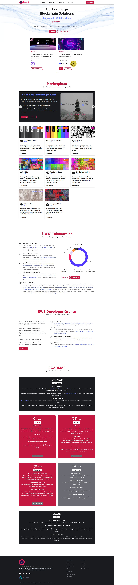 |  |  |  |

---

### About
[Source: src/pages/about.astro](../src/pages/about.astro) | [Live](https://www.bws.ninja/about)

| Desktop (1920×1080) | iPhone SE (375×667) | iPhone 12 Pro (390×844) | Pixel 5 (393×851) |
|---------------------|---------------------|-------------------------|-------------------|
|  |  |  |  |

---

### Contact Us
[Source: src/pages/contact-us.astro](../src/pages/contact-us.astro) | [Live](https://www.bws.ninja/contact-us)

| Desktop (1920×1080) | iPhone SE (375×667) | iPhone 12 Pro (390×844) | Pixel 5 (393×851) |
|---------------------|---------------------|-------------------------|-------------------|
| 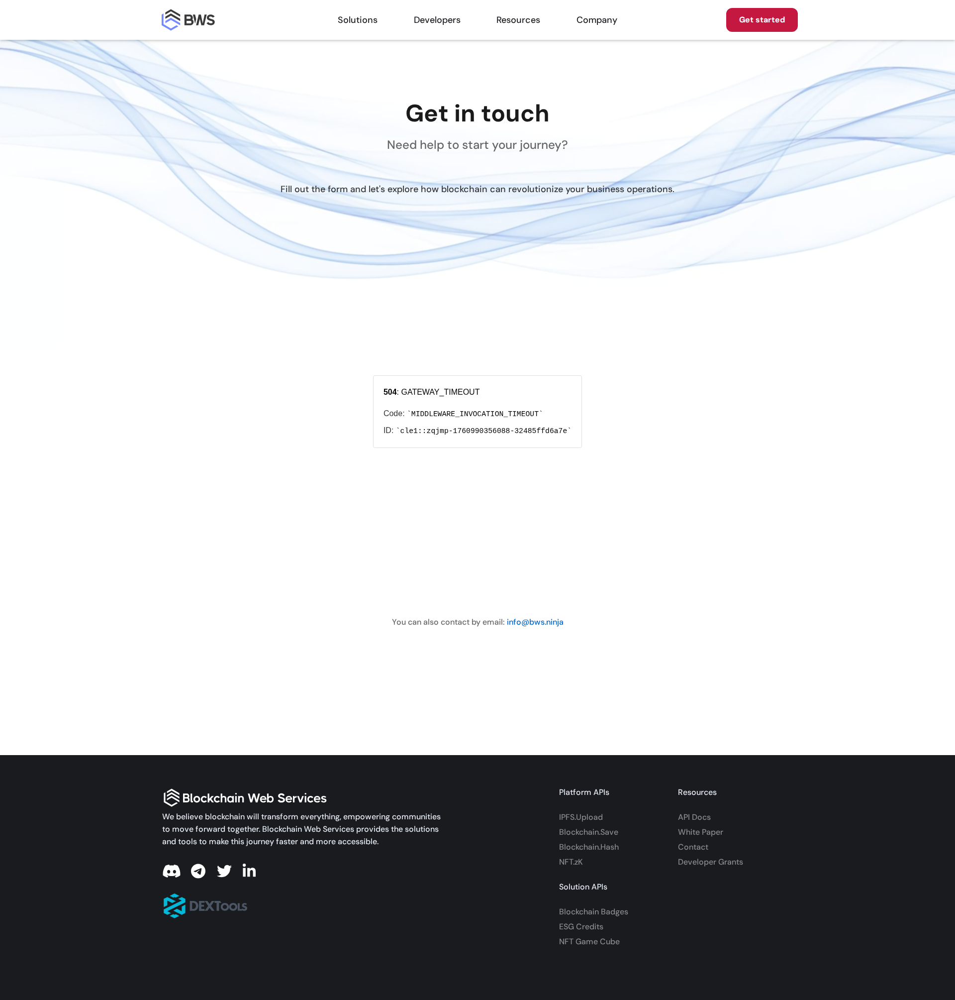 |  | 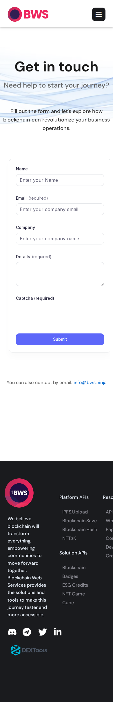 |  |

---

### Industries
[Source: src/pages/industries.astro](../src/pages/industries.astro) | [Live](https://www.bws.ninja/industries)

| Desktop (1920×1080) | iPhone SE (375×667) | iPhone 12 Pro (390×844) | Pixel 5 (393×851) |
|---------------------|---------------------|-------------------------|-------------------|
| 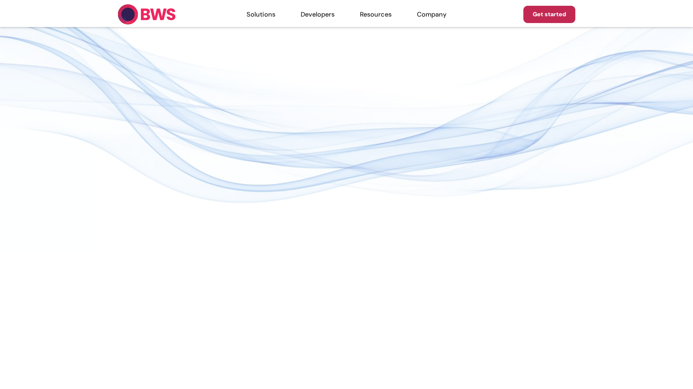 |  |  |  |

---

### Resources
[Source: src/pages/resources.astro](../src/pages/resources.astro) | [Live](https://www.bws.ninja/resources)

| Desktop (1920×1080) | iPhone SE (375×667) | iPhone 12 Pro (390×844) | Pixel 5 (393×851) |
|---------------------|---------------------|-------------------------|-------------------|
| 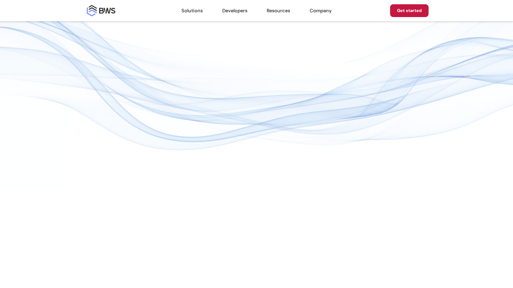 |  |  |  |

---

### White Paper
[Source: src/pages/white-paper.astro](../src/pages/white-paper.astro) | [Live](https://www.bws.ninja/white-paper)

| Desktop (1920×1080) | iPhone SE (375×667) | iPhone 12 Pro (390×844) | Pixel 5 (393×851) |
|---------------------|---------------------|-------------------------|-------------------|
|  |  |  |  |

---

### Legal Notice
[Source: src/pages/legal-notice.astro](../src/pages/legal-notice.astro) | [Live](https://www.bws.ninja/legal-notice)

| Desktop (1920×1080) | iPhone SE (375×667) | iPhone 12 Pro (390×844) | Pixel 5 (393×851) |
|---------------------|---------------------|-------------------------|-------------------|
| 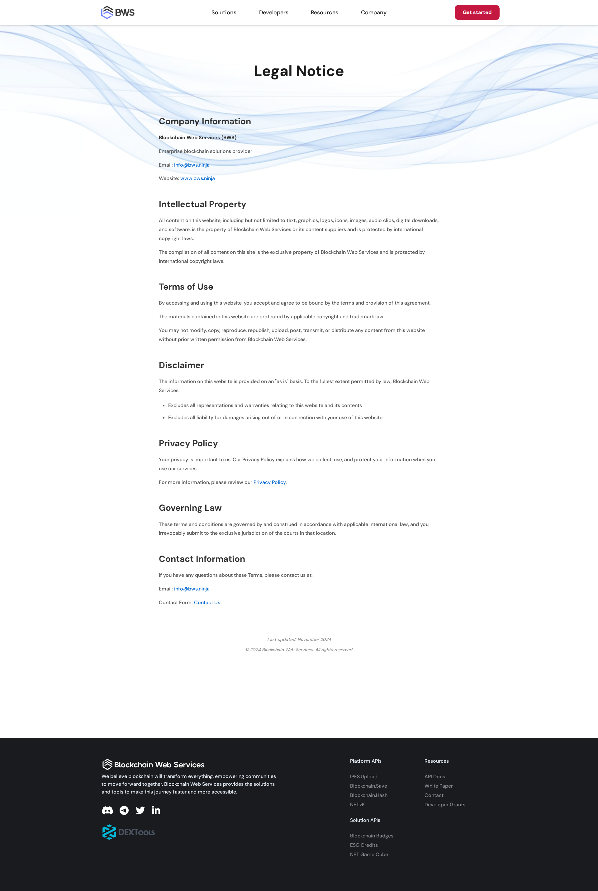 |  | 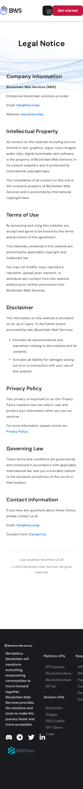 | 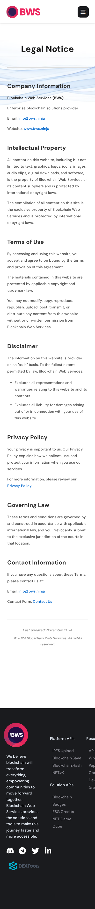 |

---

### Privacy Policy
[Source: src/pages/privacy-policy.astro](../src/pages/privacy-policy.astro) | [Live](https://www.bws.ninja/privacy-policy)

| Desktop (1920×1080) | iPhone SE (375×667) | iPhone 12 Pro (390×844) | Pixel 5 (393×851) |
|---------------------|---------------------|-------------------------|-------------------|
| 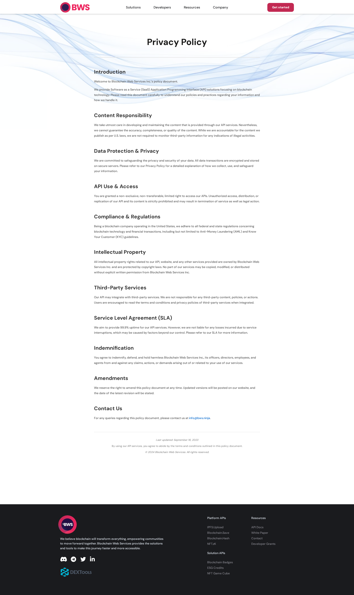 |  | 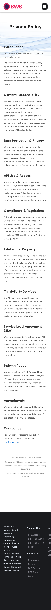 | 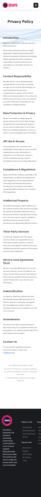 |

---

## Industry Content Pages

### Content Creation
[Source: src/pages/industry-content/content-creation.astro](../src/pages/industry-content/content-creation.astro)

| Desktop (1920×1080) | iPhone SE (375×667) | iPhone 12 Pro (390×844) | Pixel 5 (393×851) |
|---------------------|---------------------|-------------------------|-------------------|
| 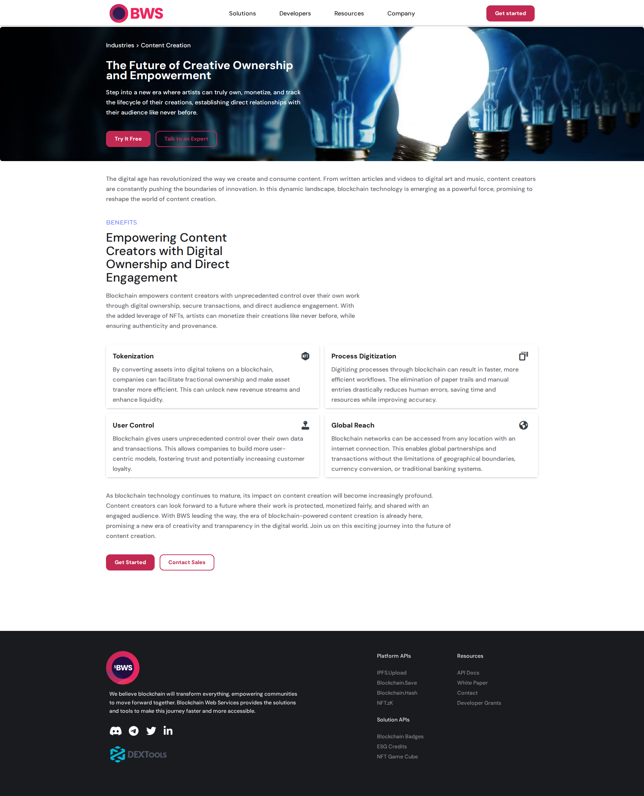 | 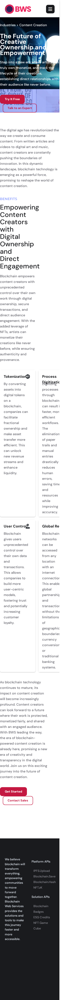 | 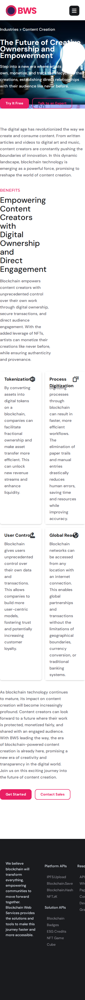 | 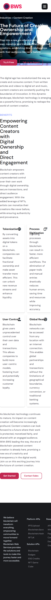 |

---

### ESG
[Source: src/pages/industry-content/esg.astro](../src/pages/industry-content/esg.astro)

| Desktop (1920×1080) | iPhone SE (375×667) | iPhone 12 Pro (390×844) | Pixel 5 (393×851) |
|---------------------|---------------------|-------------------------|-------------------|
| 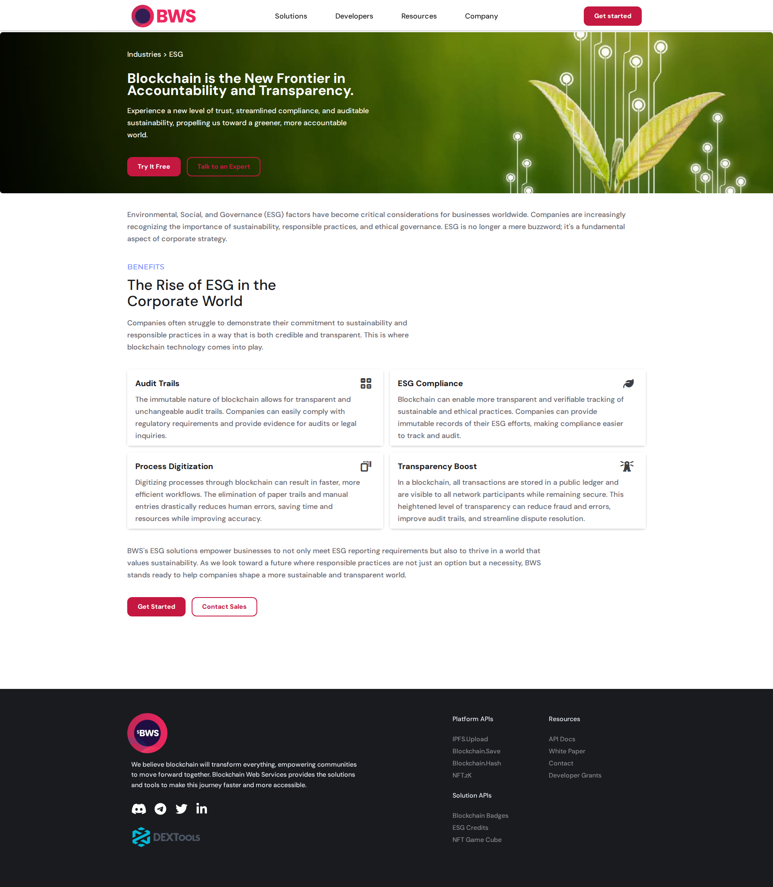 |  | 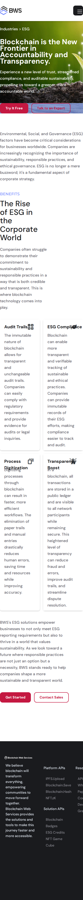 |  |

---

### Financial Services
[Source: src/pages/industry-content/financial-services.astro](../src/pages/industry-content/financial-services.astro)

| Desktop (1920×1080) | iPhone SE (375×667) | iPhone 12 Pro (390×844) | Pixel 5 (393×851) |
|---------------------|---------------------|-------------------------|-------------------|
| 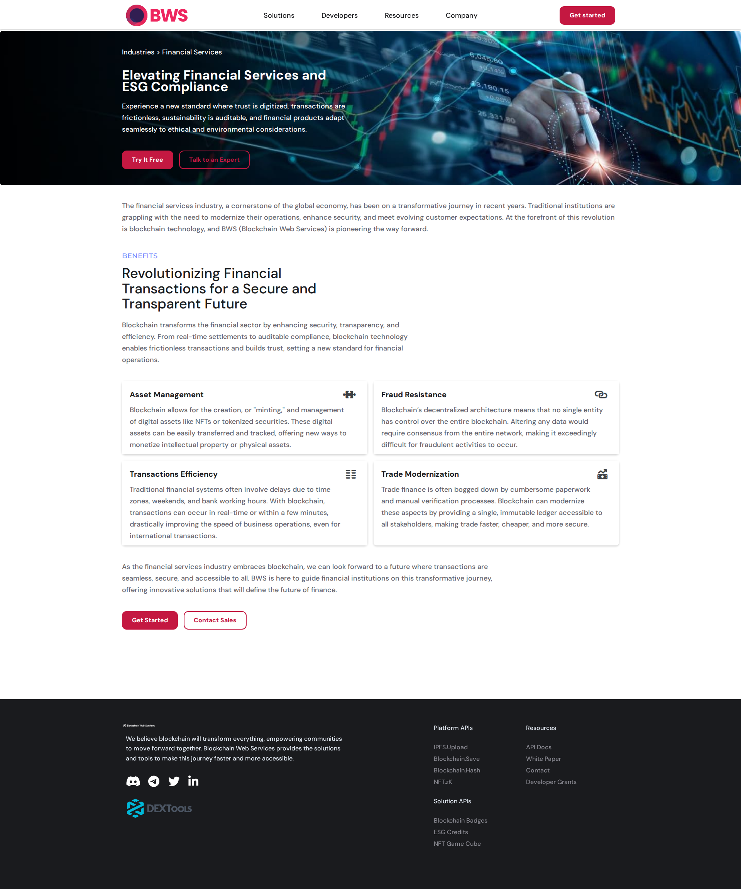 |  | 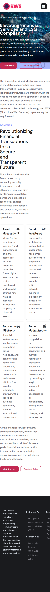 | 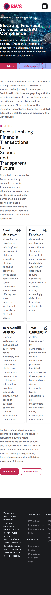 |

---

### Legal
[Source: src/pages/industry-content/legal.astro](../src/pages/industry-content/legal.astro)

| Desktop (1920×1080) | iPhone SE (375×667) | iPhone 12 Pro (390×844) | Pixel 5 (393×851) |
|---------------------|---------------------|-------------------------|-------------------|
| 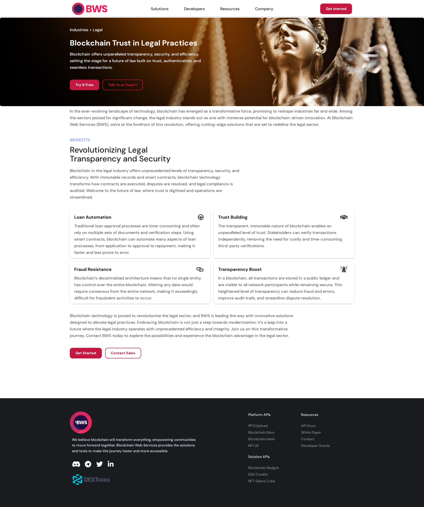 |  |  |  |

---

### Retail
[Source: src/pages/industry-content/retail.astro](../src/pages/industry-content/retail.astro)

| Desktop (1920×1080) | iPhone SE (375×667) | iPhone 12 Pro (390×844) | Pixel 5 (393×851) |
|---------------------|---------------------|-------------------------|-------------------|
| 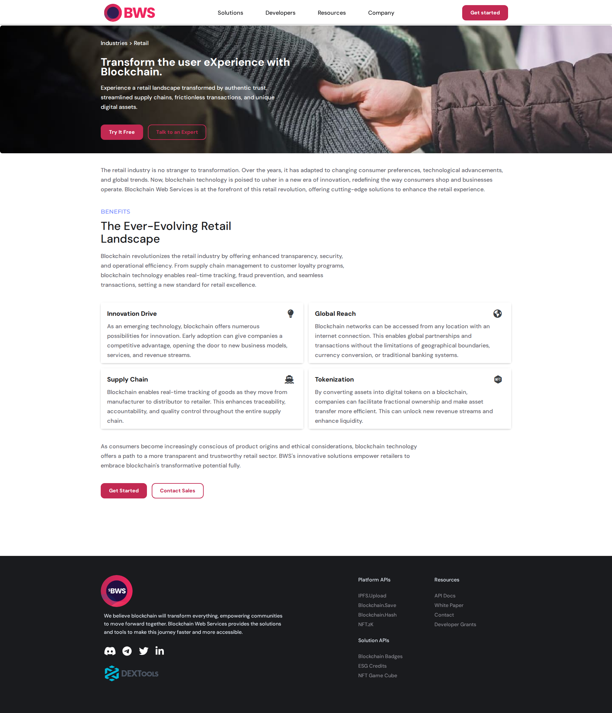 | 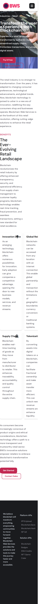 | 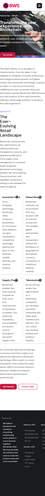 | 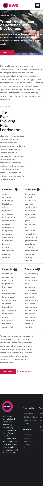 |

---

### Supply Chain
[Source: src/pages/industry-content/supply-chain.astro](../src/pages/industry-content/supply-chain.astro)

| Desktop (1920×1080) | iPhone SE (375×667) | iPhone 12 Pro (390×844) | Pixel 5 (393×851) |
|---------------------|---------------------|-------------------------|-------------------|
|  | 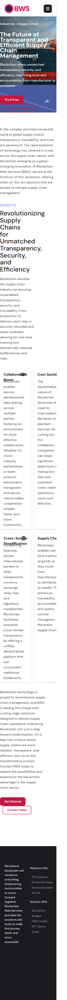 | 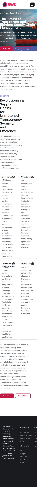 | 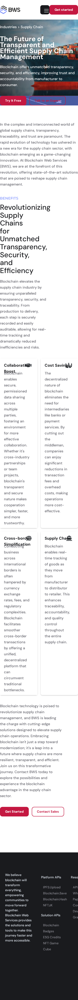 |

---

## Marketplace Pages

### Blockchain Badges
[Source: src/pages/marketplace/blockchain-badges.astro](../src/pages/marketplace/blockchain-badges.astro)

| Desktop (1920×1080) | iPhone SE (375×667) | iPhone 12 Pro (390×844) | Pixel 5 (393×851) |
|---------------------|---------------------|-------------------------|-------------------|
| 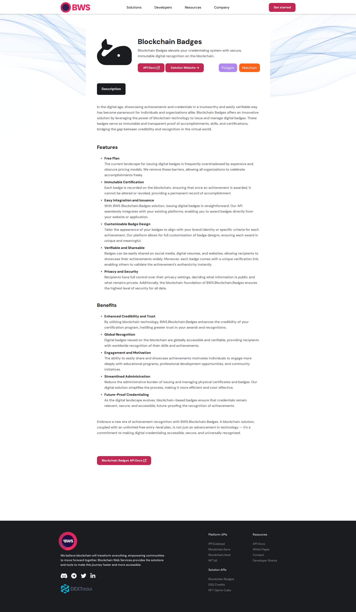 |  | 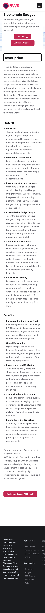 | 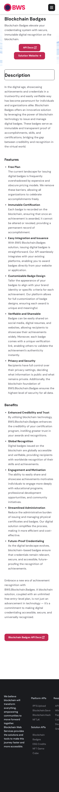 |

---

### Database Immutable
[Source: src/pages/marketplace/database-immutable.astro](../src/pages/marketplace/database-immutable.astro)

| Desktop (1920×1080) | iPhone SE (375×667) | iPhone 12 Pro (390×844) | Pixel 5 (393×851) |
|---------------------|---------------------|-------------------------|-------------------|
| 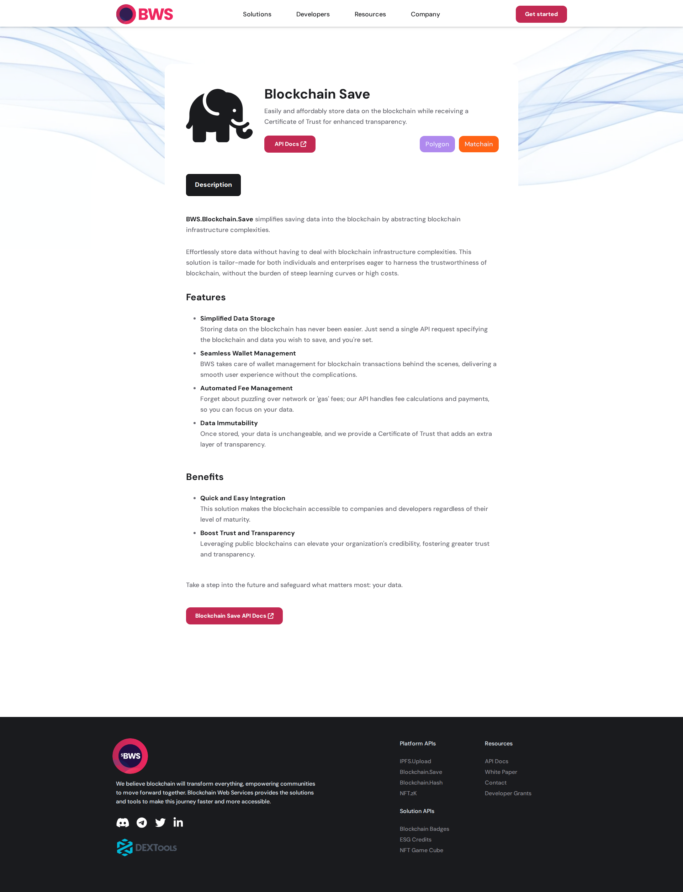 |  | 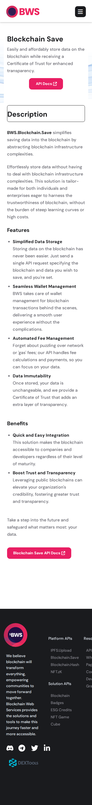 | 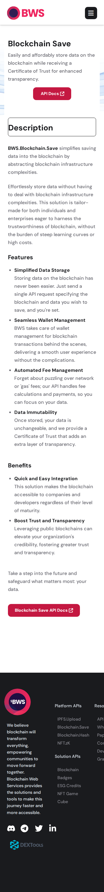 |

---

### Database Mutable
[Source: src/pages/marketplace/database-mutable.astro](../src/pages/marketplace/database-mutable.astro)

| Desktop (1920×1080) | iPhone SE (375×667) | iPhone 12 Pro (390×844) | Pixel 5 (393×851) |
|---------------------|---------------------|-------------------------|-------------------|
| 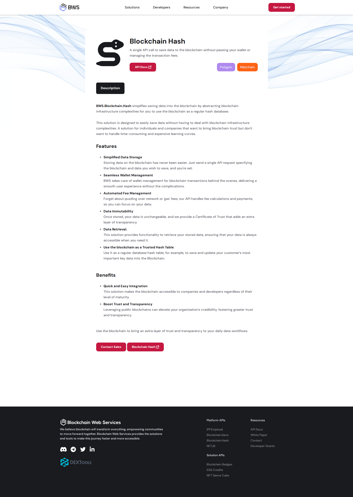 |  | 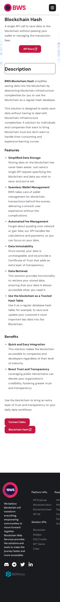 | 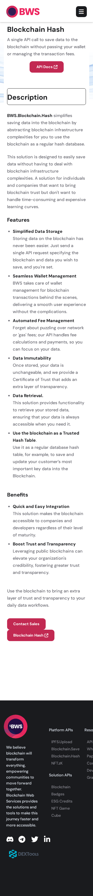 |

---

### ESG Credits
[Source: src/pages/marketplace/esg-credits.astro](../src/pages/marketplace/esg-credits.astro)

| Desktop (1920×1080) | iPhone SE (375×667) | iPhone 12 Pro (390×844) | Pixel 5 (393×851) |
|---------------------|---------------------|-------------------------|-------------------|
| 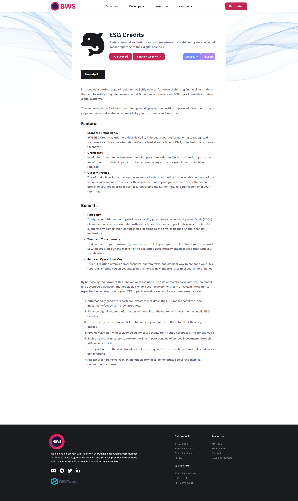 |  | 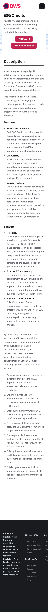 | 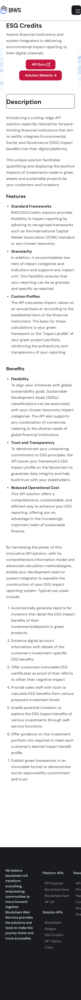 |

---

### IPFS Upload
[Source: src/pages/marketplace/ipfs-upload.astro](../src/pages/marketplace/ipfs-upload.astro)

| Desktop (1920×1080) | iPhone SE (375×667) | iPhone 12 Pro (390×844) | Pixel 5 (393×851) |
|---------------------|---------------------|-------------------------|-------------------|
| 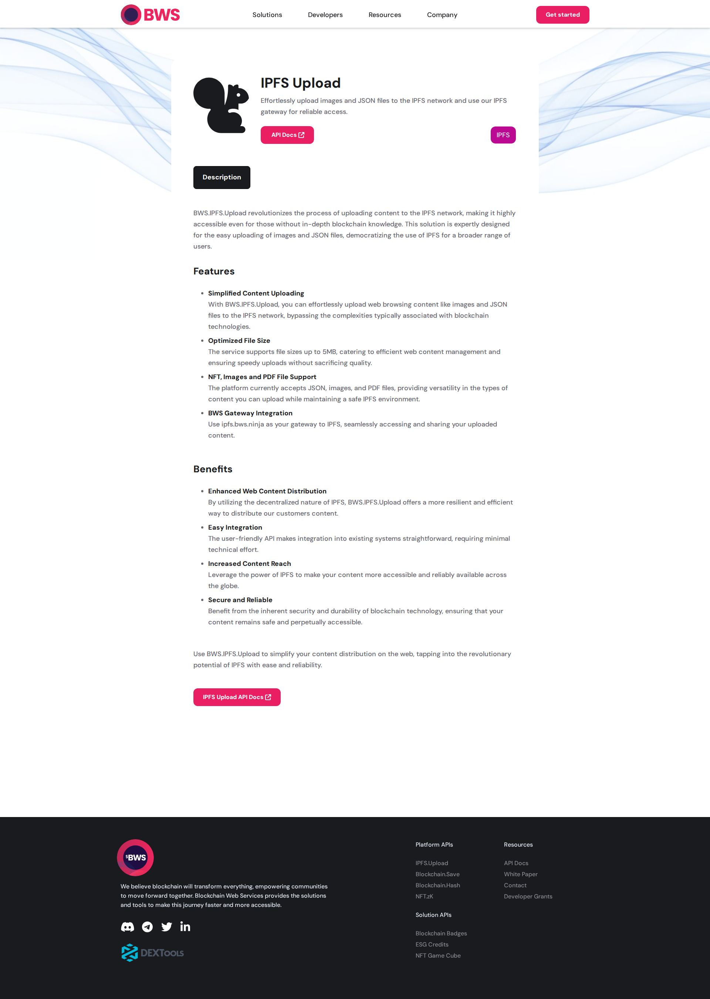 |  |  | 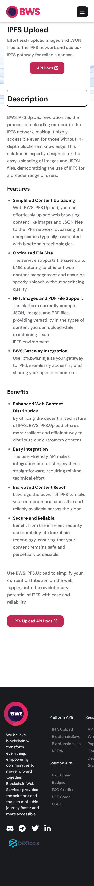 |

---

### NFT GameCube
[Source: src/pages/marketplace/nft-gamecube.astro](../src/pages/marketplace/nft-gamecube.astro)

| Desktop (1920×1080) | iPhone SE (375×667) | iPhone 12 Pro (390×844) | Pixel 5 (393×851) |
|---------------------|---------------------|-------------------------|-------------------|
| 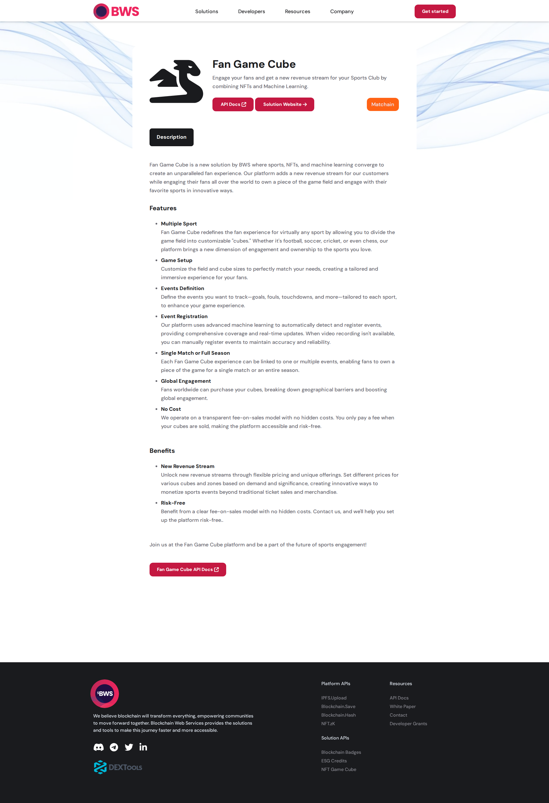 |  | 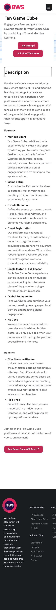 | 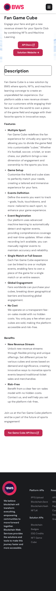 |

---

### NFT Zero Knowledge
[Source: src/pages/marketplace/nft-zeroknwoledge.astro](../src/pages/marketplace/nft-zeroknwoledge.astro)

| Desktop (1920×1080) | iPhone SE (375×667) | iPhone 12 Pro (390×844) | Pixel 5 (393×851) |
|---------------------|---------------------|-------------------------|-------------------|
| 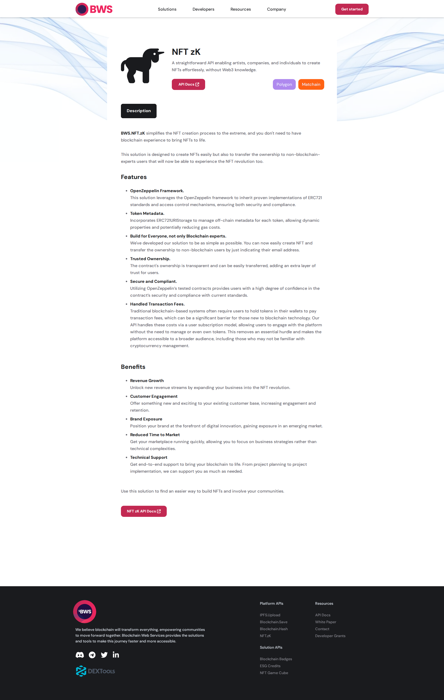 | 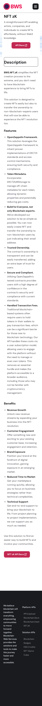 | 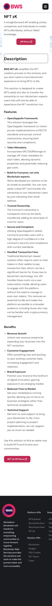 | 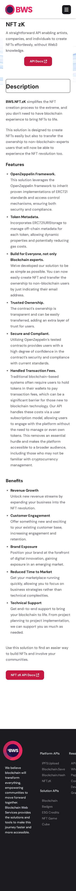 |

---

### Telegram XBot
[Source: src/pages/marketplace/telegram-xbot.astro](../src/pages/marketplace/telegram-xbot.astro)

| Desktop (1920×1080) | iPhone SE (375×667) | iPhone 12 Pro (390×844) | Pixel 5 (393×851) |
|---------------------|---------------------|-------------------------|-------------------|
| 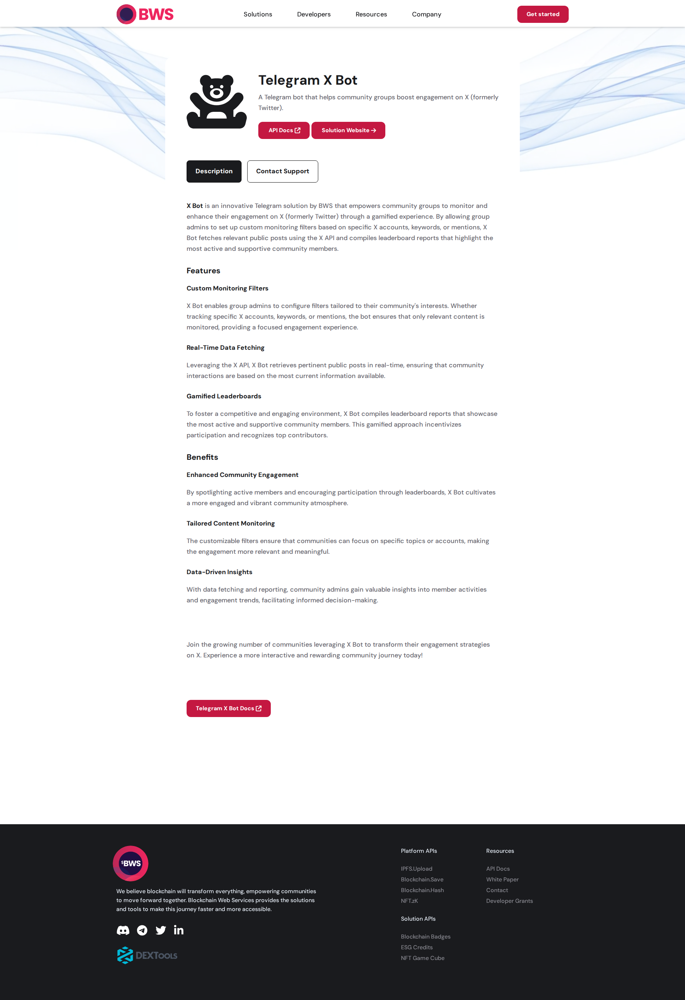 | 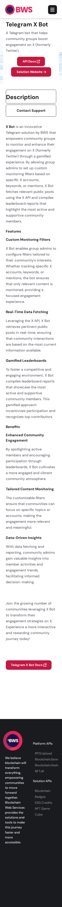 |  | 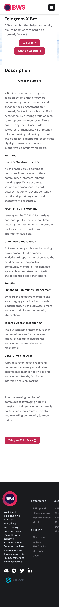 |

---

## Article Pages

### X Bot Article
[Source: src/pages/articles/x-bot-2025-10-20.astro](../src/pages/articles/x-bot-2025-10-20.astro)

| Desktop (1920×1080) | iPhone SE (375×667) | iPhone 12 Pro (390×844) | Pixel 5 (393×851) |
|---------------------|---------------------|-------------------------|-------------------|
| 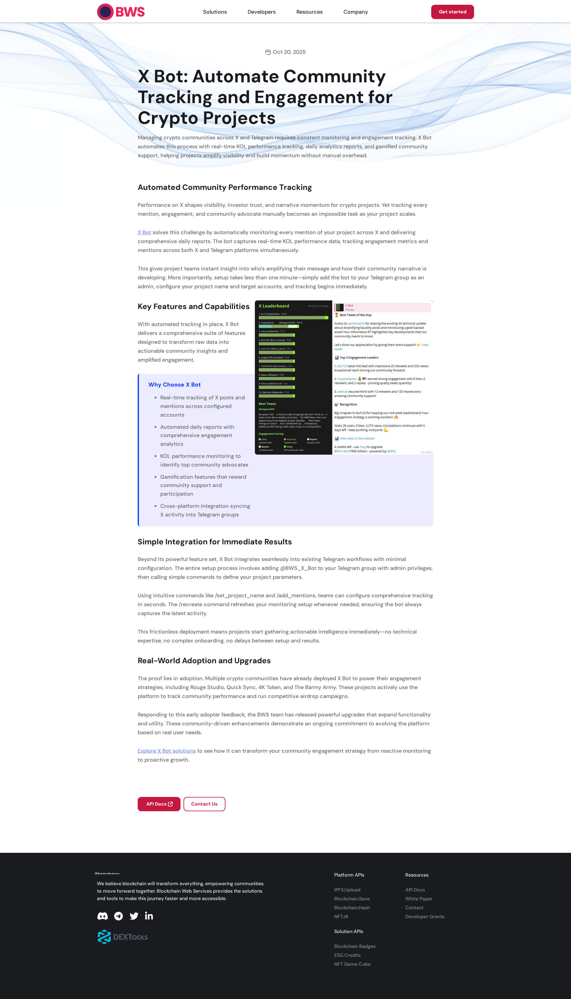 | 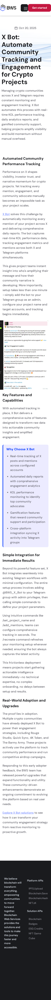 |  | 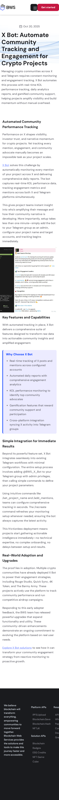 |

---

### Blockchain Badges Article
[Source: src/pages/articles/blockchain-badges-2025-10-20.astro](../src/pages/articles/blockchain-badges-2025-10-20.astro)

| Desktop (1920×1080) | iPhone SE (375×667) | iPhone 12 Pro (390×844) | Pixel 5 (393×851) |
|---------------------|---------------------|-------------------------|-------------------|
| 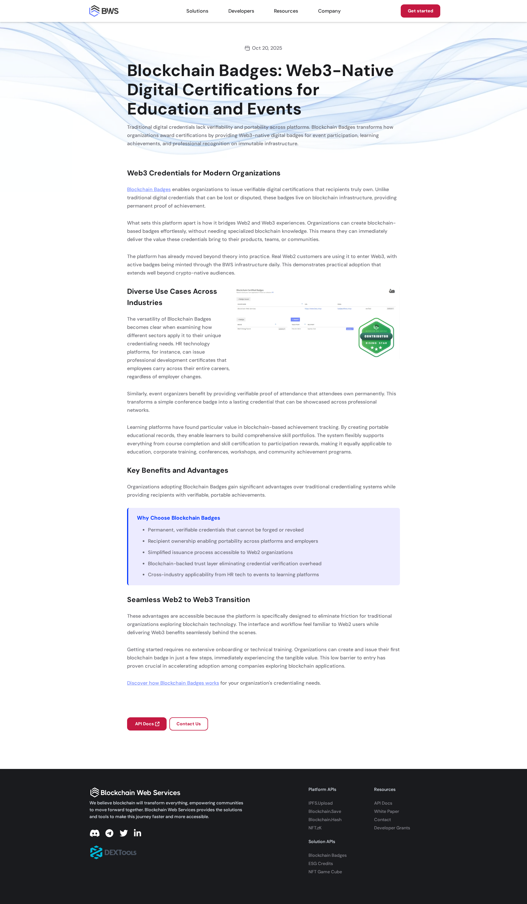 | 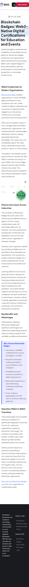 | 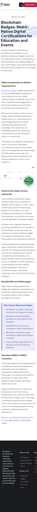 | 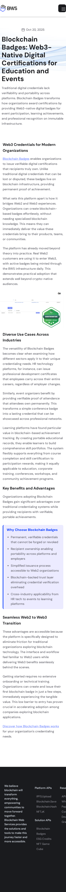 |

---

### ESG Credits Article
[Source: src/pages/articles/esg-credits-2025-10-20.astro](../src/pages/articles/esg-credits-2025-10-20.astro)

| Desktop (1920×1080) | iPhone SE (375×667) | iPhone 12 Pro (390×844) | Pixel 5 (393×851) |
|---------------------|---------------------|-------------------------|-------------------|
| 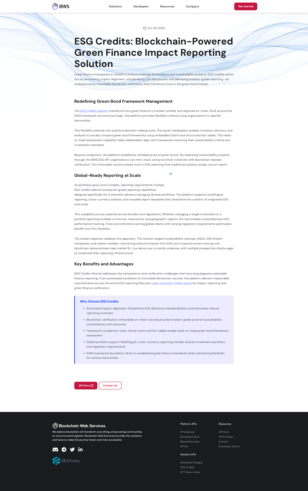 | 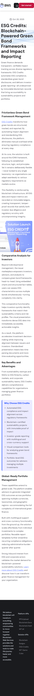 | 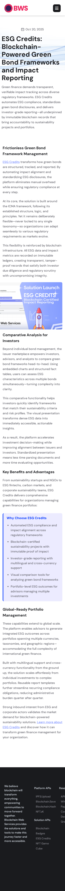 | 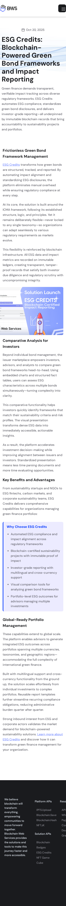 |

---

### Fan Game Cube Article
[Source: src/pages/articles/fan-game-cube-2025-10-20.astro](../src/pages/articles/fan-game-cube-2025-10-20.astro)

| Desktop (1920×1080) | iPhone SE (375×667) | iPhone 12 Pro (390×844) | Pixel 5 (393×851) |
|---------------------|---------------------|-------------------------|-------------------|
| 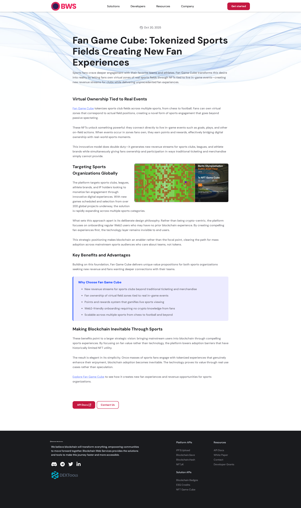 | 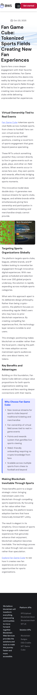 | 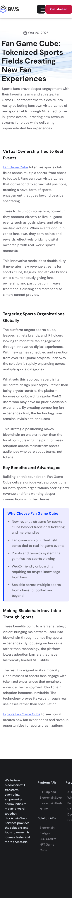 | 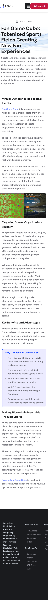 |

---

## Notes for Mobile CSS Review

### Common Mobile Issues to Check
- Header/navigation responsiveness
- Text overflow or truncation
- Image scaling and aspect ratios
- Button and link touch targets (minimum 44×44px)
- Form input sizing and spacing
- Footer layout and link accessibility
- Horizontal scrolling (should not occur)
- Excessive whitespace or cramped layouts

### Testing Checklist
- [ ] Navigation menu works on all mobile viewports
- [ ] All images load and scale appropriately
- [ ] Text is readable without horizontal scrolling
- [ ] CTAs and buttons are easily tappable
- [ ] Forms are usable on small screens
- [ ] No content is cut off or hidden
- [ ] Spacing is consistent across viewports
- [ ] Tables and data grids are responsive

### Updating Snapshots
Snapshots are automatically regenerated when changes are pushed to the main branch. To manually regenerate:

```bash
cd tests
npm run test:snapshot
```

The GitHub Action workflow will commit updated screenshots back to the repository automatically.
